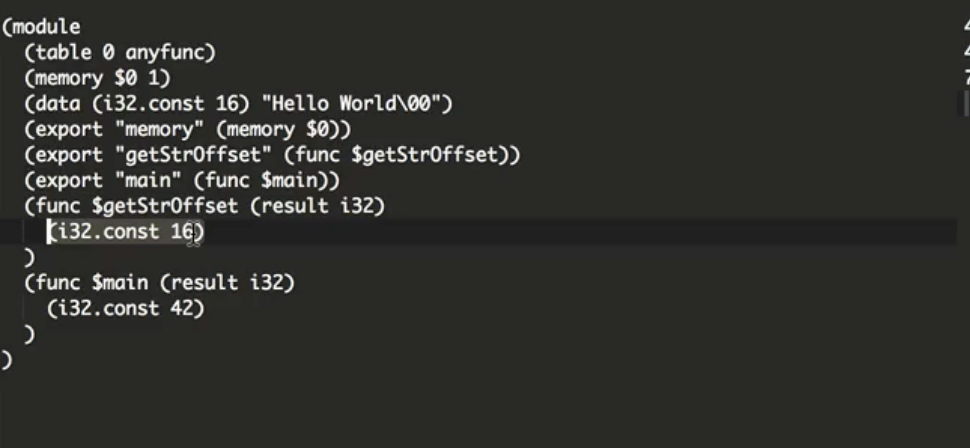

Using functions in **WebAssembly**, we can pass individual numeric values. We're restricted to integers and floats, either 32 bits or 64 bits. The standard WASM filler example has a function that returns a number. When we build and run this, we can log that number. We're passing numbers through the interfaces.

```cpp
int main() {
	return 42;
}
```

What if I wanted to deal with something like a string of characters? In C, we define a string using a character array. If I wanted this `"Hello World"` string to be passed into JavaScript, how might I do that?

```cpp
char str[] = "Hello World";
```

One option would be to create a function, `getChar`, that returns individual characters at a single offset. We're still returning a number representing the character, but we can call it many times to get the whole string.

```cpp
char getChar (int offset) {
	
}
```

If I `return` the individual item of the string, we can then call this function from JavaScript. Calling the `getChar` function in JavaScript with zero to get the first character of the string, we can then see the char code for H being returned.

####C Code
```cpp
char getChar (int offset) {
	return str[offset];
}
```

####Javascript Code
```javascript
var wasmModule = new WebAssembly.Module(wasmCode);
var wasmInstance = new WebAssembly.instance(wasmModule,
	wasmImports);
log(wasmImports.exports.main());
log(wasmInstance.exports.getChar(0));
```

We could then use some code to convert that into the correct string character, and we could read out the string letter-by-letter. Thankfully, there's a better way to do this. Instead of a `getChar` function, I'm going to create a `char` pointer-returning function called `getStrOffset`.

```cpp
char* getStrOffset () {
	return &str[0];
}
```

What this function will do is it'll `return` the memory address of the first character of the string. When we build this, we can see in the code below, `getStrOffset` is returning a single number, which is a 32-bit integer. It's a constant integer, 16.



This is the address of our string in the **WebAssembly** memory. If we look further up in this output, we can see that there's a data section. The data section is used to create pre-allocated memory in our **WebAssembly** modules.

This data section is allocating at address number 16, and the contents are `"Hello World\00"` Then our memory is also being exported over here. We've got this single piece of addressable linear memory that contains the data we want.

Now, we just have to write the JavaScript to read it. The first thing I'm going to do is read out that memory export, which is directly the `wasmInstance.exports.memory;` property. The way that we access raw memory in JavaScript is using typed arrays.

```javascript
const memory = wasmInstance.exports.memory;
```

We want to create a typed array on top of this **WebAssembly** memory that represents our string. Each character of the string is eight bits. I'm going to use the `Uint8Array()` typed array on top of the **WebAssembly** memory, the memory.`buffer` property, and then specify the offset within the **WebAssembly** memory that our string starts.

Calling the `getStrOffset` function, we can get this address, 16. The last argument for our typed array is the length of the buffer, in this case `11` characters for the string.

```javascript
const memory = wasmInstance.exports.memory;
const strBuf = new Uint8Array(memory.buffer, wasmInstance
	.exports.getStrOffset(), 11);
```

Finally, to convert this raw buffer into an actual JavaScript string, we use the `TextDecoder()` API. We pass the raw buffer, and it gives us back the string that we can then log in the console.

```javascript
const memory = wasmInstance.exports.memory;
const strBuf = new Uint8Array(memory.buffer, wasmInstance
	.exports.getStrOffset(), 11);
const str = new TextDecoder().decode(strBuf);
log(str);
```