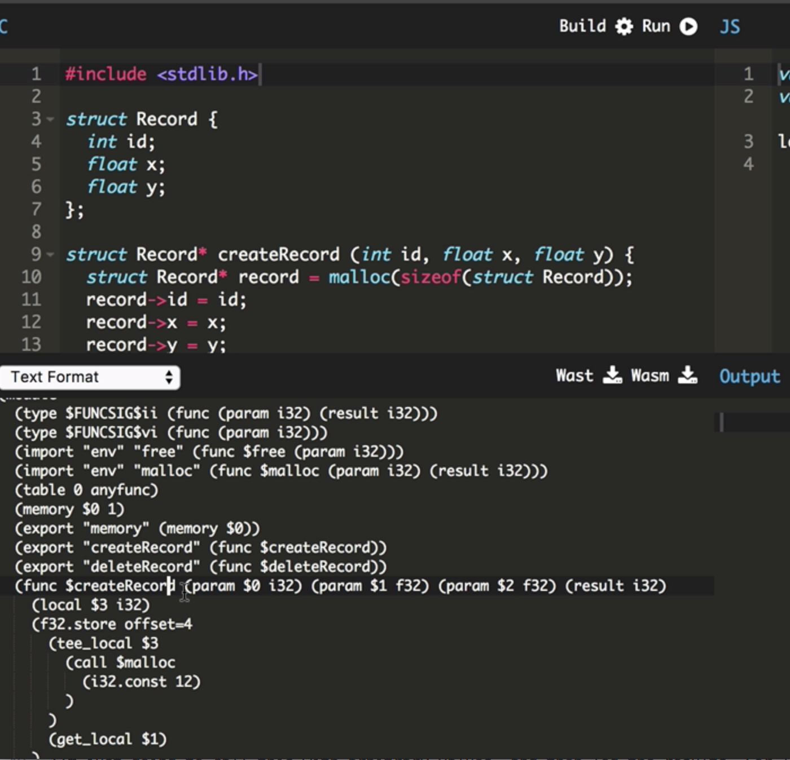

For a simple example of dynamic memory allocation in **WebAssembly**, let's consider that we have a `Record` data type which has some arbitrary fields associated with it. Say, for example, an `id`, an `x`, and a `y` value.

```
struct Record {
	int id;
	float x;
	float y;
};
```

To dynamically create one of these records, we're going to use a `createRecord()` function, which will take its fields as its arguments. Then we can use `malloc` within this function to create the memory for each `Record`. We need to pass into `malloc` the size of the `Record` in bytes so we can use the `sizeof` operator here.

```C
createRecord (int id, float x, float y) {
	mallox(sizeof(struct Record));
}
```

The value we get back is then the memory address of the new `Record`, where is therefore a pointer to a `Record`. We can now use this pointer to set the `id` `x` and `y` values directly into that new memory address. Finally, we will `return` the memory address from the `createRecord()` function, so the function is therefore returning a pointer to a `Record`.

```C
createRecord (int id, float x, float y) {
	struct Record* record = mallox(sizeof(struct Record));
	record->id = id;
	record->x = x; 
	record->y = y;
	return record;
}
```

To create a `deleteRecord` function, this is going to be a function with no `return` value that takes a `Record*` address in memory, and then calls `free` on that memory address. Of course, there's more efficient and much better ways to do this, but this is just for an example. In order to use `malloc` and `free`, I'm going to `#include <stdlib.h>` as well.

```C
void deleteRecord (struct Record* record) {
	free(record);
}
```

Taking a look at the generated **WebAssembly** code, we can see that the `free` and `malloc` functions are both treated as imported functions. It's up to us to link them in ourselves. The memory is being exported, and then we've got our `createRecord()` and `deleteRecord` functions defined.



Looking at the `deleteRecord` function, we can see that it's taking a 32-bit integer as its argument, which is a memory address in **WebAssembly**. It's then calling the `free` function with that argument number from the local parameter.

```
(func $deleteRecord (param $0 i32)
	(call $free
		(get_local $0)
	)
)
```

Briefly looking at the `createRecord()` function, we can also see that it's calling `malloc`, storing it in a local variable, `$3`, which is defined over here. Then it's using the `f32.store`, `i32.store`, and `f32.store` calls to do our `Record` saves in memory of the `id` `x` and `y` values that were passed as parameters before finally returning the memory address, which was stored in the local variable.

```
(func $createRecord (param $0 i32) (param $1 f32) (param $2 f32) (result i32)
	(local $3 i32)
	(f32.store offset=4
		(tee_local $3
			(call $malloc
				(i32.const 12)
			)
		)
		(get_local $1)
	)
	(i32.store
		(get_local $3)
		(get_local $0)
	)
	(f32.store offset=8
		(get_local $3)
		(get_local $2)
	)
	(get_local $3)
)
```

Let's download the **WebAssembly** code, and get this wired in. In my local project, I've included the `fetchAndInstantiateWasm` helper, which I'm going to local `program.wasm` file that we just downloaded.

For the imports object, I'm going to need to pass an environment import, which contains the `malloc` and `free` implementations. I'll get to that in a moment. This promise resolved to the **WebAssembly** module exports, which contains our `createRecord()` function.

```jsx
<!doctype html>
	<script>
		function fetchAndInstantiateWasm (url, imports) {
			return fetch(url)
			.then(res => {
				if(res.ok)
					return res.arrayBuffer();
				throw new Error(`Unable to fetch Web Assembly file ${url}.`);
			})
			.then(bytes => WebAssembly.compile(bytes))
			.then(module => WebAssembly.instantiate(module, imports || {}))
			.then(instance => instance.exports);
		}

		fetchAndInstantiateWasm('./program.wasm', {
			env: {
				malloc, 
				free
			}
		})
		.then(m => {
			console.log(m.createRecord(2, 1.1, 2.2)); 
		})
	</script>
```

I'm just going to call this with arbitrary values, and then log the results. For linking in `malloc` and `free`, I've actually already prebuilt from C into **WebAssembly** a `malloc` and `free` implementation, which I'm just going to load from the existing file at `memory.wasm`.

The link to this file is included [here](https://github.com/guybedford/wasm-stdlib-hack/blob/master/dist/memory.wasm). This `memory.wasm` file takes a single `env` import, which sets the `memory`. The reason for this is that `malloc` and `free` both need to act on the program's memory, which is defined in the program itself, because it exported its own memory.

```jsx
fetchAndInstantiateWasm('./program.wasm', {
	env: {
		malloc, 
		free
	}
})
.then(m => {
	fetchAndInstantiateWasm('./memory.wasm', {
		env: {
			memory: 
		}
	})

	console.log(m.createRecord(2, 1.1, 2.2)); 
})
```

We can only work with a single memory at a time in **WebAssembly**, at least currently, so we want to pass that program's memory into the memory's memory. I'm going to access that from `m.memory`, where it was exported.

```jsx
.then(m => {
	fetchAndInstantiateWasm('./memory.wasm', {
		env: {
			memory: m.memory
		}
	})

	console.log(m.createRecord(2, 1.1, 2.2)); 
})
```

The module value that we get back from `memory.wasm` then contains our `malloc` and our `free` functions bound to the program's memory. How do we get these `malloc` and `free` functions into the imports of the `program.wasm`?

```jsx
.then(m => {
	fetchAndInstantiateWasm('./memory.wasm', {
		env: {
			memory: m.memory
		}
	})
	.then(m => {
		m.malloc
		m.free
	})

	console.log(m.createRecord(2, 1.1, 2.2)); 
})
```

I'm going to use an indirection here by creating temporary placeholders for these functions called `wasmMalloc` and `wasmFree`. In the environment imports to `program.wasm`, I'm actually going to create a JavaScript implementation of `malloc`, that takes and length, and returns the `wasmMalloc` result applied to that length.
The same for the `free` function, which will take an address, and `return` the `wasmFree` of that address. 

```jsx
let wasmMalloc, wasmFree;
fetchAndInstantiateWasm('./program.wasm', {
	env: {
		malloc; len => wasmMalloc(len),
		free: addr => wasmFree(addr)
	}
})
```

We now just need to assign the `wasmMalloc` from the version that we got back from the memory, and the same for the `wasmFree` implementation.

```jsx
.then(m => {
	fetchAndInstantiateWasm('./memory.wasm', {
		env: {
			memory: m.memory
		}
	})
	.then(m => {
		wasmMalloc = m.malloc;
		wasmFree = m.free;
	})

	console.log(m.createRecord(2, 1.1, 2.2)); 
})
```

Lastly, I'm just going to make sure that we're calling our `createRecord()` function only once everything has been set up. When we run this, we can see that we're getting a dynamically allocated memory address.

```jsx
.then(m => {
	fetchAndInstantiateWasm('./memory.wasm', {
		env: {
			memory: m.memory
		}
	})
	.then(m => {
		wasmMalloc = m.malloc;
		wasmFree = m.free;
	})
	.then(() => {
		console.log(m.createRecord(2, 1.1, 2.2)); 
	})
})
```

I have done performance measurements to see what the cost is of these JS bindings. Because we're not linking directly to the **WebAssembly**, we're jumping through JavaScript, there's a very, very small performance overhead on my tests of about five percent on otherwise very highly performing code.

If that's something that worries you, a better thing to do here is to have `program.wasm` as well import its memory. There's another performance concern in this code, which is that we're fetching `program.wasm`, and then only once that is fetched and compiled are we fetching `memory.wasm`.

What we really want to be doing is fetching in parallel so that we utilize the network as best as possible. We can adjust this `fetchAndInstantiateWasm` function to convert it into a parallel fetch and compile function that'll instead take an array of URLs to fetch and compile.

We use this to fetch program and memory in parallel. Then we need to call `WebAssembly.instantiate` ourselves. This takes the imports object as its second argument, so the rest of the code is actually much the same. I'll just copy all that in.

Then the final difference is that the `return` value of `WebAssembly.instantiate` is a module object, so we need to access the exports property on that directly. That gives us the parallel loader.

```jsx
<!doctype html>
  <script>
    function fetchAndCompileWasmModules (urls) {
      return Promise.all(urls.map(url => {
        return fetch(url)
        .then(res => {
          if (res.ok)
            return res.arrayBuffer();
          throw new Error(`Unable to fetch Web Assembly file ${url}.`);
        })
        .then(bytes => WebAssembly.compile(bytes));
      }));
    }

    let wasmMalloc, wasmFree;
    fetchAndCompileWasmModules(['./program.wasm', './memory.wasm'])
    .then(([program, memory]) => {
      return WebAssembly.instantiate(program, {
        env: {
          malloc: len => wasmMalloc(len),
          free: addr => wasmFree(addr)
        }
      })
      .then(m => {
        return WebAssembly.instantiate(memory, {
          env: {
            memory: m.exports.memory
          }
        })
        .then(m => {
          wasmMalloc = m.exports.malloc;
          wasmFree = m.exports.free;
        })
        .then(() => {
          console.log(m.exports.createRecord(2, 1.1, 2.2));
        });
      });
    });
  </script>
```