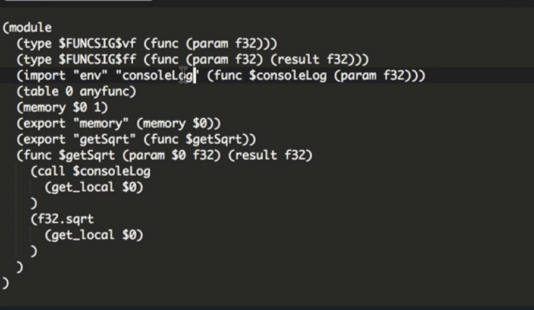

When writing **WebAssembly**, one of the issues we hit is with debugging workflows. We can actually get this raw **WebAssembly** format in the browser console and step through it, but it's often not very useful for finding a problem.

Source maps will be coming, but in the meantime, we unfortunately have to step back to some of the old JavaScript tricks. To debug this `getSqrt` function, what I'm going to do is create a `consoleLog()` function that I can call. For example, if I wanted to know what inputs this function was getting, I want to just log that number.

```C
#include <math.h>

float getSqrt (float num) {
	consoleLog(num);
	return sqrt(num);
}
```

The way we can create a `consoleLog()` function is by calling this function that actually exists in JavaScript. We define the shape of this function in **C** and treat it as an external function. It has no `return` value, so it's a `void`. Then the input value is going to be a float number.



We're going to just define that signature. When we build our **WebAssembly**, we'll see that this function is automatically treated as an external and it becomes available as an `input` within our module. It's importing `consoleLog()` from a `module` called `env`.

This is just a default `module` namespace name for the externals of a **C** code compilation process. In our instantiation code here, we've got this wasm `import` object going into the instance creation. I'm going to change this to be a direct object literal and set that `env` value to contain a `consoleLog()`.

```
var wasmModule = new WebAssembly.Module(wasmCode);
var wasmInstance = new WebAssembly.Instance(wasmModule, {
	env: {
		consoleLog: log
	}
});
log(wasmInstance.exports.getSqrt(25));
```

Normally, we'd set this to the `consoleLog()` function, but because I'm in **WasmFiddle**, I want to use the WasmFiddle log function, which is just called `log`. We can now execute this code, and we can see the input value logged before we log the output value.

We're running a JavaScript function directly from within **WebAssembly**. To quickly go through loading the same workflow in our local application, I'm going to download the **WebAssembly** binary. Switching into the local application, I'm first going to include our wasm helper. Using this helper, I'm going to fetch the `program.wasm` file that we located in the project folder.

The optional second argument to this helper is the imports object. This is where we can set that `env` module. I'm going to set the `consoleLog()` function of the `env` module, this time just to be the direct `console.log(num)` function in the browser. The promise we get back for this `fetchAndInstantiate` call is our executed **WebAssembly** module with the exports available on the objects.

```jsx
<!doctype html>
  <title>WASM Test</title>
  <script>
    function fetchAndInstantiateWasm (url, imports) {
      return fetch(url)
      .then(res => {
        if (res.ok)
          return res.arrayBuffer();
        throw new Error(`Unable to fetch Web Assembly file ${url}.`);
      })
      .then(bytes => WebAssembly.compile(bytes))
      .then(module => WebAssembly.instantiate(module, imports || {}))
      .then(instance => instance.exports);
    }

    fetchAndInstantiateWasm('https://cdn.rawgit.com/guybedford/wasm-intro/f61eb0d0/3-calling-js-from-wasm/program.wasm', {
      env: {
        consoleLog: num => console.log(num)
      }
    })
    .then(m => {
      console.log(m.getSqrt(5));
    });
  </script>
 ```

I can now call the `getSqrt` function directly with any input value. If I log the output as well, we should see both the input and the output being logged in the browser.