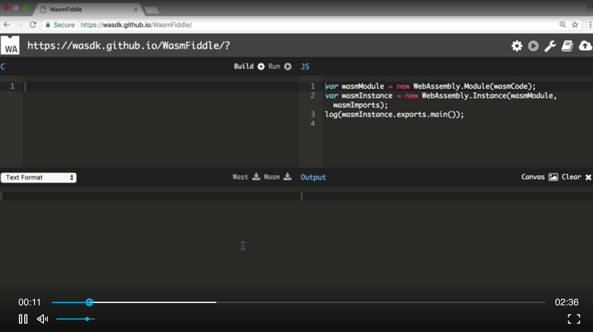
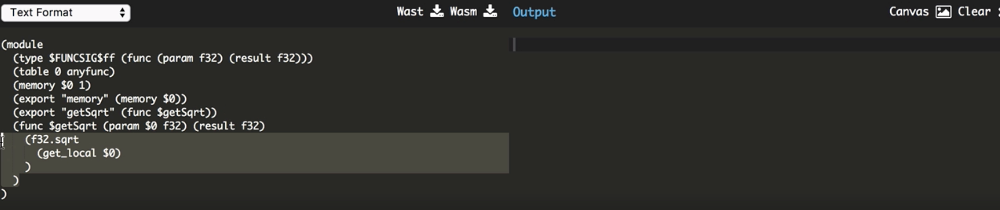
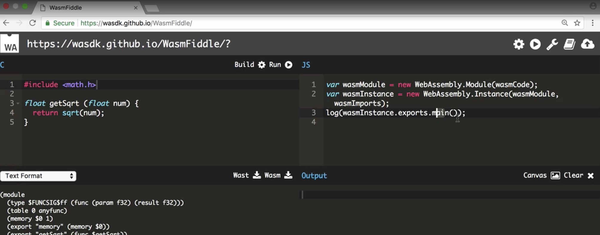

For this lesson, I'm using a project called **WasmFiddle** which allows me to write **C** in the box over here and compile it into **WebAssembly** in the browser, as well as running it to experiment with it.



There's going to be many, many languages that compile into **WebAssembly**. This is one of the major benefits of **WebAssembly**, but if we want to play around with it and understand **WebAssembly**, **C** is one of the best levels to do this at, because it's a very low level abstraction on top of the raw assembly code.

Let's create, for example, a `getSqrt` function. The `return` value of this function is going to be a floating point number. By default, `float` is a 32-bit type, and then we're going to call this function `getSqrt`. The input into this function is going to be a `float` number again.

```c
float getSqrt (float num) {
	return sqrt(num);
}
```

Then, we're just going to `return` the square root of a number. In **C**, the square root function is loaded from the math header, so I'm just going to `include` that header at the top. We can now build the code.

```c
#include <math.h>

float getSqrt (float num) {
	return sqrt(num);
}
```

At the bottom, our **WebAssembly** module comes up. We can see that it's exporting our `getSqrt` function, and we can see the function defined over here as well, where it's taking an input `f32`, returning a `f32`, and then taking the square root.



Obviously, as you write more complicated **C** code, it gets much more difficult to read this, but there's a very, very direct translation between the two.



If you want to play around with the outputs, this is a very simple, synchronous instantiation of **WebAssembly** that comes by default when you load up **WasmFiddle**. On this wasm instance or exports, we can access any of our functions in the **C** code.

I'm going to run the `getSqrt` function over here. I can call it with any number and then use the run feature.

To use this **WebAssembly** in our own projects, I'm going to click the *Download WASM* button. I'm then going to locate the `program.wasm` file in the local projects and open up the HTML. To load the wasm, I'm going to use a helper function called `fetchAndInstantiateWasm`. This will asynchronously load a **WebAssembly** file from a URL, execute it, and returned back the exports of that **WebAssembly** module.

```jsx
<!doctype html>
  <title>WASM Test</title>
  <script>
    function fetchAndInstantiateWasm (url, imports) {
      return fetch(url)
      .then(res => {
        if (res.ok)
          return res.arrayBuffer();
        throw new Error(`Unable to fetch Web Assembly file ${url}.`);
      })
      .then(bytes => WebAssembly.compile(bytes))
      .then(module => WebAssembly.instantiate(module, imports || {}))
      .then(instance => instance.exports);
    }
  </script>
```

I can call this function directly, passing the URL of our program file, which is `program.wasm`, and this will `return` a promise, returning the exact exports of the wasm file. I can then assign our `getSqrt` function, directly from the wasm module exports available, as the name `getSqrt`. If you're on this in the browser, we can see `getSqrt` is now available.

```jsx
<!doctype html>
  <title>WASM Test</title>
  <script>
    function fetchAndInstantiateWasm (url, imports) {...}

    fetchAndInstantiateWasm('https://cdn.rawgit.com/guybedford/wasm-intro/f61eb0d0/2-c-wasm/program.wasm')
    .then(m => {
      window.getSqrt = m.getSqrt;
    });
  </script>
```