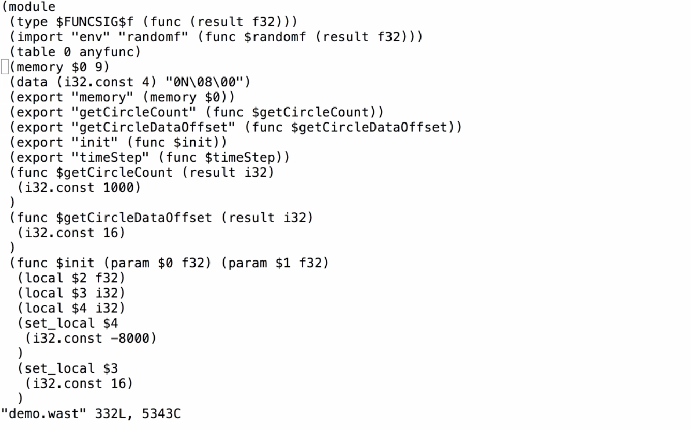
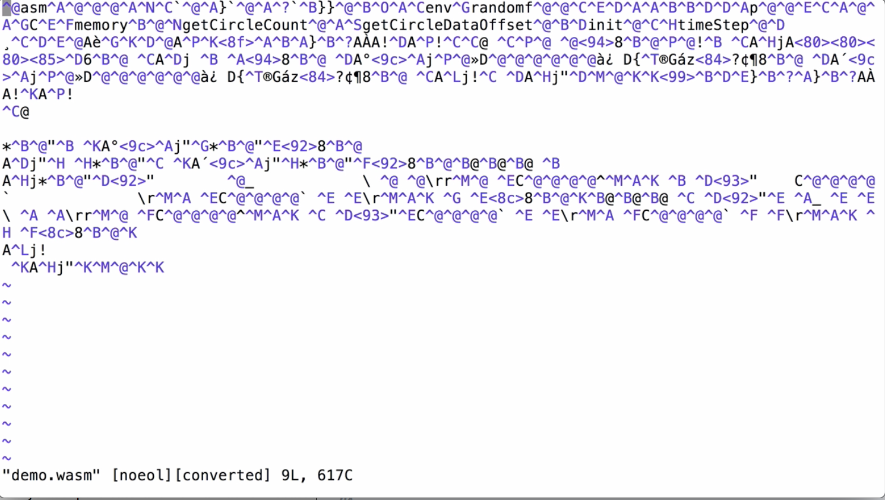
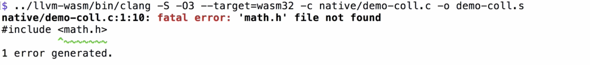

I've got a file located in `native/demo.c` which we're going compile into **WebAssembly**. I've got my **WebAssembly** build of `llvm` located at `../llvm-wasm`. I'm going to use the `/bin/clang` driver to be able to do the C or C++ compilation. When we run `clang`, we can't convert directly into **WebAssembly** yet. For now, what we have to do is output an intermediate S format.

This is the `-emit-llvm` flag for `clang` or we can just use the short hand capital `-S`. I'm then going to apply my C optimizations `-O3`, and I'm going to choose `--target=wasm32`. By default, wasm is a 32-bit system. That may well change in future and then using the `-c` flag to compile the file at `native/demo.c`. Then, finally, output that into a temporary file `demo.s`.

```
../llvm-wasm/bin/clang -S -O3 --target=wasm32 -c native/demo.c demo.s
```

Ideally, this would be on a temporary folder or something like that. When we run that compilation process, we'll see if there's any warnings or errors. Then we can see the final `demo.s` file contains this intermediate `llvm` format. To convert this `llvm` intermediate format into **WebAssembly**, we use the `binaryen` project which comes with a tool called `s2wasm`.

I'm going to call this against the `demo.s` file. I'm going to pass an `-S` flag to set the stack size. I strongly recommend remembering this flag because otherwise code will run and will break. I'm going to set a stack size of half a megabyte. It's a size in bytes. Then we're going to output `-o` into a `demo.wast` file.

```
../binaryen/bin/s2wasm demo.s -s 524288 -o demo.wast
```

If I wanted to compile my **WebAssembly** module to import its memory, instead of exporting it by default here, I could pass an `--import-memory` flag. For now, I'm going to compile with the export memory option. If we look at `demo.wast`, we can now see that this is a **WebAssembly** module. We have our function exports, our memory being set up, etc.



The last step is to convert this wast file into **WebAssembly** binary that we can run in the browser. This is where we use the third tool from the **WebAssembly** binary toolkit called `wast2wasm`. I'm going to run that against `demo.wast` outputting `-o` a `demo.wasm` file. 

```
../wabt/out/wast2wasm demo.wast -o demo.wasm
```

If we look inside that `demo.wasm` file, you can see it starts with an `asm` header and it's all binary format, ready to run in a browser.



One of the first problems you run into with this kind of a compilation process is if I try and compile a different demo that uses the standard library, we'll see that we immediately get an issue trying to compile with a standard library. 



Because **WebAssembly** is so new, we need to configure the standard library ourselves.

This is where it can be useful to use an all encompassing tool like **emscripten** that can handle all of these details for us. What I found works quite well here is linking against emscripten version of the standard libraries. Because it's a large download, `clone` `emscripten` from GitHub. I'll actually just hack together a repo that contains just these include folders.

```
$ cd ..
$ git clone git@github.com:guybedford/wasm-stdlib-hack
$ cd wasm-demo
```

If we `clone` this, we can then use this as our input target to get some basic standard lib support. When running our `clang` build command, we add the Include option `-I..`, and then we can load this `include` folder, either using `libc`, or `libcxx`, or both, to get standard library headers that can then fix the build.

```
../llvm-wasm/bin/clang -S -O3 --target-wasm32 -c native/demo.coll.c -o demo.coll.s -I../wasm-stdlib-hack/include/libc
```