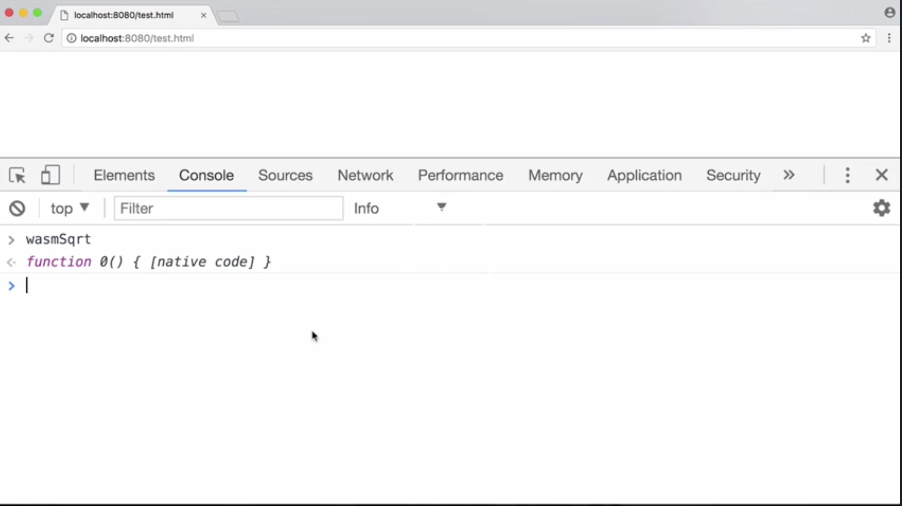

In this lesson, we're going to look at how to create a very simple **WebAssembly** function. In this example, a function that'll take the square root of a number. As you can see here, this function is running as native **WebAssembly** code in the browser, and we can call it to get the square root.



I'm going to be using a project called **WebAssembly Explorer**. This allows us to write pure **WebAssembly** code, directly in the browser, to get a binary that we can use in our application.

Let's jump straight in. Every **WebAssembly** file starts with a `module` declaration. We then need to create our `$sqrt` function itself. We can do this through a function declaration. We give the function a name and then inside of the function, we have to say what parameters and return values the function has.

```
(module
	(func #sqrt
		()
	)
)
```

For our `$sqrt` function, we're going to have a single parameter, which we can label num. The type of this parameter is a decimal type, so we're going to use the **float32** number representation in memory. This means it's a 32-bit floating point number.

The `result` type is also going to be the same `f32` output of the square root value. The parameter's written. We can now write the body of the function. We want to take the `f32.sqrt` of the `$num`. The way we read that parameter is by using the `get_local` function.

We can then reference the `$num` by the label we gave it. 

```
(module
	(func #sqrt
		(param #num f32)
		(result f32)

		(f32.sqrt (get_local $num))
	)
)
```

We're reading the parameter value, passing it the `$sqrt` function, and the `result` is going to just sit over here at the end of the function and will naturally become the return value. It's the correct type because it's already a `f32`.

To actually be able to use this function, we want to expose it to JavaScript. The way we do this is with an `export` declaration in the **WebAssembly** `module`. We can give the `export` a name, say, `$sqrt`. Then we reference the function by the function label we gave it further down, just like you would exporting a function in JavaScript.

```
(module
	(export "sqrt" (func $sqrt))
	(func #sqrt
		(param #num f32)
		(result f32)

		(f32.sqrt (get_local $num))
	)
)
```

Now we can assemble the binary using the in-browser tool, and then we can also download the binary to our file system. Moving this downloaded **WebAssembly** file to our main project folder, we can then edit our html file to load the **WebAssembly** binary.


In order to load the **WebAssembly** in the browser, we're going to need to `fetch` and compile it ourselves. We're going to use the `fetch` function in the browser to `fetch` the **WebAssembly** binary. That gives us back a promise for the response. We need to check that the response is `ok` and if so, we can return the `arrayBuffer()` from the response.

This is because **WebAssembly** is a binary format, so we want to use the raw binary `bytes`. Let's also add a nice error message if the response is not `ok`. This returns back those raw `bytes`, which we can then use the JavaScript **WebAssembly** API to `compile` into a **WebAssembly** `module`.

```jsx
<!doctype html>
	<title>WASM Test</title>
	<script>
		fetch('./test.wasm')
		.then(res => {
			if (res.ok)
				return res.arrayBuffer();
			throw new Error('Unable to fetch WASM.');
		})
		.then(bytes => {
			return WebAssembly.compile(bytes);
		})
		.then(module => {
			return WebAssembly.instantiate(module);
		})
	</script>
```

The promise for the `module` comes back, and we then need to actually instantiate this to get a **WebAssembly** `module` instance, so we use `WebAssembly.instantiate`. The `instance` then contains an `export`s property, which contains all our exports and bindings from the **WebAssembly** `module`.

```jsx
<!doctype html>
	<title>WASM Test</title>
	<script>
		fetch('./test.wasm')
		.then(res => {
			if (res.ok)
				return res.arrayBuffer();
			throw new Error('Unable to fetch WASM.');
		})
		.then(bytes => {
			return WebAssembly.compile(bytes);
		})
		.then(module => {
			return WebAssembly.instantiate(module);
		})
		.then(instance => {
			window.wasmSqrt = instance.exports.sqrt;
		})
	</script>
```

I'm going to pick out `$sqrt` function off the `export`s and write it to the window object. We can now see our **WebAssembly** function in the browser.

### Console
```
> wasmSqrt
< f 0() { [native code] }
```