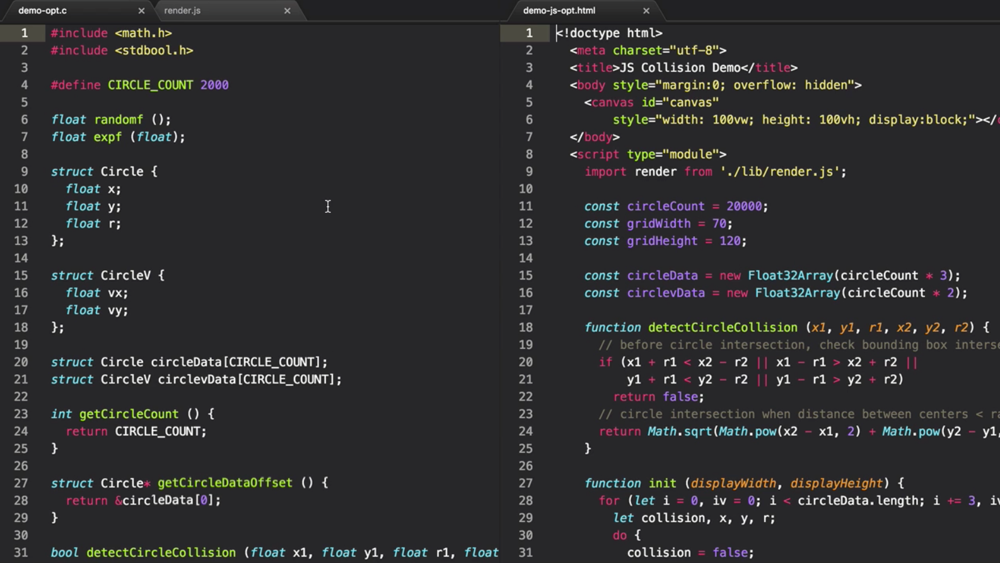

On the right of the screen over here, I've got the optimized JS collision detection algorithm. On the left, we've got the C code for the unoptimized version. I'm going to bring across the optimizations from the JS version into the C code so we can get our optimized collision algorithm in WebAssembly to compare the performance.



If you're not very familiar with C programming, please don't worry if you don't follow every single detail here.

The first difference between the two is on the right. I've got this `gridWidth` and `gridHeight` being defined after the `circleCount`. I'm going to define those in the C code.

####C Code
```cpp
#define CIRCLE_COUNT 2000 
#define GRID_WIDTH 70
#define GRID_HEIGHT 120
```

The rest of the code for the grid optimization is in a `timeStep` function. We create the `grid`, initialize the `grid`, and then we start assigning the circles that belong to that cell in the `grid`.

Starting with the initialization, we can create a `grid` in C using a multi-dimensional array of the `GRID_WIDTH` and `GRID_HEIGHT`. This will give us the same thing that we had in JavaScript, but the value of each `grid` cell in C can't just be an arbitrary array of circles in that `grid` cell because we don't have arbitrary length arrays in C.

The legacy option would be to just assign the maximum amount of memory. We could say that there's never going to be more than a thousand circles in a given `grid` cell, and so we just make every `grid` cell an array of a thousand circles.

The reference for each circle that we used in the JS code is that each circle was referenced by its integer index, so we'll have a thousand integers per `grid` cell. This is a terrible waste of memory, though.

Instead, a better data structure that we can use is a linked list. The principle of a linked list is that instead of storing the index of the circle for each cell, we create a record data type which contains that index, and then also has a pointer to another record for the next record in that cell.

The pointer is a memory reference to another record of exactly the same type. When we no longer point to anything else, we know we've reached the end of the list. This way, any number of individual circles can be referenced from a single `grid` cell.

####C Code
```cpp
struct CellCircle {
	int circleindex;
	struct CellCircle* next; 
}
```

The `CellCircle` records then need their own place to be stored in memory. I'm going to initialize a set length of them using an array. A given circle is never going to belong to more than four `grid` cells at a time due to the design on the `grid` size.

The amount of memory I'll set aside for this is the number of circles times four, as we'll never have more records than that. 

####C Code
```cpp
struct CellCircle cellCircles[CIRCLE_COUNT * 4];
```

The `grid` itself now becomes the first layer of our linked list. Each `grid` cell corresponds to a pointer into the first record. From that record, we can follow the next cell records to get the full list of circles in a given cell.

####C Code
```cpp
struct CellCircle cellCircles[CIRCLE_COUNT * 4];
struct CellCircle* grid[GRID_WIDTH][GRID_HEIGHT];
```

That completes the data structuring. We can now move on to the initialization step.

The loop over the `grid` cells remains much the same except we don't have to cache the columns anymore for performance. To set the individual `grid` cells to an empty list initially, I'm going to use the `NULL` pointer. This is a zero-memory reference. To use this, I'm going to have to include `<stddef.h>` from the header files.

####C Code
```cpp 
void timeStep(float displayWidth, float displayHeight) {
	for (int p = 0; p < GRID_WIDTH; p++) {
		for (int q = 0; q < GRID_HEIGHT; q++) {
			grid[p][q] = NULL;
		}
	}

	...
}
```

Next, we move on to the code that allocates each circle to a `grid` cell. I'll copy that indirectly and update it to represent valid C code.

We determine the cell range of the current circle, and then loop through that range, assigning it to each of those `grid` cells. The assignment we'd like to be making here is to set a new record into the `grid` to represent this circle within the cell. In most cases, there'll already be a record in place.

####C Code
```cpp
int leftCol = floorf((xi - ri) / displayWidth * gridWidth);
int rightCol = floorf((xi + ri) / displayWidth * gridWidth);
int topRow = floorf((yi - ri) / displayHeight * gridHeight);
int bottomRow = floorf((yi + ri) / displayHeight * gridHeight);

if (leftCol < 0)
	leftCol = 0;
if (rightCol >= gridWidth)
	rightCol = gridWidth - 1;
if (topRow < 0)
	leftCol = 0;
if (bottomRow >= gridHeight)
	bottomRow = gridHeight - 1;

for (int p = leftCol; p <= rightCol; p++) {
	for (int q = topRow; q <= bottomRow; q++) {
		grid[p][q] = cellCircle;
	}
}
```

This is where the linked list comes in. We have to set the next value of the current record to the last record that was in place. We chain on and amend the list each time. The record also contains the index of the current circle.

####C Code
```cpp
for (int p = leftCol; p <= rightCol; p++) {
	for (int q = topRow; q <= bottomRow; q++) {
		cellCircle.circleIndex = i;
		cellCircle.next = grid[p][q];
		grid[p][q] = cellCircle;
	}
}
```

The `CellCircle` record is instantiated as a struct. I've glossed over a detail here, in that the `grid` values were memory addresses of the individual `CellCircle` records. This needs to be a pointer, and then we need to use the pointer struct to access for these assignments.

####C Code
```cpp
for (int p = leftCol; p <= rightCol; p++) {
	for (int q = topRow; q <= bottomRow; q++) {
		struct CellCircle* cellCircle;
		cellCircle->circleIndex = i;
		cellCircle->next = grid[p][q];
		grid[p][q] = cellCircle;
	}
}
```

What does this pointer point to, or we already allocated all the space in memory for the `cellCircles` as the `cellCircles` array? The pointer can be set to reference an exact record in this memory. Ideally, we want to allocate from the first record to the last.

####C Code
```cpp
for (int p = leftCol; p <= rightCol; p++) {
	for (int q = topRow; q <= bottomRow; q++) {
		struct CellCircle* cellCircle = &cellCircles[0];
		cellCircle->circleIndex = i;
		cellCircle->next = grid[p][q];
		grid[p][q] = cellCircle;
	}
}
```

I'm going to create a counter that allows me to determine how many we've allocated, and then we know the next one is just at that count, which we can then increment each time. `int cellCircleCount = 0;`

####C Code
```cpp
for (int p = leftCol; p <= rightCol; p++) {
	for (int q = topRow; q <= bottomRow; q++) {
		struct CellCircle* cellCircle = &cellCircles[cellCircleCount++];
		cellCircle->circleIndex = i;
		cellCircle->next = grid[p][q];
		grid[p][q] = cellCircle;
	}
}
```

For the collision detection algorithm, I'm going to copy the loop over all of the `grid` cells from the JS optimized version and update that to the C code. Let me just correct those `gridWidth` and `gridHeight` names to be `GRID_WIDTH` and `GRID_HEIGHT` as well.

####C Code
```cpp
for (int p = 0; p < GRID_WIDTH; p++) {
	for (int q = 0; q < GRID_HEIGHT; q++) {
		const cell = col[q];

		for (let k = 0; k < cell.length; k++)
	}
}
```

When reading the `grid` cell, this is now the pointer to our `CellCircle` record. We're going to instantiate that struct pointer. Looping over all the records means looping over those next values. Using a `while` loop, we can then keep updating the individual `CellCircle` record to the next record in the list.

####C Code
```cpp
for (int p = 0; p < GRID_WIDTH; p++) {
	for (int q = 0; q < GRID_HEIGHT; q++) {
		struct CellCircle* iCellCircle = grid[p][q];

		while (iCellCircle) {
			iCellCircle = iCellCircle->next
		}
	}
}
```

Copying over the inner part of the loop, I'll update these valuables for the index position and velocity values of the current circle. For the loop over all of the next circles in the cell, I'm going to start with the `jCellCircle` equal to exactly the `iCellCircle`.

In the `while` statement itself, I'll update to the `next` value and check that it's not the `NULL` reference before continuing the loop. This way, the JS circle that we're comparing with is the one after the current circle, as it should be, and it's a little bit less code to write in the loop.

####C Code
```cpp
for (int p = 0; p < GRID_WIDTH; p++) {
    for (int q = 0; q < GRID_HEIGHT; q++) {
      struct CellCircle* iCellCircle = grid[p][q];

      while (iCellCircle) {
        int i = iCellCircle->circleIndex;

        float xi = circleData[i].x;
        float yi = circleData[i].y;
        float ri = circleData[i].r;

        float vxi = circlevData[i].vx;
        float vyi = circlevData[i].vy;

        struct CellCircle* jCellCircle = iCellCircle;
        while ((jCellCircle = jCellCircle->next)) {
        	int j = jCellCircle->circleIndex;

        	
        }
    }
  }
```

With the optimization loops complete, lastly, we need to include the collision detection code, which is already in C. Once that's in place, the optimization is complete.

Upping the circle count before compiling, let's now compare the performance. The WebAssembly version on the right is now faster than the JavaScript version on the left. It's our ability to create more efficient data structures in WebAssembly that gives us the true performance benefits.