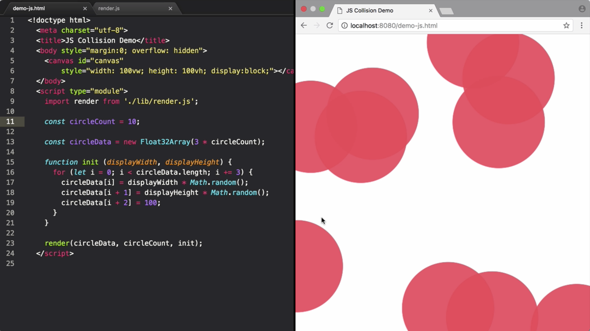

We're going to use a typed array to `render` a number of circles directly into the page with incredibly high performance. We've got a `<canvas>` inside the `<body>` and then I'm importing a `render` function from a local `render` module, which we're just going to treat as a black box.

```jsx
<!doctype html>
	<meta charset="UTF-8">
	<title>JS Collision Demo</title>
	<body style="margin:0; overflow: hidden"> 
		<canvas id="canvas"
			style="width: 100vw; height: 100vw; display:block;"></canvas>
	</body>
	<script type="module">
		import render from './lib/render.js';


		render(circleData, circleCount)
	</script>
```

This `render` function takes the `circleData` as its first argument and the `circleCount` as the second argument. As a first example let's just `render` a single circle.

That `circleData` is then exactly our typed array which represents its position and size on the screen. This position data is decimal data, and so uses the "float data" type memory. Each circle is based on three numbers; its x value, its y value and its radius.

```jsx
const circleCount = 1;

const circleData = new Float32Array(3);
```

Which are each going to be this 32-bit floating point numbers. Let's set the circle initially, where its x value is at zero, its y value is at zero and its third slot, the radius, is set to 100. That typed array data then gets copied straight to the graphics card and drawn to the screen.

```jsx
circleData[0] = 0;
circleData[1] = 1;
circleData[2] = 100;
```

Let's position the circle randomly within the page. The third argument to the `render` function is an `init` method. Which will get the `displayWidth` and the `displayHeight` as convenience arguments. We can then move our assignment of the circle positions to within this `init` function.

```jsx
funciton init (displayWidth, displayHeight) {
	circleData[0] = displayWidth * Math.random(); 
	circleData[1] = displayHeight * Math.random();
	circleData[2] = 100;
}
```

Set the x value to a random point within the width of the page and the y value to a random point within the height of the page. To then draw any `circleCount` we need to make our `init` function depending on the circle counts.

On our initial data allocation we're going to allocate an x, y and r value, times the `circleCount`. Within the `init` function we can do a loop from the first data points of the first circle, through to the last data point of the last circle, incrementing three points at a time for each circle.

```jsx
const circleData = new Float32Array(3 * circleCount);

funciton init (displayWidth, displayHeight) {
	for (let i = 0; i < circleData.length; i += 3) {
		circleData[i] = displayWidth * Math.random(); 
		circleData[i + 1] = displayHeight * Math.random();
		circleData[i + 2] = 100;
	}	
}
```

I can then update the indices to be relative to the current circle. Let's try rendering 10 circles. To add dynamics, the fourth argument to our random function is a `timeStep` function.



This has the same signature as our initialization function, except it allows us to then modify the data positions on each frame. If we just re-randomize the positions we'll get something quite catastrophic, although it's no problem at all for the WebGL renderer.

```jsx
funciton timeStep (displayWidth, displayHeight) {
	for (let i = 0; i < circleData.length; i += 3) {
		circleData[i] = displayWidth * Math.random(); 
		circleData[i + 1] = displayHeight * Math.random();
		circleData[i + 2] = 100;
	}	
}

render(circleData, circleCount, init, timeStep);
```

To properly have dynamic movement we want to store the velocities as another data points substantiated with the circle, as well as its x, y and r value.

We can't include this in our current `circleData` because this represents a single piece of continuous memory that's sent to the GPU on `render`, and it needs to be as compact as possible to only send what's necessary for rendering, in order to get the best performance.

```jsx
const circleData = new Float32Array(3 * circleCount);
```

We're actually going to create a separate typed array which is going to contain the velocity values. We just need to have two values within this `Float32Array`. They're still 32-bit floats because they're decimal values. Now on our initialization function we can set the velocities to random x and y components.

```jsx
circlevData = new Float32Array(2 * circleCount);

funciton init (displayWidth, displayHeight) {
	for (let i = 0; iv = 0; i < circleData.length; i += 3; iv += 2) {
		circleData[i] = displayWidth * Math.random(); 
		circleData[i + 1] = displayHeight * Math.random();
		circleData[i + 2] = 100;

		circlevData[iv] = Math.random() - 0.5;
	}	
}
```

In order to index the velocities we're going to need a new index counter. Because the velocities move in sequences of two we need to index through in an order of two for these.

```jsx
circlevData = new Float32Array(2 * circleCount);

funciton init (displayWidth, displayHeight) {
	for (let i = 0; iv = 0; i < circleData.length; i += 3; iv += 2) {
		circleData[i] = displayWidth * Math.random(); 
		circleData[i + 1] = displayHeight * Math.random();
		circleData[i + 2] = 100;

		circlevData[iv] = Math.random() - 0.5;
		circlevData[iv + 1] = Math.random() - 0.5;
	}	
}
```

In our `timeStep` function we're going to increment the x and y components by the velocity values. Convey again at the separate increment of two for the velocities array. I'm just going to remove these unnecessary re-assignments and add some x detection.

If the x value of the circle is `>` `displayWidth` or `<` zero, we're going to flip the x component of the velocity, and the same for the y component. We can polish up the exact balance later. For now let's test the performance.

```jsx
 function timeStep (displayWidth, displayHeight) {
      for (let i = 0, iv = 0; i < circleData.length; i += 3, iv += 2) {
        circleData[i] += circlevData[iv];
        circleData[i + 1] += circleData[iv + 1]

        if (circleData[i] > displayWidth || circleData[i] < 0)
          circleData[iv] = -circleData[iv];
        if (circleData[i + 1] > displayHeight || circleData[i + 1] < 0)
          circleData[iv + 1] = -circleData[iv + 1];
      }
    }
```

Decreasing the circle radius, let's start upping that circle count. Lowering the radius again we can try 1,000. Or 10,000. Lowering it even further we can see if we can get to 100,000. Or even a million circles being rendered.

By using typed arrays and various simple operations in JavaScript, we've been able to write very, very low-level code that acts directly on top of memory. Combined with the WebGL renderer, this is what gets us the incredible performance.