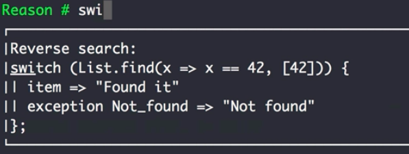

Instructor: [00:00] In this course, we're going to focus on the core language. To do so, we're going to install the Reason CLI tool globally. Up-to-date instructions, which command to run, can be found at the Reason [website](https://reasonml.github.io/docs/en/global-installation.html), navigating to global installation. 

[00:14] I'll copy and paste the command in the terminal and run it. 

#### Terminal
```bash
npm install -g reason-cli@3.1.0-darwin
```

This installs a handfull of tools, like Reformat and Merlin. Just import Reason in your editor. Also, the interactive command line tool, RTOP. RTOP is the perfect companion for us trying out the language. Let's get started, and give it a try. 

```bash
$ rtop
```

[00:34] We type in `1 + 1;`, and hit enter to evaluate the line, and see the result. 

```
Reason # 1 + 1;
- : int = 2
```

In RTOP, the output of every evaluation consists of three parts. The most left part indicates a `let binding`, which I will explain in a coming lesson. It is followed by a colon and the `type definition`. 

[00:54] Next comes an equals sign with the result of the evaluated code. 

```
let binding: type definition = result of the evaluated code;
```

In RTOP, the semicolon also triggers evaluation, but semicolons are also a required part of the language to separate imperative statements. As you might already have noticed, there's a list always below. It autocompletes with possible options of modules and functions we can use. 

[01:17] By the way, when we `print` out the value, we see the value, and then the output of the evaluation. Depending on the print function, it can be the same or the next line. 

```
Reason # print_int(42);
42 - : unit = ()
```

What's also really useful is reverse search in RTOP, even across multiple sessions. Press 'Control+R', and we can search for the history. 



[01:37] Regarding editor support, I recommend to check out the [website](https://reasonml.github.io/docs/en/editor-plugins.html) instructions. Whatever editor you decide to go with, I highly recommend enabling Reformat, which autoformats your code. Now, you are familiar with the basic tooling, and we can get started exploring the language.