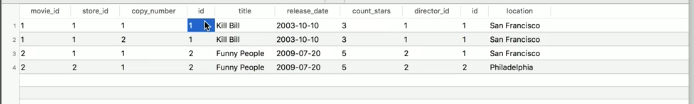
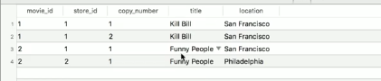
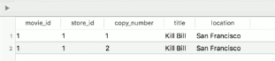
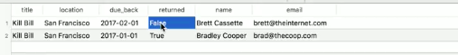
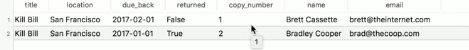

We have a movie rental store with rentable `movies` and `rentings`. We want to see all of our renting information in one place. We're going to `SELECT * FROM rentable_movies`. We're going to `JOIN` that to the `movies` table, so we can see these two things together in action.

```sql
SELECT *
FROM rentable_movies
INNER JOIN movies
```

We use an `ON` statement to say which of these fields is the same, so that the `id` column in the `movies` table is supposed to be equal to the `rentable_movies`' `movie_id` column.

```sql
SELECT *
FROM rentable_movies
INNER JOIN movies
ON movies.id=rentable_movies.movie_id;
```

We can see what this looks like. It looks like you just smashed the `rentable_movies` table, which we'll remember is this `movie_id`, `store_id`, and `copy_number` -- that's what's over here -- in with the `movies` table. The `movies` table has its `id`, `title`, `release_date`, `count_stars`, `director_id`. You just smooshed those two things together.


Pretty straightforward, but we want to ultimately get to the `rentings`, so let's get some store information here. The `stores`, and we'll say on `stores.id=rentable_movies.store_id;` column, but we see here it doesn't matter how many inner joins we make. We can just keep smooshing them onto the end here.

```sql
SELECT *
FROM rentable_movies
INNER JOIN movies
ON movies.id=rentable_movies.movie_id
INNER JOIN stores
ON stores.id=rentable_movies.store_id;
```



We start getting our IDs mixed up. We see that stuff is conflicting. Let's just take the information that we want. Let's take all of the `rentable_movies`columns, all of these guys here. Then we'll say maybe we'll get `movies.title` and we'll get the `stores.location`. We have that information here.

```sql
SELECT rentable_movies.*,
movies.title,
stores.location
FROM rentable_movies
INNER JOIN movies
ON movies.id=rentable_movies.movie_id
INNER JOIN stores
ON stores.id=rentable_movies.store_id;
```



This is the `title` that was rented. This is the `location` it was rented in, so the `copy_number` of that. If we remember, the `rentings` table is a little bit more complicated. `rentings` has a primary key that is built up of the `movie_id`, the `store_id`, and the `copy_number`, which is the same as this information. We're going to have to make a **compound INNER JOIN** here.

```sql
SELECT rentable_movies.*,
movies.title,
stores.location
FROM rentable_movies
INNER JOIN movies
ON movies.id=rentable_movies.movie_id
INNER JOIN stores
ON stores.id=rentable_movies.store_id
INNER JOIN rentings
ON (

);
```

Let's say `rentings.movie_id=rentable_movies.movie_id AND`. Copy this. The `store_id`s are equal and `copy_number`s are the same. This will give us all of the `rentings` for each of these individual rentable `movies` and there could be multiples here.

```sql
SELECT rentable_movies.*,
movies.title,
stores.location
FROM rentable_movies
INNER JOIN movies
ON movies.id=rentable_movies.movie_id
INNER JOIN stores
ON stores.id=rentable_movies.store_id
INNER JOIN rentings
ON (
  rentings.movie_id=rentable_movies.movie_id AND
  rentings.store_id=rentable_movies.store_id AND
  rentings.copy_number=rentable_movies.copy_number 
);
```



What an `INNER JOIN` does is it only finds intersecting data. There were only actually two `rentings` in our `rentings` table, which is why some `rentable_movies` that were never rented didn't get sent back to us. We didn't return anything about that.

Let's also give us all the `rentings` information. We have the `guest_id`, all this information. I don't think we really want all that, so let's just take `due_back`, let's take `rentings.returned`. We've got that.

```sql
SELECT rentable_movies.*,
movies.title,
stores.location,
rentings.due_back,
rentings.returned
FROM rentable_movies
INNER JOIN movies
ON movies.id=rentable_movies.movie_id
INNER JOIN stores
ON stores.id=rentable_movies.store_id
INNER JOIN rentings
ON (
  rentings.movie_id=rentable_movies.movie_id AND
  rentings.store_id=rentable_movies.store_id AND
  rentings.copy_number=rentable_movies.copy_number 
)

```


We also probably want to know some information about the guest. Let's `INNER JOIN` into the `guests` table, `ON guests.id=rentings.guest_id;`. Let's take `guests.name` and `guests.email`, so we know who has the movie.

```sql
SELECT rentable_movies.*,
movies.title,
stores.location,
rentings.due_back,
rentings.returned,
guests.name,
guests.email
FROM rentable_movies
INNER JOIN movies
ON movies.id=rentable_movies.movie_id;
INNER JOIN stores
ON stores.id=rentable_movies.store_id;
INNER JOIN rentings
ON (
  rentings.movie_id=rentable_movies.movie_id AND
  rentings.store_id=rentable_movies.store_id AND
  rentings.copy_number=rentable_movies.copy_number 
)
INNER JOIN guests
ON guests.id=rentings.guest_id;
```

This is really cool. We've built up this custom view that gives us all of the information about the `rentings`. At this point, we don't even need all this information for `rentable_movies`.

```sql
SELECT movies.title,
stores.location,
rentings.due_back,
...
```

Let's rerun this. This is the information we want. We know that I've got a copy of "Kill Bill" and that it's due back on some date in 2017 and that I haven't returned it.



We know, apparently, this is a famous video store because Bradley Cooper is here too. He has actually returned a copy of Kill Bill. It does matter for us to get a `rentable_movies.copy_number` because these are two different `movies`here. Now we have the `copy_number` as well.

```sql
SELECT rentable_movies.*,
movies.title,
stores.location,
rentings.due_back,
rentings.returned,
rentable_movies.copy_number,
guests.name,
guests.email
FROM rentable_movies
INNER JOIN movies
ON movies.id=rentable_movies.movie_id;
INNER JOIN stores
ON stores.id=rentable_movies.store_id;
INNER JOIN rentings
ON (
  rentings.movie_id=rentable_movies.movie_id AND
  rentings.store_id=rentable_movies.store_id AND
  rentings.copy_number=rentable_movies.copy_number 
)
INNER JOIN guests
ON guests.id=rentings.guest_id;
```

