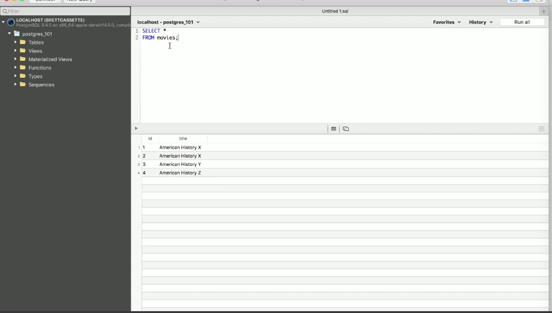

We'll look at getting distinct information, today. Create a movies' table. We'll `INSERT` a couple of titles here. "American History X" gets inserted twice.

```sql
CREATE TABLE movies (
  id SERIAL NOT NULL,
  title character varying(200)
);

INSERT INTO movies (title) VALUES
(
  'American History X'
),
(
  'American History X'
),
(
  'American History Y'
),
(
  'American History Z'
);
```

Maybe, that's OK. Maybe, you can have multiple American History Xs as long as they have different dates. If we `SELECT *` all of this right now, we'll see that we have two American History Xs listed in here.



What do we do, though, if we want to get distinct titles? We just `SELECT distinct title`. Now, we have different titles, probably still want to make sure that they are in order.

```sql
SELECT distinct title
FROM movies
ORDER BY 1 
```

We can also do other things, like we can count the number of distinct titles. This is something that's composable with other functions. There, we have three.

```sql
SELECT COUNT(distinct title)
FROM movies
```