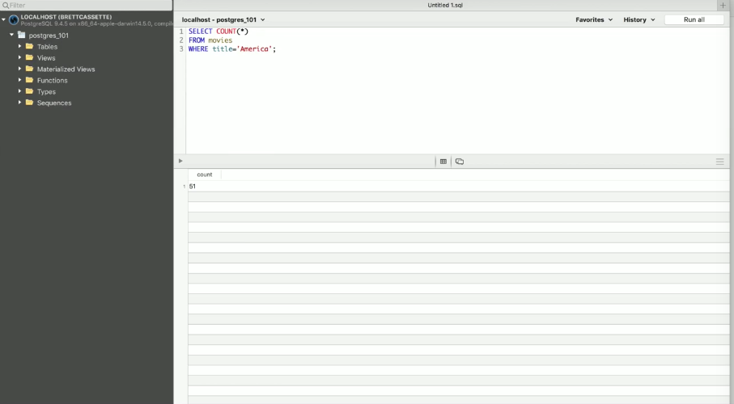
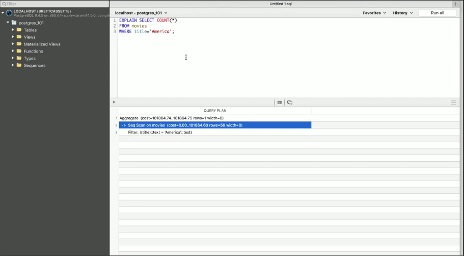
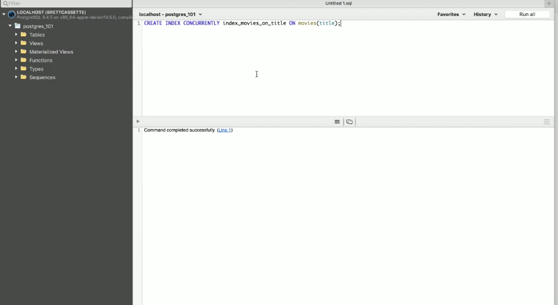
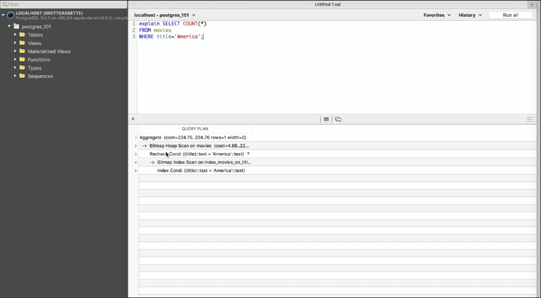

We've got a table that's pretty small by table standards, honestly, called `movies`, but we've given it about three million rows and there's instructions on how to set this up, you have the data. We want to perform some queries over the `movies` where the `title='America'`. Maybe there's a movie called `'America'`. It's `51`.



You saw a little bit of a lag there. That's probably the first time that you saw a lag like that. It's still running in less than a second, but that is a really long time on a database. Especially on production databases, where you have a lot of people contending for resources, you don't want something like this, because it will take down your entire system.

The reason that this is running so slowly is because we don't have an `INDEX`. We can find that out with an `EXPLAIN` statement. We can see here that this is doing a sequential scan on the `movies`, which means it's going through each movie in order and looking at the `title` `'America'` and saying, "Is that your `title`?"



That's really, really slow. We can perform this a few more times, see that it does take in fact quite a long time. What we want to do is add an `INDEX` here. We're going to `CREATE INDEX`. We're going to do this `CONCURRENTLY`. This is really, really important. Postgres gives us the ability to add in an `INDEX` without taking out any locks on the database.

```sql
CREATE INDEX CONCURRENTLY
```

If you can do this and you're on a production machine, you should do it. You absolutely should do it. You can do it in Postgres. Let's do that. We'll `index_movies_on_title`. That's the name of the `INDEX`. So `ON movies(title);`.

```sql
CREATE INDEX CONCURRENTLY index_movies_on_title ON movies(title);
```

Now, it has to go through and build that `INDEX`, which is going to take a little bit of time.



That took about a minute and a half. Now if we do the same thing, OK, cool. That finished in a much shorter period of time.

```sql
explain SELECT COUNT(*)
FROM movies
WHERE title='AMERICA';
```



Here, we can see what this looks like. We see that now it's actually using the `INDEX` condition, which is going to be a much, much faster way to look this up.