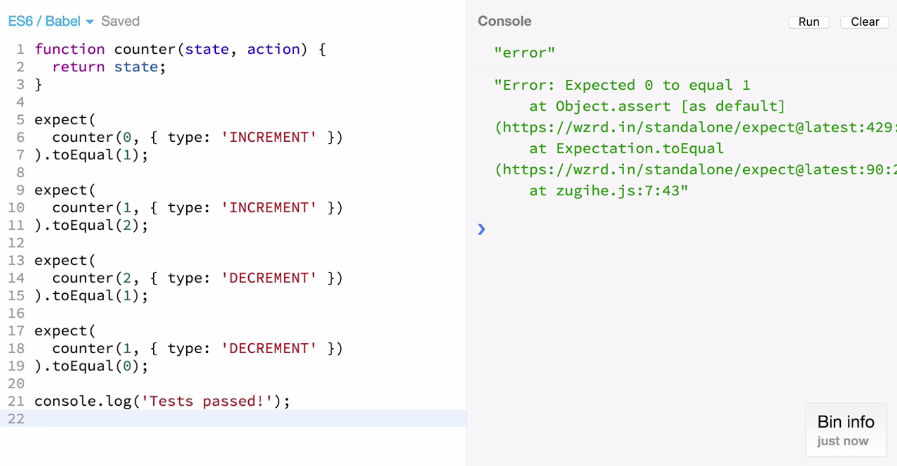
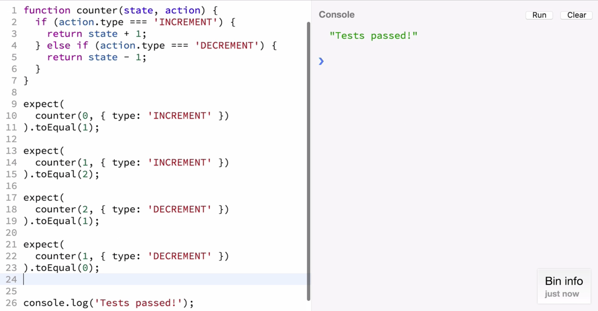

The first function we're going to write is the **reducer** for the counter example. Reducer accepts state and action as arguments and returns the next state. Before jumping into the implementation, we're going to make certain assertions using Michael Jackson's Expect library. We're going to assert that when the state of the counter is zero and you pass an `INCREMENT` action it should return one. Similarly it should return two when this state is one and you `INCREMENT`.

``` javascript
function counter(state, action){
  return state;
}
// Tests
expect(
  counter(0, { type: 'INCREMENT' })
).toEqual(1);

expect(
  counter(1, { type: 'INCREMENT' })
).toEqual(2);

expect(
  counter(2, { type: 'DECREMENT' })
).toEqual(1);

expect(
  counter(1, { type: 'DECREMENT' })
).toEqual(0);

expect(
  counter(1,{ type: 'SOMETHING_ELSE' })
).toEqual(1);

console.log('Tests passed!')
```

We're going to add a couple of tests that test how `DECREMENT` works, which is that it decrements from two to one and from one to zero and we're going to add a log to tell if our tests are successful.



If you ran this test, they're actually going to fail because we haven't even begun to implement our reducer. We're going to start by checking the `action.type` and if the `action.type` is `INCREMENT` we're going to return state plus one, but if it is `DECREMENT` we're going to return state minus one.
``` javascript
function counter(state, action) {
  if(action.type === 'INCREMENT'){
    return state + 1;
  } else if (action.type === 'DECREMENT') {
    return state - 1;
  }
}
```
If you run the tests we will find that this is enough to get them to pass. However, there are still some flaws in our current implementation of the **counter reducer**. For example, I think that if we **dispatch** an action that it does not understand, it should return the **current state** of the application.



However, if we check for that we will see that this test fails, because we currently don't handle **unknown actions**. I'm going to add an else clause that returns the **current state**. The tests pass now.
``` javascript
else {
  return state;
}
```
Another issue is that while the **reducer** is normally in control of the application state, currently it does not specify the **initial state**. In the case of counter example that would be zero. The convention we use in **Redux** is that if the reducer receives `undefined` as the state argument, it must return what it considers to be the initial state of the application. In this case it will be zero.
``` javascript
function counter(state, action) {
  if (typeof state === 'undefined'){
    return 0;
  }
}

expect(
  counter(undefined, {})
).toEqual(0);
```
Now come a few cosmetic tweaks. I'll replace this bunch of tweaks with a **switch statement** and I'm going to replace this condition with **ES6** default argument, which looks better. I'm also going to replace the function declaration with an **arrow function**, which has clearer semantics in ES6.
``` javascript
const counter = (state = 0, action) => {
  switch (action.type) {
    case 'INCREMENT':
      return state + 1;
    case 'DECREMENT':
      return state - 1;
    default:
      return state;
  }
}
```
