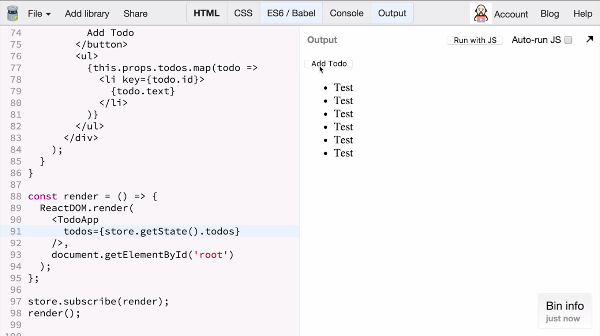
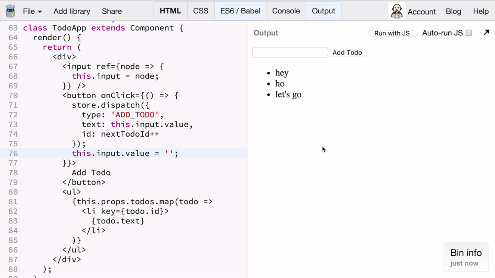

In the previous lessons, we learned how to split the root registers into many smaller registers that manage parts of the stream tree.

We have a ready ToDo app reducer that handles all the actions of our simple ToDo application. Now it's trying to implement the View layer. I'm going to use **React** in this example.

I'm adding **react** and **react-dom** packages from the Facebook CDN. I'm also adding a div with the ID root, which is where I'm going to **render** my react application.

# javascript
``` javascript
const render = () => {

};

store.subscribe(render);
render();
```

# html
```html
<body>
  <div id='root'></div>
</body>
```

Similar to the react counter-example from the eighth lesson, I declare a **render function** that is going to update dom in response to the current application state. I'm going to subscribe to these core changes and call render whenever the store changes and wants to render the initial state.

The implementation of the render method is going to use react, so it's called `ReactDOM.render` for some to-do app component I haven't written yet. It renders it into the div I created inside the HTML. It's div with the ID called "root".

``` javascript
const render = () => {
  ReactDOM.render(
    <TodoApp />,
    document.getElementById('root')
  );
};

```
**React** provides a base class for all components. I'm grabbing from the react object called **reactComponent**. I'm declaring my own `ToDoApp` component that extends the react-based component. This component is only going to have a render function and is going to return a `div`. Inside the div, I'm going to place a button saying add todo them.

``` javascript
const { Component } = React;

let nextTodoId = 0;
class TodoApp extends Component {
  render() {
    return (
      <div>
        <button onClick={() => {
          store.dispatch({
            type: 'ADD_TODO',
            text: 'Test',
            id: nextTodoId++
          });
        }}>
          Add Todo
        </button>
      </div>
    );
  }
}
```

I don't want to add an input field yet to keep the example simple at first. I'm dispatching the out ToDo action, and I'm going to put a test as my checks for the action. It's going to keep adding to this with the products test.

The ID, I need to specify a sequential ID. This is why I'm declaring an global variable called `NextToID`, and I'm going to keep in command in it. Every time, it's going to emit a new id.

I also want to display a list of the ToDo list. Assuming that I have the ToDos inject as ToDos prop, I'll call map and for every ToDo item, I'm going to show a list item show in the text of that particular ToDo.

``` javascript
<ul>
  {this.props.todos.map(todo =>
    <li key={todo.id}>
      {todo.text}
    </li>
   )}
</ul>
```

Finally, because I need to the ToDo as a prop, I'm going to pass it to the `TodoApp` by reading the currents chores straight and written its ToDo field.

``` javascript
  <TodoApp todos={store.getState().todos} />
```



You can see that there is a button at ToDo and anytime I press it, I see a new ToDo with a test text. I'm going to add an input inside my render function, and I'm using the react callback ref API where ref is a function, it gets the note corresponding to the ref, and I'm saving that note with some name. In this case, this.input.

``` javascript
<input ref={node => {
  this.input = node;
}}

<button onClick={() => {
  store.dispatch({
    type: 'ADD_TODO',
    text: this.input.value,
    id: nextTodoId++
  });
  this.input.value = '';
}}>
```

I'm able to read the value of the input inside my event handler. I'm reading this job input that value. I'm also able to reserve the value after dispatching the action so that the field is cleared. If I try write something to build and press AddtoDo, the AddtoDo action is dispatched and the field is cleared.



<a class="jsbin-embed" href="https://jsbin.com/poguse/3/embed?js,console">JS Bin on jsbin.com</a><script src="https://static.jsbin.com/js/embed.min.js?3.35.12"></script>

Let's take a moment to recap how this application works. It starts with a `ToDoApp` **react component**. This component is not aware of how exactly ToDos are being added. However, it can express its desire to mutate the state by dispatching an action with the type ToDo.

```javascript
<button onClick={() => {
  store.dispatch({
    type: 'ADD_TODO',
    text: this.input.value,
    id: nextTodoId++
  });
  this.input.value = '';
}}>
```

For the text field, it uses the current input value and it passes an incrementing ID as the ID of ToDo. Every ToDo needs its own ID, and in this approach, we're just going to increment the counter, so it always gives us the next integer as ID.

It is common for **react components** to dispatch actions in **Redux apps**. However, it is equally important to be able to render the current state. My `ToDoApp` component assumes that it's going to receive ToDos as a prop, and it maps over the ToDo list to display a list of them using the ID as a key.

```html
<ul>
  {this.props.todos.map(todo =>
    <li key={todo.id}>
      {todo.text}
    </li>
  )}
</ul>
```

This component is being rendered in the render function that runs any [indecipherable 4:53] changes and initially. The render function reads the current state of this chore and passes the ToDos array that it gets from the current state of this chore to do to the app component as a prop.

```javascript
const render = () => {
  ReactDOM.render(
    <TodoApp
      todos={store.getState().todos}
    />,
    document.getElementById('root')
  );
};
```

The render function is called on every store change so the ToDos prop is always up to date. This was the rendering part of the **redux** flow. Let's recap how mutations work in Redux.

Any state change is caused by a store dispatch call somewhere in the component. When an action is dispatched, this store calls the reducer it was created with, with the current state and the action being dispatched.

In our case, this is the ToDo app reducer, which we obtained by combining divisibility filter and the ToDos reducer.

It matches the action type and the switch statement. If the action type is add ToDo and indeed, it is equal to add ToDo string. In this case, it will call the child ToDo reducer, passing it undefined, because this is no state for a new ToDo that it can pass in the action.

```javascript 
case 'ADD_TODO':
  return [
    ...state,
    todo(undefined, action)
  ];
```

We have a similar state statement inside the ToDo reducer and the action type is add to-do. It returns the initial state of the to-do where the ID and text from the action and the completed field set to false.

```javascript 
case 'ADD_TODO':
  return {
    id: action.id,
    text: action.text,
    completed: false
  };
```

The ToDos reducer that called it was returned a new array with all existent items and the new item added at the very end. It adds a need to do to the current state.

Finally, the combined producer called ToDo app will use this new array as the new value for the to-dos field in the global state object. It's going to return a new state object where the ToDos field corresponds to the array with the newly-added ToDo item.

```javascript
const todoApp = combineReducers({
  todos,
  visibilityFilter
});
```

The `todoApp` reducer is the root reducer in this application. It is the one the straw was created with. Its next state is a next state of the **Redux chore**, and all the listeners are notified.

The render function is subscribed to the straw changes so it is called again, and it gets the fresh state by call and gets state and it passes the fresh ToDos to the component, re-rendering it with the new [indecipherable 7:24] .
