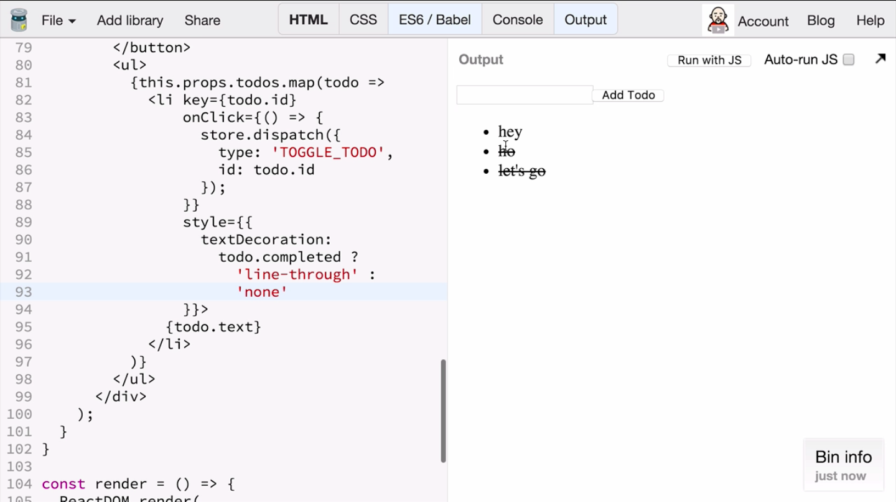

In the last lesson, we implemented a simple UI for the todo list application that is able to add new todos and view the existing todos in the list.

To add the todos, we dispatched the `ADD_TODO` action. In this lesson, we're going to dispatch the `TOGGLE_TODO` action to toggle the completed state of the todos by clicking on them.

I'm scrolling down to my **React component**. I've got a list item here corresponding to the todo, so I'm adding the on click handler. When the user clicks on the list item, I want to dispatch an action to my store with a type `TOGGLE_TODO` and the `ID` of the todo being toggled, which I get from the todo object.

The event handler knows which todo it corresponds to, so it is able to pass its `ID` in the action.

``` javascript 
<ul>
  {this.props.todos.map(todo =>
    <li key={todo.id}
        onClick={() => {
          store.dispatch({
            type: 'TOGGLE_TODO',
            id: todo.id
          });         
        }}
      {todo.text}
    </li>
  )}
</ul>
```

In the user interface, I want the completed todos to appear crossed out, so I'm adding this trial attribute to the list item. I'm going to use the text decoration property, which is going to be a line through when todo completed is `true`, and non when todo completed is `false`, so I get a normal looking todo.

``` javascript
style={{
  textDecoration:
    todo.completed ?
      'line-through' : 'none'
}}>
```

Now, if I add a couple of todos, I can click on them and they're going to appear toggled, and I can toggle them back. Isn't that satisfying?



Let's recap how toggling the todo actually works.

It starts with me dispatching the `TOGGLE_TODO` action inside my click handler, with a type `TOGGLE_TODO` and the `ID`, which is the `ID` of the todo being rendered.

```javascript
onClick={() => {
  store.dispatch({
    type: 'TOGGLE_TODO',
    id: todo.id
  });         
}}
``` 

I get the todo object as an argument to the array map call back inside my render method where I render all the todos.

When an action is dispatched, the store will call the **root reducer**, which will call the todos reducer with the array of todos and the action. In this case, the action type is `TOGGLE_TODO`, so the todos reducer delegates handling of every todo to the todo reducer with a map function to call it for every todo item. The todo reducer receives the todo as state, and the action.

```javascript 
const todos = (state = [], action) => {
  switch (action.type) {
    case 'ADD_TODO':
      return [
        ...state,
        todo(undefined, action)
      ];
    case 'TOGGLE_TODO':
      return state.map(t =>
        todo(t, action)
      );
    default:
      return state;
  }
};
```

Again, we switch on the action type, and it matches `TOGGLE_TODO` string. Now, for every todo whose `ID` does not match the `ID` specified in the action, we just return the previous state, that is the todo object, as it was.

However, if the `ID` of the todo matches the one specified in the action, we're going to return any object with all the properties of the original todo, but with the completed field equal to the opposite value of what it was.

The updated todo item will be included in the todos field under the new application state. Because we subscribe, the render function is going to get the next state of the application in store -- get state -- and pass the new version of the todos to the todo app component, which is going to render the updated todos.

Finally, this trial of the list item, the bands on the todo completed field, which we just updated, which is why it re-renders in a cross-child state.
