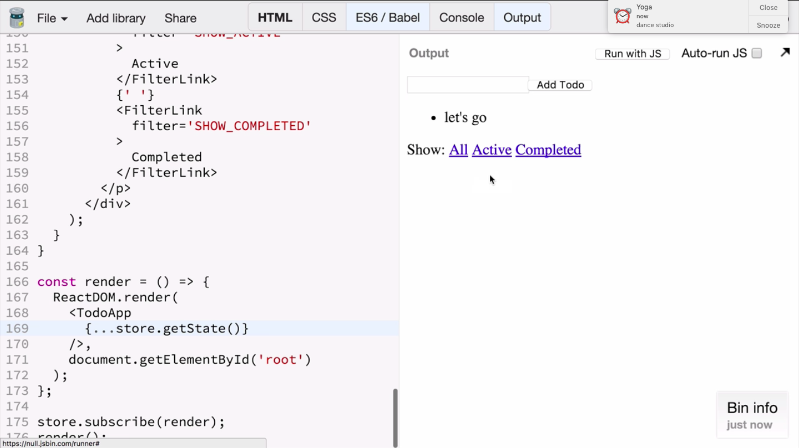

In the previous two lessons, we were working on creating the user interface for the to-do list application that displays the to-dos, lets us add new to-dos, and toggle them on click. We implemented that by dispatching add to-do and toggle to-do actions that we already know how to handle in our reducers.

<a class="jsbin-embed" href="https://jsbin.com/licape/3/embed">JS Bin on jsbin.com</a><script src="https://static.jsbin.com/js/embed.min.js?3.35.12"></script>

In this lesson, we're going to dispatch set `visibilityFilter` reaction and use the `visibilityFilter` field to only show the to-dos the user wants to see -- either the completed to-dos, active to-dos, or all to-dos in the current state.

``` javascript
const FilterLink = ({
  filter,
  children
}) => {
  return (
    <a href='#'
       onClick={e => {

       }}
    >
      {children}
    </a>
  );
};
```

I'm starting by creating a new functional component called, `FilterLink` that the user needs to click to switch the current visible to-dos. The `FilterLink` accepts the `filter` prop, which is just a string, and the children, which is the contents of the link. It's going to be a simple A tag that doesn't really link anywhere. It's going to prevent the navigation when clicked.

``` javascript
e.preventDefault();
store.dispatch({
  type: 'SET_VISIBILITY_FILTER',
  filter
});
```

It's going to dispatch an action, the type, `SET_VISIBILITY_FILTER`, and pass in the filter prop so that the reducer knows which filter is being clicked. I will pass the children down to the A tag, so the consumer can specify the text of the link. Now I can use it in my to-do app component.

Just below the to-do list, I am adding a paragraph where I'm going to offer the user the choice as to which to-dos should be currently visible by using the filter link component I just created.

The `filter` prop is one of the three possible values, such as show all, which corresponds to showing every to-do in the state, show active, which means just show the to-dos that are not completed yet, and show completed, which means show the completed to-dos. I'm copy-pasting the filter link, and I'm changing the labels and the filters corresponding to it.

``` javascript
<p>
  Show:
  {' '}
  <FilterLink
    filter='SHOW_ALL'
  >
    ALL
  </FilterLink>
  {' '}
  <FilterLink
    filter='SHOW_ACTIVE'
  >
    Active
  </FilterLink>
  {' '}
  <FilterLink
    filter='SHOW_COMPLETED'
  >
    Completed
  </FilterLink>
</p>
```

Running this code will give me three different things under the list of to-dos. Clicking on them will change the state visibility filter field. However, it doesn't have any effect yet because we don't interpret the value of the `visibilityFilter`.

I am creating a new function that is going to help me filter the to-dos according to the filter value. It's called, "get visible to-dos." It accepts two arguments, the to-dos and the filter. It switches on the current filter value.

``` javascript
const getVisibleTodos = (
  todos,
  filter
) => {
  switch (filter) {
    case 'SHOW_ALL':
      return todos;
    case 'SHOW_COMPLETED':
      return todos.filter(
        t => t.completed
      );
    case 'SHOW_ACTIVE':
      return todos.filter(
        t => !t.completed
      );
  }
}
```

If the filter is show all, it's going to return all of the to-dos. But if the filter is show completed, it's going to call `todos.filter`, that is array filter method, to only return those to-dos that have completed set to true. Show active is going to the opposite of that. It's going to return only those to-dos where a completed field is false.

Now I need to call this function to filter the to-dos before rendering them. In the **render function** of the `TodoApp` component, I get the visible to-dos by calling `getVisibleTodos` with the to-dos and the visibility filter values from my props. I'm going to use the visible to-dos instead of these props to-dos when I enumerate them for rendering.

``` javascript
const visibleTodos = getVisibleTodos(
  this.props.todos,
  this.props.visibilityFilter
);
```

Finally, I now use the visibility filter inside my `TodoApp` component, so I need to pass it as a prop.

I could do this explicitly, but actually it's easier for me just to spread over all the **state fields**. So every state field inside the state object is passed as a prop to the `TodoApp` component. This way, it receives the `visibilityFilter`. If I add some to-do items and then click on them, so I change their completed fields, and then click on the `visibilityFilter` links, the currently visible to-dos are rendered according to the chosen `visibilityFilter`.

``` javascript
<TodoApp
  {...store.getState()}
/>
```



The links look all the same right now, but we want to highlight the chosen one. To implement this, we're going to need the `visibilityFilter` prop which says which is the current one.

I'm changing the beginning of the render method to destructure the to-dos and the `visibilityFilter` from the props, so I can access them directly now without typing this .props every time. I'm going to pass the `visibilityFilter` to every filter link, so it can know which filter is the current one and apply different styling if the current filter matches the filter links' own filter.

``` javascript
const {
  todos,
  visibilityFilter
} = this.props;
const visibleTodos = getVisibleTodos(
  todos,
  visibilityFilter
);

<FilterLink
  filter='SHOW_ALL'
  currentFilter={visibilityFilter}
>
```

After passing the current filter prop to every filter link, I go back to the filter link declaration. I'm adding current filter as a prop to it, and I'm adding a condition that says that when the filter is the current filter, that is, when the link is active, I want to return a span instead of a link because I don't want it to be clickable. I want it to be static text.

``` javascript
if (filter === currentFilter) {
  return <span>{children}</span>;
}
```

This completes the user interface of our to-do list example. It lets us add items. It lets us view items, toggle them as completed. When we switch the `visibilityFilter`, it displays only relevant to-dos, and it also updates the link appearance, so we see which link is active.

<a class="jsbin-embed" href="https://jsbin.com/vozozo/3/embed">JS Bin on jsbin.com</a><script src="https://static.jsbin.com/js/embed.min.js?3.35.12"></script>

Let's recap how a change in the `visibilityFilter` works. It starts with a dispatch code with an action of the type set `visibilityFilter`. It passes filter, which is a prop, to the link component, so every one of those three links is going to have a different filter prop it passes in the action.

The store dispatch function will call our root reducer with the state and the action which in turn will call the visibility filter reducer with the part of the state and the action.

Note that when the action type is set `visibilityFilter`, it doesn't care for the previous state, it just returns the action filter as the next value, the next state, of the `visibilityFilter` reducer.

```javascript 
const visibilityFilter = (
  state = 'SHOW_ALL',
  action
) => {
  switch (action.type) {
    case 'SET_VISIBILITY_FILTER':
      return action.filter;
    default:
      return state;
  }
};
```

The **root reducer** will use this new field as part of its new state object.

Because the `render` function is subscribed to the stored changes, it's going to get this new state object and pass all its keys as props to the `TodoApp` component.

```javascript
const render = () => {
  ReactDOM.render(
    <TodoApp
      {...store.getState()}
    />,
    document.getElementById('root')
  );
}; 
```

The `TodoApp` component will receive the to-dos and the updated `visibilityFilter` as its props.

Both these props are passed through the `getVisibleTodos` function, which calculates the currently visible to-dos according to a list of all to-dos and the `visibilityFilter`.

```javascript
const visibleTodos = getVisibleTodos(
  todos,
  visibilityFilter
);
```

The filter is just a string saying show all, completed, or active.

The return value is a new array of to-dos that in some cases, filters them and, in some cases, returns as is. The show completed and show active are only different in their predicates.

```javascript 
case 'SHOW_ALL':
  return todos;
case 'SHOW_COMPLETED':
  return todos.filter(
    t => t.completed
  );
case 'SHOW_ACTIVE':
  return todos.filter(
    t => !t.completed
  );
```

The return value is the array of visible to-dos. It is used in the `render` function to actually enumerate every to-do and render it.

The `visibilityFilter` field is also used by the filter links as the current filter because the filter link wants to know whether its filter is the current one in order to render a span instead of a link. This is how clicking a link makes it appear selected and changes the currently displayed items in the list.
