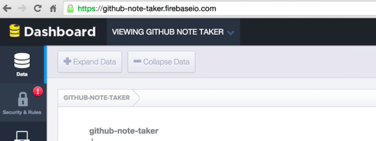
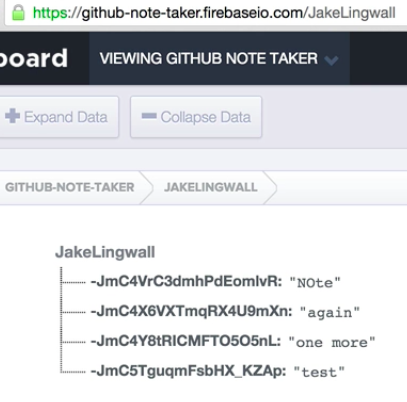

Now what we're going to do in this video is we're going to hook up our **firebase** so we can start persisting these notes, and we're going to build out the rest of this `notes` component so that we get a nice **little unordered** list of all of our `notes` that are in firebase.


So let's go ahead and jump to our code, and what we're going to do first is we are going to use this thing called **ReactFire** that Firebase made that makes it so that our **component state** can be bound to a Firebase **endpoint**.

### Terminal
``` bash
npm install --save reactfire@0.5.1
```

Meaning whenever a Firebase **endpoint changes**, our state will **automatically** update with the **data** that's there. So head to your terminal and go ahead and install it's called `ReactFire`. Then once that finishes, as a side note really quick you might be wondering why we're getting this error, that's because we've installed `webpack` globally so that we can use the command line tools, but we haven't installed it locally. It's not really necessary, but I'm going to npm install it locally just so this error goes away.

### Terminal
``` bash
npm install --save-dev webpack
```

So what we'll do is go ahead and run `npm install` dev webpack. That will make it so whenever we install new packages this error isn't getting thrown. Go ahead and head over to your `profiles.js` file and then require `ReactFireMixin`. You can do it just by requiring ReactFire so what we're going to do, as the name suggests, is we are going to add `ReactFire` as a **mixin** into your **component**.

What we're going to do is go ahead and give your class a `mixins` property, and then the value is going to be an array with `ReactFireMixin` as the first item in that array. What this is doing is it's going to take your instance, it's going to **mixin** some certain **functionalities** so that we can use that new functionality. So this is literally taking the `this` keyword of your class and it's adding a few `ReactFire` mixin methods onto that, so that we can use those later.

### Profile.js
``` javascript
var ReactFireMixin = require('reactfire');

var Profile = React.createClass({
  	mixins: [ReactFireMixin],
```

Now what we want to do is we're going to introduce a brand new **lifecycle event** called `componentDidMount`. Here is where you're going to want to all your **Ajax requests**, it's where you're going to want to set up all your Firebase **listeners**, the `componentDidMount` lifecycle event will be called right **after** your component mounts to the **view**. So it's pretty straightforward, but basically when the component mounts this callback will be called.

What we're going to do here is the very thing we want to do is we're going to create a new `reference` to our Firebase. If you've never used Firebase before, what we're doing here is we're going to create a new **instance** of Firebase and we're going to **pass** it the **URL** of where our **project** is located. So if I head over to my Firebase dashboard, you'll notice all I did was create a new project and you'll notice there's this URL.



This URL is kind of the **base** of our project, so if I head back over to my code all I'm doing here is I'm saying, "Hey, create me a new instance of Firebase which is going to return me an **object** full of all these Firebase-y **type properties**. I'm going to save that on my instance under the ref property. Then once I do that, I'm going to then call `bindAsArray`, and the reason that's this keyword now has a `bindAsArray` property, is because that's exactly what our ReactFire **mixin** did.

### Profile.js
```javascript
componentDidMount: function(){
	this.ref = new Firebase('https://github-note-taker.firebaseio.com/');
	this.bindAsArray();
}
```
It took our context, it took our `this` keyword and added a few properties to it and one of those is `bindAsArray`. BindAsArray takes two arguments the **first** argument is a **reference** to your Firebase, and the **second** argument is the **property on your state** that you want to bind the Firebase data to. So looking back at Firebase you'll notice that we have our endpoint and basically at our **root location** we have all these user names. If I come and click on one of these user names, notice the **URL changed**.



This gives us a little bit of insight into how we want to `bind` to the specific property in our state, because if we're here and we're at Tyler's profile, we want to bind to `\tyler`, or if we come here and the user name is `\jclingwall`, then we want to get all of jclingwall's information. So what we're going to do is let's go ahead and make a `childRef` which is `this.ref.child` and then we're going to pass it the `username` property.

### Profile.js
```javascript
componentDidMount: function(){
	this.ref = new Firebase('https://github-note-taker.firebaseio.com/');
	var childRef = this.ref.child(this.props.params.username);
	this.bindAsArray();
}
```
So `.child` is a Firebase thing, and it says hey dial 1 if this is our **root**, and it is because that's a reference we created with just the this specific URL. If we want it to then go into `\jclingwall`, notice how it goes `\jclingwall`. That's exactly what we're doing here, is we're basically just saying take our ref and then go one deeper into whatever this is, jclingwall, tylermcginnis, whatever it is.

Now what we're going to do is we're going to pass `bindAsArray` our `childRef` which is again, a reference to this **specific username's** endpoint in Firebase, and then we're going to pass it the property on the state that we want to bind to which is `notes`. So now, when this **component mounts** it's going to set up this **binding** between our local state and Firebase, and `this.state.notes` should be the data that's located at this **specific Firebase endpoint**.

### Profile.js
```javascript
componentDidMount: function(){
	this.ref = new Firebase('https://github-note-taker.firebaseio.com/');
	var childRef = this.ref.child(this.props.params.username);
	this.bindAsArray(childRef, 'notes');
}
```
What's nice as well, is whenever this Firebase endpoint changes, that's going to update our **local state** as well. But what we don't want to do is **add** all these **Firebase listeners** and never get rid of those. So what we're going to do is introduce a brand new lifecycle event called the `componentWillUnmount`.

### Profile.js
```javascript
componentWillUnmount: function(){
	this.unbind('notes');
},
```
Whenever this component unmounts, what we're going to do is we're going to call the `unbind()` property on ReactFire and we're going to pass it `notes` so that it will remove that `listener` so it's not always listening and not always trying to **update** our state even after our component has **moved on**. Before we forget let's go ahead and `require Firebase`, and also `npm install` Firebase so that we can do line 18 here. So I'm going to go ahead save our `Firebase = require Firebase`.

**Whoa**. Now then I'm going to head over here to my terminal and I'm going to npm install Firebase.

### Terminal
``` bash
npm install --save firebase@2.3.2
```

Now that we have Firebase, let's go ahead and make some changes to our **UI**. So the very first thing I'm going to do, and this is just preparatory for future lessons, is notice here we're **passing** in the username to `userProfile`, let's go ahead and do that for our repos component. So our `repos` component has access to the username, let's also do that for our `notes` component.

I'm also going to delete `this.props` on here, so that's not clouding anything that we see.

### Profile.js
```javascript
render: function(){
    return (
      <div className="row">
        <div className="col-md-4">
          <UserProfile username={this.props.params.username} bio={this.state.bio} />
        </div>
        <div className="col-md-4">
          <Repos username={this.props.params.username} repos={this.state.repos}/>
        </div>
        <div className="col-md-4">
          <Notes username={this.props.params.username} notes={this.state.notes} />
        </div>
      </div>
```
Then let's go ahead and go over to our `notes` component and instead of just puking the notes to the screen, **React** is actually going to throw an error in React .14 because you can't just puke a whole array to the screen, it needs to be a string or something like that. So what we're going to do is let's go ahead and remove this line,

### Notes.js
``` javascript
<p>{this.props.notes}</p>
```

and now let's go ahead and just `console.log` notes and then `this.props.notes`.

### Notes.js
``` javascript
var Notes = React.createClass({
	render: function(){
		console.log('Notes: ', this.props.notes)
```

So now what we should see is if we go and refresh this, let's go ahead and start `webpack`, all right everything's good. If we refresh this what we should see is it's logging our notes to the console. You'll notice here that it logs **1,2,3** because what we've done is in our `profile` view we've set the **initial** notes values to an array of 1, 2, and 3.

Then what happens is Firebase comes and sets our **listeners**, and then eventually we get a bunch of our notes like this, which has a **key value** which is the key in our key **property**, which is the key of the **specific** item in Firebase, and then a **value** property which is the item at that value.

So what's cool about Firebase, this is all **real time**. So if I come in here and I say change this from "Hi" to "Hello" what we should see is over here, we now have brand new notes, and we see "Hello." So head back over to your code and let's finish formatting the `notes` component.

First, notice we're passing notes to our `notes` component, and we are here and so let's go ahead and change this around a little bit. Very first thing is instead of just saying notes, I'm going to have an `H3` tag, and we're going to say notes for `this.props.username`. Then below that, let's go ahead and instead of making it so this component is worried about styling everything, let's go ahead and make a brand new component. So here's our fixed example.

### Notes.js
``` javascript
var Notes = React.createClass({
	render: function(){
		console.log('Notes: ', this.props.notes)
		return (
			<div>
				<h3> Notes for {this.props.username} </h3>
			</div>
```
We could have everything just be in one component, but that's kind of not the point of **React**, we want **multiple** components and we want to be able to have **reusable** components. So let's make a component which takes in an array of items and will loops over those array and create an unordered list for us. If we head back over to our code, let's go ahead and inside of our `notes` folder, let's create a new file called `NotesList.js`.

Here we're going to require React and we're going to create a component called `NotesList` and let's go ahead and `module.export` that. All right, so the **UI** for this component is going to be pretty simple. We are going to return an unordered list has a class name of `list-group` which is just a bootstrap thing. Here what we want to do is we want to have a bunch of `li` tags that we want one `li` tag for **each** item in the array that we're going to **pass** this component.

### NotesList.js
``` javascript
var NotesList = React.createClass({
	render: function(){
		var notes = this.props.notes.maps(function(note, index){

		})
		return (
			<ul className="list-group">

			</ul>
		)
	}
});
```

So what we're going to do is we are going to **map** over the notes that we're getting from the **parent** component. So if you've never used map before, basically all it does is it allows you to **iterate** through every item in an array and **modify each** item in an array **separately**, and then spit out a new array with each item modified. So say for example we had an array of 1, 2, and 3.

What we can do is we could call `.map()` on that array, and pass it a callback function, and then what we can do is if we `return item + 1`, the very first iteration or the very first time this callback is ran, `item` is going to be `1`, or the first item in our array, and `index` is going to be `0`, so if we `return item + 1`, eventually we're going to have a brand new array that looks like 2,3, and 4 getting returned from `this.map` function.

### NotesList.js
``` javascript
[1,2,3].map(function(item, index){
	return item + 1
	}); //[2,3,4]
```
So imagine if these were all now notes, and if we were mapping over these notes what that is going to return us is a brand new array after we've modified each note. So what we're doing is if these were `this.props.notes`, what we can do is we can wrap each note in a **list item** so that we then get an **array** of list items with some `note` inside of it.

### NotesList.js
``` javascript
this.props.notes.map(function(item, index){
	return <li> {item} </li>
	}); //[<li>Notes</li>,3,4]
```
So what we're going to do is for each item in the array we're going to return a new list item with a class name of `list-group-item`, it's going to have a key of the `index`, and index is just 0,1,2,3, just normal indices for arrays, and then inside of this **list item**, we are going to show the note at `.value`, and you might be asking why is .value? If you remember, what Firebase does is it wraps each item in an object that has a key property and a .value property.

### NotesList.js
``` javascript
var NotesList = React.createClass({
	render: function(){
		var notes = this.props.notes.maps(function(note, index){
			return <li className="list-group-item" key={index}>{note['.value']}</li>
```

We only care currently about this `.value` property. Now let's go ahead and close our `li` tag, and now we have notes which is an array of list items, and we will just throw that here, so inside of our **unordered list**, we have an array of **list items**.

### NotesList.js
``` javascript
<ul className="list-group">
	{notes}
</ul>
```
So the last thing we need to do is head back over to our `notes` component and let's go ahead and require `NotesList`, and then we want to...let's delete all this stuff.

### Notes.js
``` javascript
var React = require('react');
var NotesList = require('./NotesList');

var Notes = React.createClass({
  render: function(){
    return (
      <div>
        <h3> Notes for {this.props.username} </h3>
        <NotesList notes={this.props.notes} />
      </div>
    )
  }
})

module.exports = Notes;
```
Instead, we want to use `NotesList` and we are going to pass it `notes` which is coming down from our **parent** component. So notice that you can **pass down** properties as far as you want. So our `notes` originally started at our `profile`, then go to our `notes` component, and then we're **passing** them down to our `NotesList` component. Let's go ahead and close this `NotesList` component, check that webpack is still working, it is, and in our app we should see if we hit refresh all of our items that are in Firebase.
