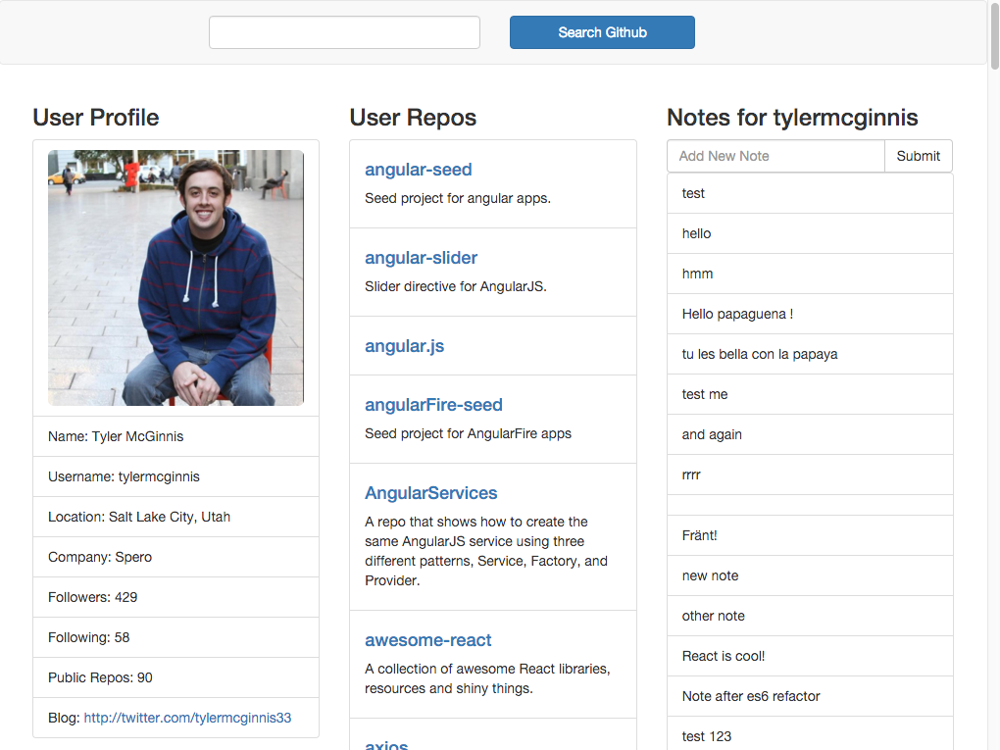

This video we are going to build out the UI for our user profile component as well as our repos component. Since inside this repos component, what we're going to do is we're going to map over all of our repositories and basically make an array of list items. So here we're going to have a repos variable and we're going to map over our repos, the first parameter that the callback function the map takes is the item itself, or in this case the repository, then the second one is the index.

### Repos.js
``` JavaScript
render: function() {
  var repos = this.props.repos.map(function(repo, index){
    return()
  })
  return(
    <div> REPOS<br />
      Username: {this.props.username} <br />
      REPOS: {this.props.repos} </div>
  )
}
```

So here let's go ahead and return a list item and let's add some bootstrap-y stuff to it, so it's going to be a list group item and the key is going to be index. Whenever you're mapping over anything, React needs these keys. If you don't have these keys on every item in the array, then React is going to throw an error. This is kind of low-level React stuff, but it's how React optimizes when you remove or take something out of a list.

### Repos.js
``` JavaScript
render: function() {
  var repos = this.props.repos.map(function(repo, index){
    return(
      <li className="list-group-item" key={index}>
      </li>
    );
  });
  return(
    <div> REPOS<br />
      Username: {this.props.username} <br />
      REPOS: {this.props.repos} </div>
  )
}
```

What we're going to do now is we are going to say if the repo has a HTML URL property, then let's go ahead and render an H4 with a link to it, and the link is going to take us to this URL, the name is going to be repo.name, and then we're going to close H4. So what we're doing here is because not every repository has a HTML, or has a URL associated with it, so this is just making sure it has URL before it renders this. This is kind of a tricky way to do an if statement in JavaScript.

### Repos.js
``` JavaScript
render: function() {
  var repos = this.props.repos.map(function(repo, index){
    return(
      <li className="list-group-item" key={index}>
        {repo.html_url && <h4><a href={repo.html_url}>{repo.name}</h4>}
        {repo.description && <p>{repo.description}</p>}
      </li>
    );
  });
  return(
    <div> REPOS<br />
      Username: {this.props.username} <br />
      REPOS: {this.props.repos} </div>
  )
}
```

Then next one is going to be very similar, so if this specific repository has a description, then what we're going to do is render that description inside of a paragraph tag and then close the paragraph. We have our repos array that's full of these list items now, and so now what we want to do is let's go ahead and change this around to where we have a header, that's the user repos, and then underneath that let's go ahead and have our unordered list with a class name of listgroup. In here we're going to throw repos.

### Repos.js
``` JavaScript
render: function() {
  var repos = this.props.repos.map(function(repo, index){
    return(
      <li className="list-group-item" key={index}>
        {repo.html_url && <h4><a href={repo.html_url}>{repo.name}</h4>}
        {repo.description && <p>{repo.description}</p>}
      </li>
    );
  });
  return(
    <div>
      <h3> User Repos </h3>
      <ul className="list-group">
        {repos}
      </ul>
    </div>
  )
}
```

If this worked, then let's go ahead and start webpack.

### Terminal
``` Bash
npm start
```


So now our user repos is formatted a little bit better, we can click on these links and it'll take us to the github project. Now let's go ahead and fix the bio real quick. If we head over to our user profile.js file, we're going to do roughly the same thing. This one's a little bit longer so I'm just going to paste it in. Not every repository is mandated to have all of these properties on it.

### UserProfile.js
``` JavaScript
render: function(){
    return (
      <div>
        {this.props.bio.avatar_url && <li className="list-group-item"> </li>}
        {this.props.bio.name && <li className="list-group-item">Name: {this.props.bio.name}</li>}
        {this.props.bio.login && <li className="list-group-item">Username: {this.props.bio.login}</li>}
        {this.props.bio.email && <li className="list-group-item">Email: {this.props.bio.email}</li>}
        {this.props.bio.location && <li className="list-group-item">Location: {this.props.bio.location}</li>}
        {this.props.bio.company && <li className="list-group-item">Company: {this.props.bio.company}</li>}
        {this.props.bio.followers && <li className="list-group-item">Followers: {this.props.bio.followers}</li>}
        {this.props.bio.following && <li className="list-group-item">Following: {this.props.bio.following}</li>}
        {this.props.bio.following && <li className="list-group-item">Public Repos: {this.props.bio.public_repos}</li>}
        {this.props.bio.blog && <li className="list-group-item">Blog: <a href={this.props.bio.blog}> {this.props.bio.blog}</a></li>}
      </div>
    )
  }
```

Basically we're going to say if this specific...or not every bio, excuse me. We're going to say if this specific user profile has an avatar URL, then go ahead and load their image. Or, if they have a company go ahead and load their company. But for example, not everyone has a blog associated with their profile, so we wouldn't want to just render an empty href if the blog property is actually undefined, that would not be useful.

These are all just checking to make sure those properties are truthy, if they are, it will go ahead and render those to the screen. Let's save that, webpack is good, let's check this and there we go.


