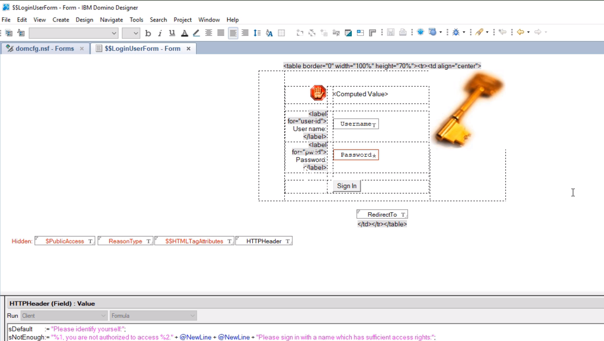

This course is for IBM Domino developers or JavaScript developers who are looking to use IBM Domino. The aim of the course is to take the strengths of Domino and combine them with the strengths of [Node.js](https://egghead.io/browse/platforms/node).

The first part of the course is all to do with Domino security, and making sure that we can utilize the Domino security model within our Node.js application. This means you will not have to worry about setting up new user access schemes or even user roles. We will just utilize the standard names address book inside Domino.

To do that, we need to identify authentication errors from Domino. Normally, Domino will return a status 200 code even if you have failed to log into Domino. This is not very useful.

We will go over a method that allows us to enhance the standard login form and add a custom HTTP header, which can then be intercepted by the Node.js application to be parsed wherever we have an authentication error.

We look at how we can log into Domino via our Node.js application. 

We will see how we can use the Domino security to actually access restricted data, and we will confirm that it is working.

We're going to go over how we can expose the standard user information like the common name and user roles, and how we can utilize those to actually protect some of the routes within our Node.js application.

We look at how we can store the Domino user information inside what's known as a [JWT](https://egghead.io/lessons/angularjs-json-web-token-jwt-introduction), which is a JSON web token. This allows us to store this client-side in a protected format, and then send it back to our Node.js application on every call.

Therefore, we don't need to go back to Domino to confirm what roles a user has. We can then use these user roles to protect our HTTP routes.

We'll look at using the standard create, read and update, and delete methods of the Domino data service via the Node.js application. We'll then go over how to render that Domino data inside a Handlebars template in an [Express](https://egghead.io/browse/libraries/express) application.

Finally, we'll cover how to take some computed Domino HTML and reuse it within our Express application. Pretty useful if you've got a complicated formula or other method that's generating HTML output, and you don't want to rewrite that.

I hope you enjoy this course. You should find it gets you up to speed so that you can start using Node.js with your Domino server right away.