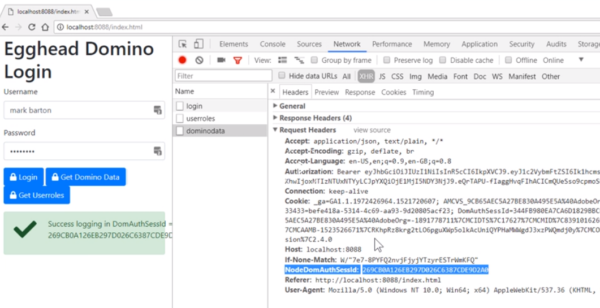
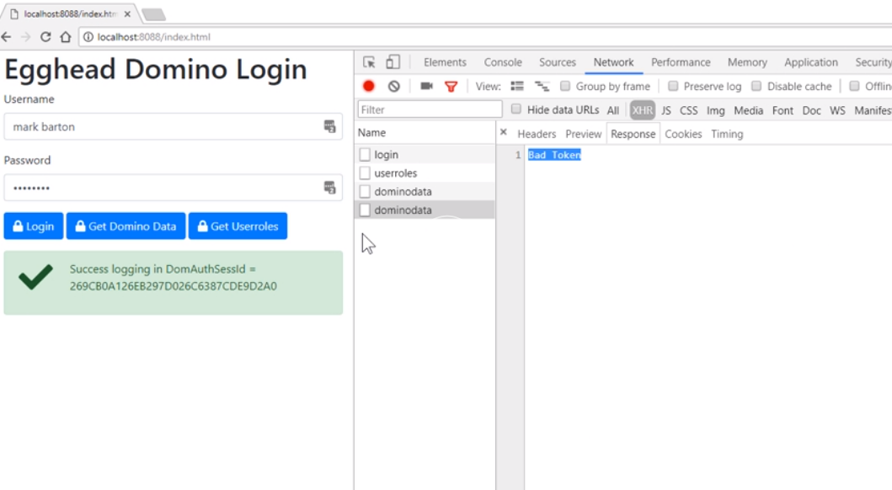
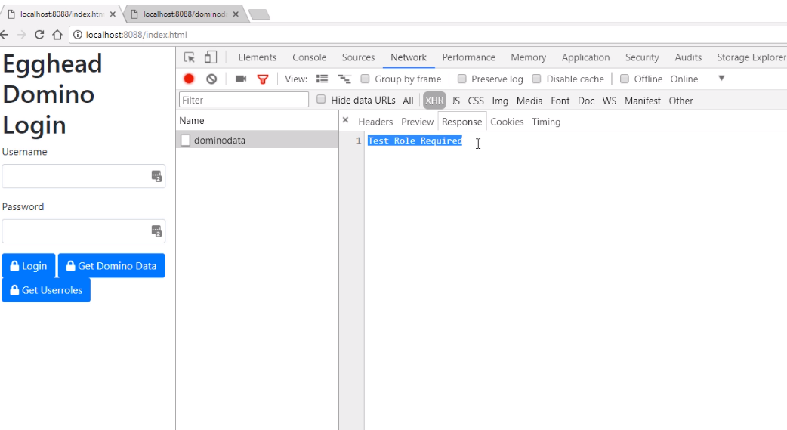

We've reopened the `server.js` file, and we're going to modify the `/dominodata` route. This is the one we're going to test to see if the user has a specific role.

First, what we're going to do is deconstruct out of the `request` headers, the `authorization` header, and the `nodedomauthsessid`. We might as well do it at the same time.

```javascript
app.get("/dominodata", function(req, res, next) {
  const { nodedomauthsessid, authorization } = req.headers;
```

Once we've done that, we're going to check to see if we have an `authorization` header. If not let's immediately return back to the browser with 401, because we need one of those.

```javascript
if (!authorization) {
  return res.status(401).send("Missing Token");
}
```

As part of the [RFC](https://tools.ietf.org/html/rfc6750) specification, we need to include the word `Bearer` in front of our JWT token in the `authorization` header, but actually to decode it, we need to remove that now.

Initially, the `token` will be the `authorization` value. Now, we're going to look for the word `Bearer` and if we have it, we will remove it.

```javascript
let token = authorization;
if (authorization.includes("Bearer")) {
  token = authorization.substring(7);
}
```

The JWT library has a `verify` method, and what happens is, if the token is not verified correctly, then it will throw an error. We'll catch the error, and we will return to the browser, again a `401` status.

We'll just put bad token in this case. 

The method is going to be setting a `decoded` JWT object, and we'll use the `verify` method, pass it our `token`, and we will also need to pass it our secret.

Normally, your secret would be stored locally in an environment variable, and don't store them inside your source control. If we get to this point, we can now deconstruct our `username`, and our `userroles`.

```javascript
 try {
    const decoded = jwt.verify(token, "egghead");
    const { username, roles } = decoded;
  } catch (err) {
    return res.status(401).send("Bad Token");
  }
```

For this demo, we're going to check to see if we've got an `Admin` role. We're using `includes` method of the array. 

If we don't have an `Admin` role, we're going to return a `403` status code this time, which is a forbidden status code, rather than authorization missing.

```javascript
try {
    const decoded = jwt.verify(token, "egghead");
    const { username, roles } = decoded;
    if (!roles.includes("Admin")) {
      return res.status(403).send("Admin Role Required");
    }
  } catch (err) {
    return res.status(401).send("Bad Token");
  }
```

If we get to this point in our code, we have successfully got the role, and we can continue to give back our Domino Data. Let's now see that working.

OK. I've restarted my server, refreshed my browser page, and I've modified the `getDominoData()` call to always use local storage. The first thing I'm going to do is login to get my `NodeDomAuthSessId`.

Once I login, I get the local storage set. 

I use my `Get Userroles` button, and that's now going to set the JWT token locally with a Bearer. Finally, I'll click `Get Domino Data`, check the console, and we're getting back some data correctly on the tab.



As you can see, the `Authorization` header's been set, and so has the `NodeDomAuthSessId`. Let's try modifying the JWT token on my client.

If a user came in, and said, "Right, I am going to modify this value here." And, you can do that inside the Chrome tools.

I'm just going to add some values in. If I try and get Domino Data again, if we look at the network tab, I see a 401 unauthorized if I click on the tab, and if I look at the actual response, it's a `Bad Token`, which it is, because I've modified it.



Let's put that back, so the first thing we'll do it is click `Get Userroles`, that should reset my local token. 

Then use the `Get Domino Data` to make sure it's still working. It is.

What we're going to do is, we're going to modify what role we should have on the server. 

I've reopened my `server.js` file, I'm going to change `Admin` to `Test`, I've changed my error message as well. 

```javascript
try {
    const decoded = jwt.verify(token, "egghead");
    const { username, roles } = decoded;
    if (!roles.includes("Test")) {
      return res.status(403).send("Test Role Required");
    }
  } catch (err) {
    return res.status(401).send("Bad Token");
  }
```

Save that and restart my server, and retest it in the browser.

I've reopened my browser page. If I now click `Get Domino Data` this time, we can see we get a 403, which is a forbidden status code. 

Look at the response we get, and it says `Test Role Required`.



We've now got our Node server successfully decoding user roles. Therefore it can detect what routes the user can call based on the roles that have been sent to them originally by Domino.
