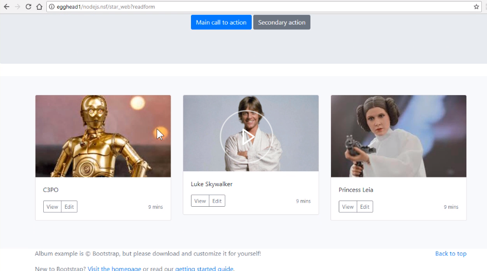
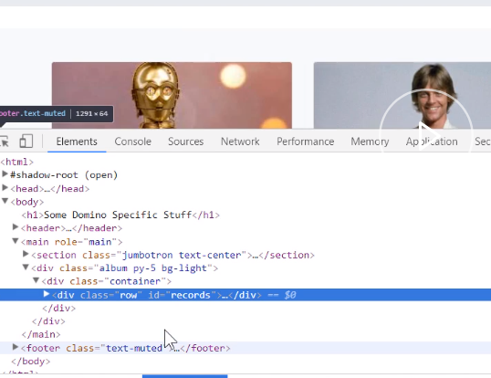
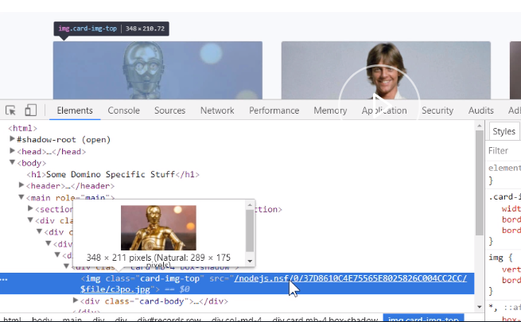
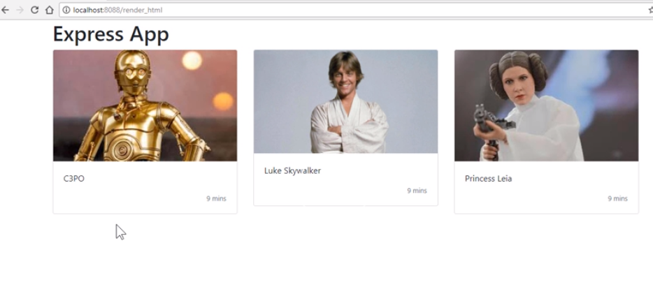
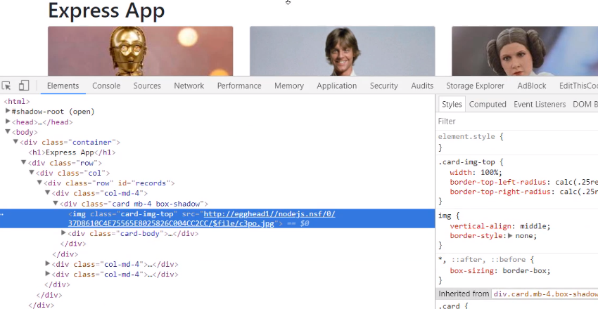

One of the things you might want to do, is reuse Domino generated HTML where you've got some complicated computed values using @formulas, or other various ways of generating HTML in Domino.

If we take this notes form which has got some pass-through HTML on it. In here, I have a `<Computed Value>` field, and it has a looping @formula. 

```javascript
x:=@DbColumn("":"";"";"star_wars";3);

content := "";
@For(n := 1; n <= @Elements(x); n := n + 1;
name:=@Left(x[n];"%");
image:=@Right(x[n];"%");
content:=content+"   <div class=\"col-md-4\">
              <div class=\"card mb-4 box-shadow\">
                
                <div class=\"card-body\">
                  <p class=\"card-text\">"+name+"</p>
                  <div class=\"d-flex justify-content-between align-items-center\">
                    <div class=\"btn-group\">
                      <button type=\"button\" class=\"btn btn-sm btn-outline-secondary\">View</button>
                      <button type=\"button\" class=\"btn btn-sm btn-outline-secondary\">Edit</button>
                    </div>
                    <small class=\"text-muted\">9 mins</small>
                  </div>
                </div>
              </div>
</div>"
);
content
```

What we want to do, is rather than get the data, we just want to grab this HTML and use it inside our Express application.

The Domino Web form looks like this, it's a standard bootstrap template. This is what I want to reuse, these three image cards.



Inside our Express application, in our `server.js` file, we've installed `cheerio`, which is a package used within Node.js which basically allows you to use JQuery type methods to extract and manipulate HTML.

```javascript
const cheerio = require("cheerio");
```

The first thing I am going to do is create a new route called `/render_html`. 

```javascript
app.get('/render_html', function(req,res,next){
})
```

We're going to set up some `options` to get hold of the data from Domino. Our `url` this time is not going to use the Domino data service. Instead, we're just going to be opening a web form using the `?readform`.

Our method is going to be a `GET`, and we'll use `resolveWithFullResponse`. 

```javascript
const options ={
    url: 'http://Egghead1/nodejs.nsf/star_web?readform',
    method: 'GET',
    resolveWithFullResponse: true
  }
```

We will now make the call to Domino. The HTML we get from Domino is in the `response.body`. We need to pass that HTML to the `cheerio` library so that it can manipulate it.

```javascript
rp(options).then(function(response){
    const html = response.body
    const $ = cheerio.load(html);
```

We used the `cheerio.load` method, and we can now use standard JQuery type methods. 

What I want to do is get hold of the card images, and they are within a block which has got an ID of `records`. 

```javascript
 const records_html=$('#records');
```

If we look at the source of the HTML, we can see that.


This is the block we want. As you can see from the source HTML, it has an ID of records on this div which contains the three images I want. 

If we look at the `src` of one of the images, we can see this is actually a relative URL to the Domino server. This will not work in our Node application. We need to include the Domino hostname.


Using the Cheerio library, we can manipulate the `src` for all the images. This is the sort of thing you can do in JQuery. We should select all images within the `records` block, we will loop over them, and for each element, we will change its `src`.

We'll add the hostname for the Domino server in front of the current source. 

```javascript
$('#records img').each(function(i, elem){
      $(this).attr('src', 'http://egghead1/'+ $(this).attr('src'))
    })
```

What we're trying to demonstrate here is, not only can you get the HTML from Domino, you can also then manipulate it to however you want to use it.

I also don't want the buttons, which are all within those cards. Again, using the Cheerio methods, and JQuery-like methods, we can remove and manipulate some of the HTML. Simply targeting four buttons within the `records` div, I can call the `remove` method.

```javascript
 $('#records button').remove();
```

Finally, we're going to render this HTML out to our Handlebars. 

```javascript
res.render('domino_html', {records_html});
```

We're going to create a new template called `domino_html.handlebars`, which is going to be a simple template, and we'll pass it, the HTML we got from Domino after we've modified it.

Our new template very simply looks like this, it's a bootstrap row and column, and then, we have the HTML we got from Domino inserted in here. Note, we've got three braces inside, and you need to enter three braces if you want your Handlebars template to render raw HTML, else it will escape it. 

```html

<div class="row">
    <div class="col">
        {{{records_html}}}
    </div>
</div>

```

Let's have a look, see what it looks like.

We've started our server, refreshed the page, entered our new [URL](http://localhost:8088/render_html), and here comes the data. 

This data is HTML that's come from Domino, which has been created using a computed @formula. We've manipulated the HTML, we get back remove buttons, and changed the image src.



If we have a look at the image src , we can see that the URL now includes the Domino host name.

