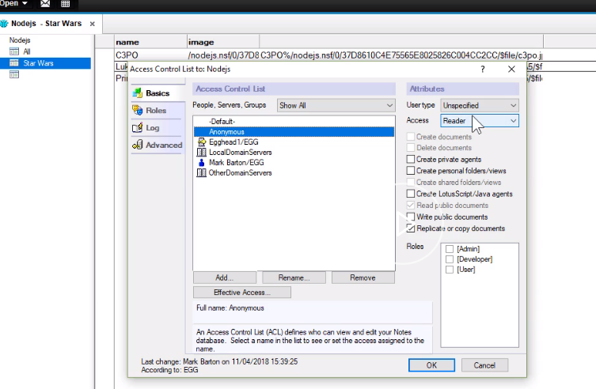

We're going to render some HTML using [Handlebars](https://egghead.io/lessons/node-js-use-template-engines-with-express), and our [Express](https://egghead.io/courses/getting-started-with-express-js) app. We're going to feed into those Handlebars templates our Domino data.

So I've installed some packages including `express3-handlebars`. I've configured my Express app to use the handlebars as the `view engine`. 

```javascript
const exphbs = require('express3-handlebars');
const hbs = exphbs.create({
  defaultLayout: 'default',
  extname: '.handlebars'
});
app.engine('handlebars', hbs.engine);
app.set('view engine', 'handlebars');
```

Within the `server.js` file, we now going to add a new route, so let's call it a `/render_data` route.

```javascript
app.get("/render_data", function(req,res,next){
})
```

First thing we want to do is, configure our `options` for getting data from Domino. 

`url` is going to use Domino data services to get data from a view. 

We're going to be using the `GET` method. We're going to `resolveWithFullResponse` in case there's any issues, and we're expecting `json` data. 

```javascript
const options = {
    url: `http://Egghead1/nodejs.nsf/api/data/collections/name/star_wars`,
    method: 'GET',
    resolveWithFullResponse: true,
    json: true
  }
```
We'll make the request to Domino now, and then deal with the response.

```javascript
  rp(options).then(function(response){
    const records = response.body;
    res.render('demo', {records});
  })
```

We should get back an array of `records` from the `body`. Then all we need to do is `render` out to our Handlebars which we're going to call `demo`, and pass it the data to be used within the Handlebars itself.

Our Handlebars layout is using the standard bootstrap style sheet. We're just using a container. We're going to be using cards with images on using the Domino data.

In the Handlebars layout, we have the three braces surrounding body, `{{{ body }}}` which define where the actual template goes. 

```html

<html>
<head>
    <link rel="stylesheet" href="https://maxcdn.bootstrapcdn.com/bootstrap/4.0.0/css/bootstrap.min.css" integrity="sha384-Gn5384xqQ1aoWXA+058RXPxPg6fy4IWvTNh0E263XmFcJlSAwiGgFAW/dAiS6JXm"
        crossorigin="anonymous">
</head>

<body>
    <div class="container">
        <h1>Express App</h1>
       {{{ body }}}
    </div>
</body>
</html>

```

If we look at the actual handlebars template which is called `demo.handlebars`, we're going to loop over the records, so in other words the Domino data and for each one, we will extract the image which is stored as a file resource in the Domino data, and also the `name`.

```html

<div class="card-columns"></div>
{{ #each records }}
<div class="card" style="width: 18rem;">
    
    <div class="card-body">
        <h5 class="card-title">{{this.name}}</h5>
    </div>
</div>
 {{/each}}
</div>

```

Just note the Domino server itself is holding the images, so the `src` needs to reference the Domino server and not the Node server. 

Within the notes application itself, I've changed the access control list to allow `Anonymous` with `Reader` access, so they can read the data.



Let's now see how that looks. I've started my server, entered my URL and the application renders the page correctly with data coming from Domino.


