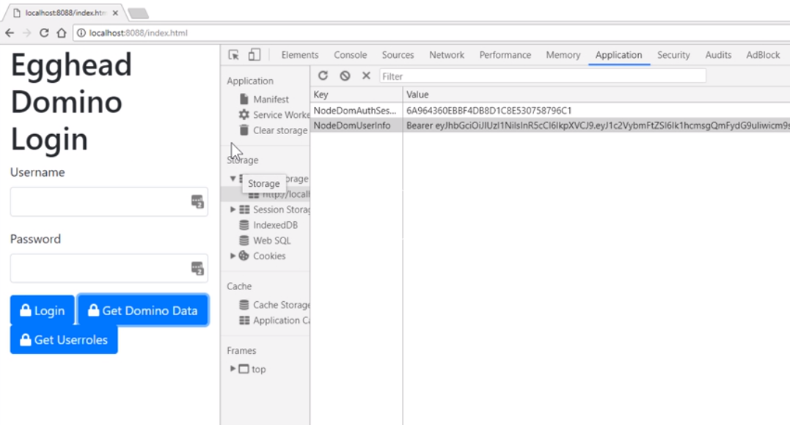
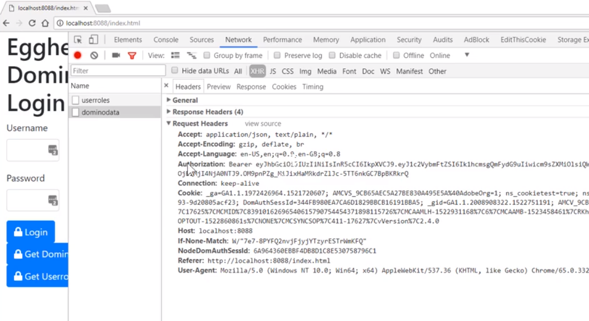
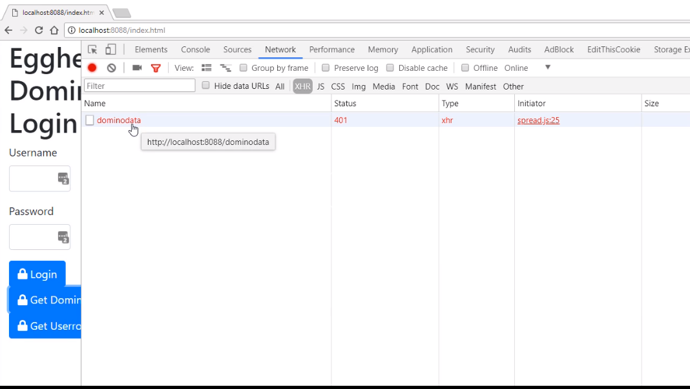

Diving back into our index page, we want to enhance our `getUserRoles()` function, and we're going to store the results that come back, which is our JWT data. I am going to store this in our local storage as well. Let's do that now.

We'll get hold of the token value from the results, and what we need to do is include the word `Bearer`.

We're going to set our authorization header, which is going back to our node server. But to be a valid authorization header, it needs to have the word `Bearer` in front of it.

We're using the ES6 templating language, where you will access the `result.data`, which is our JWT token combined with the string `Bearer`.

```javascript
axios
  .request(options)
  .then(function(result) {
    const auth_token = `Bearer ${result.data}`;
  })
  .catch(function(err) {... });
```

Next, we'll store the JWT token inside our `localStorage`. 
This will be the same as the `NodeDomAuthSessId`. We'll call this one `NodeDomUserInfo`. 

```javascript
 axios.request(options).then(function (result) { 
                const auth_token = `Bearer ${result.data}`;
                localStorage.setItem('NodeDomUserInfo', auth_token);
            }).catch(function (err) {
                console.log(err);
            })

```

If you're using a single page application, it'll be useful to set a default so that every call you make to the node server, automatically has your authorization header set, and at the same time the `NodeDomAuthSessId` as well.

The Axios library has the ability to set a default. Remember, this only really is valid if you've got a single page application, because, as soon as you change the browser page, you're going to end up having to set this again.

Just to demonstrate it though, I will set it here. 

`axios.default.headers.common`, and we will set the `Authorization` one, and we'll set to be `auth_token`, at the same time we might as well set the `NodeDomAuthSessId` as well.

```javascript
  axios.request(options).then(function (result) { 
                const auth_token = `Bearer ${result.data}`;
                localStorage.setItem('NodeDomUserInfo', auth_token);
                axios.defaults.headers.common['Authorization'] = auth_token;
                axios.defaults.headers.common['NodeDomAuthSessId'] = NodeDomAuthSessId;
            
            }).catch(function (err) {..})
```

To demonstrate this working, what we'll do is, we're going to change our `getDominoData()` method. 

This time, we will remove the local storage to get our `NodeDomAuthSessId`. Remember, we've set a default for the whole page, so we'll get rid of that. 
```javascript
  function getDominoData() {
            const options = {};
            options.method = 'get';
            options.url = '/dominodata';
            axios.request(options).then(function (result) {
                console.log(result);
            }).catch(function (err) {
                console.log(err);
            })
        }
```
Leave everything else the same, and have a look at what it looks like in the browser. 

I have started my server, reopened my page, refreshed it, and I click the `Get Userroles`.

We get back our JWT token from a server, and I check the local storage, we can see that it's set it in the `NodeDomUserInfo`, and there's the word `Bearer` in front of the JWT token. 



If I now use the `Get Domino Data` button, remember we're using the Axios defaults here.

If I look at the network tab, and look at the `dominodata` call, we can see that the authorization header has been set with the `Bearer`, and the JWT token. The `NodeDomAuthSessId` has also been set. 



But, if I refresh my page, and try that again, `Get Domino Data`, you can see that we get a 401 because the defaults have no longer been set because we refreshed the page.



In this instance, we would use the local storage to get hold of the information we need. 

Now, we just need to update the node server to manage the authorization token, and make sure that we can decode our roles.
