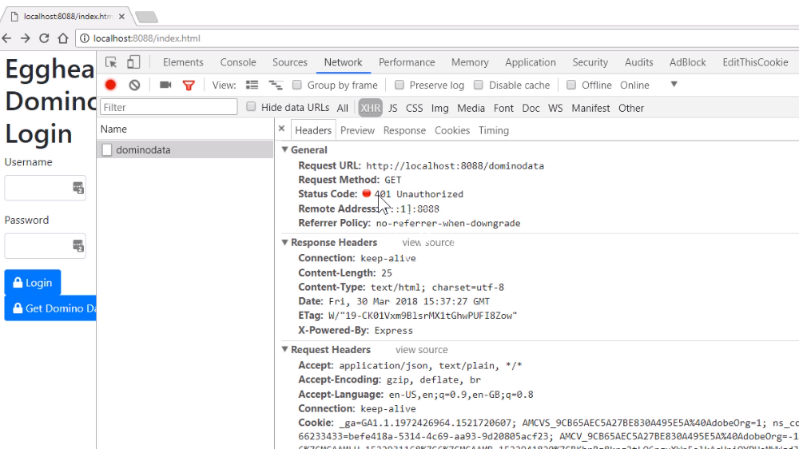
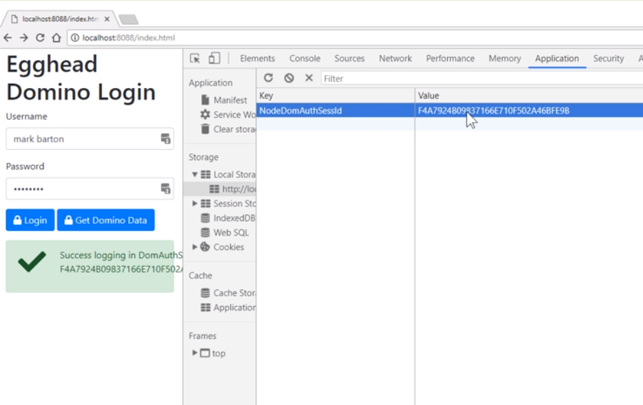
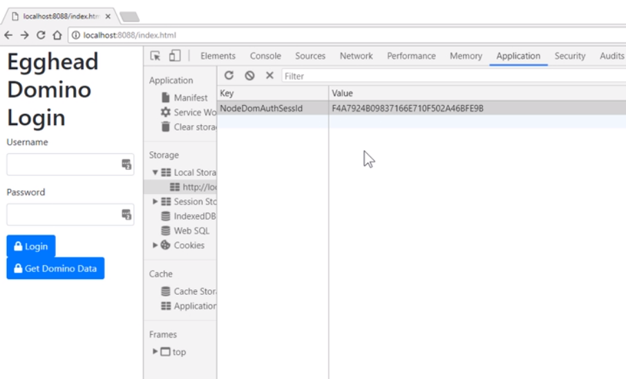
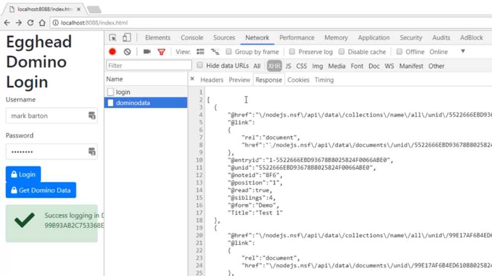

To demonstrate getting restricted Domino data via our Node server, we're going to add a new button to our login form. This is on our `index.html` page. We're going to create a new function called `getDominoData()`.

This function will use the Aoxis library to go off to our Node server, which in turn will make a request to Domino for some data. Our URL will be calling a route on our Node server, and we're going to call this route `/dominodata`.

Don't forget to add an error handler. For now, we're just going to log out the results, the same with the error.

```javascript
function getDominoData() {
  const options = {};
  options.method = "get";
  options.url = "/dominodata";
  axios
    .request(options)
    .then(function(result) {
      console.log(result);
    })
    .catch(function(err) {
      console.log(err);
    });
}
```

Let's switch to our Node server and add in the new route.

Back inside our `server.js` file, in the Node server, we'll add a new route for our Domino Data. It's a `get` route.

```javascript
app.get("/dominodata", function(req, res, next) {});
```

Similar to previously, we're going to be calling our Domino database, which has an ACL with `Anonymous` set to `No Access`.

Again, we want the complete response and we're using the `request-promise` library.

```javascript
app.get("/dominodata", function(req, res, next) {
  const options = {
    uri: "http://Egghead1/nodejs.nsf/api/data/collections/name/all",
    resolveWithFullResponse: true
  };

  rp(options)
    .then(function(response) {})
    .catch(function(err) {});
});
```

Just like previously, we will deconstruct the `headers` and `body` from the response.

The first thing we need to do is check for a `dominoauthenticationfailure` custom header. Remember, we defined this on the custom login form, on the Domino domcfg database.

If there is a Domino authentication failure, we will `return` straight back to the browser with a `status` of `401`, including the contents of the header. If not, we will `return` the contents from Domino straight back to the browser.

```javascript
rp(options)
  .then(function(response) {
    const { headers, body } = response;
    const dominoauthenticationfailure = headers.dominoauthenticationfailure;
    if (dominoauthenticationfailure) {
      return res.status(401).send(dominoauthenticationfailure);
    }
    return res.send(response.body);
  })
  .catch(function(err) {});
```

Remember to handle any errors so we'll `catch` them here.

If there are any errors, we will `return` them straight back to the browser.

```javascript
  rp(options)
    .then(function(response) {...})
    .catch(function(err) {
      return res.status(err.response.statusCode).send(err.response.body);
    });
```

Let's test that using our web page.
We've restarted our Node server and opened up our [index](http://localhost:8088/index.html) page.

If I click the `Get Domino Data` button now, and I look in the network console, I can see I actually got a `401 unauthorized`. As we would expect since we're accessing a restricted database. Our response is, `Please identify yourself.`



On our login form, if we try and log in now, I click my `Login` button.

We have successfully logged in, which is good, as you can see, with a HTTP status code of 200. Importantly, we get back our cookie reference. Somehow, we need to pass that cookie reference through to our `getDominoData()` call.


Let's do that next. Opening up our `index.html` page again, we're going to enhance our `login()` function. What we're going to do is record and store the response back from the Node server with the Domino cookie.

We are going to use the browser's [local storage](https://egghead.io/lessons/javascript-web-apis-persisting-browser-data-with-window-localstorage) property, which gives you access to a storage object. Local storage will survive a browser restart, and depending on how your sessions expires, the user may not need to have to log in again.

Local storage takes a key, and natively, you can only store text in local storage. If you have a JSON object, you need to convert it to a string. In our case, we only need a cookie value. Therefore, we don't need to convert it.

```javascript
axios.post('/login', {
           ...
            }).then(
                function (result) {
                    ....
                    localStorage.setItem('NodeDomAuthSessId', result.data);
                }
            ).catch(function (err) {... })
```

To test that, we fire up our browser again, open the [index](http://localhost:8088/index.html) page, and this time going to log in.

In Chrome tools, if you look under `Application`, under `Storage`, you'll find `Local Storage`. As you may notice, local storage is dependent on your domain -- `localhost` in this case.

Here, we have our value. We have the cookie value being stored in local storage. We can now use this value every time we want to make a call to our Node server.



We've reopened up our index page, and we're going to enhance the `getDominoData()` function.

What we'll do is try and get hold of the `NodeDOMAuthSessId`, which is stored in local storage. The method we need is `getItem()`, and we pass in the key.

We should check to make sure that we have a value first.

If we do, we can then set a header on our `options`, which we then use in the Aoxis library. This custom header we will pick up and use on our Node server.

```javascript
 function getDominoData() {
         ...
         const NodeDomAuthSessId = localStorage.getItem('NodeDomAuthSessId');
          options.headers={};
            if (NodeDomAuthSessId) {
                options.headers['NodeDomAuthSessId']= NodeDomAuthSessId
            }
        }
```

We'll now modify our `server.js` file to manage this custom header.

Opening up our `server.js` file again, and we're modifying our custom route for `/dominodata`.

What we need to do is deconstruct the headers, specifically looking for our custom header called `nodedomauthsessid`.

```javascript
app.get("/dominodata", function(req, res, next) {
  const { nodedomauthsessid } = req.headers;
});
```

Now you have a choice.

You could say that this URL is always going to be restricted and, therefore, if you don't have this custom header immediately return back to the browser.

I actually prefer if you just let Domino handle the authentication itself within our custom header.

Therefore, within the `options`, we now need to set the cookie value that we have to send to Domino. Domino expects a cookie, and it has to be called `DomAuthSessId`. We can use some ES6 templating here to insert the value.

```javascript
app.get("/dominodata", function(req, res, next) {
  const { nodedomauthsessid } = req.headers;
  const options = {
    uri: "http://Egghead1/nodejs.nsf/api/data/collections/name/all",
    resolveWithFullResponse: true,
    headers: {
      Cookie: `DomAuthSessId=${nodedomauthsessid}`
    }
  };
});
```

Now we can fire up the server and test it again. 

I've restarted my server, refreshed my page. 

Notice my previous cookie value is still available in the local storage, even though I've restarted my browser.



In Chrome, if you want to delete it, you just highlight it and press delete on the keyboard and it's gone. 

I'm going to re-log in to get a new cookie. 

The value's been set. 

If you look at the network tab and click my `Get Domino Data`, hopefully, this time, I get a 200, and my response is Domino Data coming back successfully.



That's working fine. Going forward now, I can use that local storage cookie to talk to my Node server to Get Domino Data as an authenticated user.
