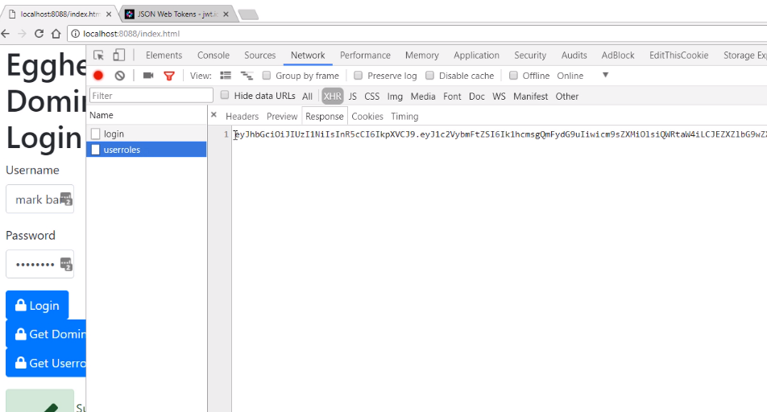
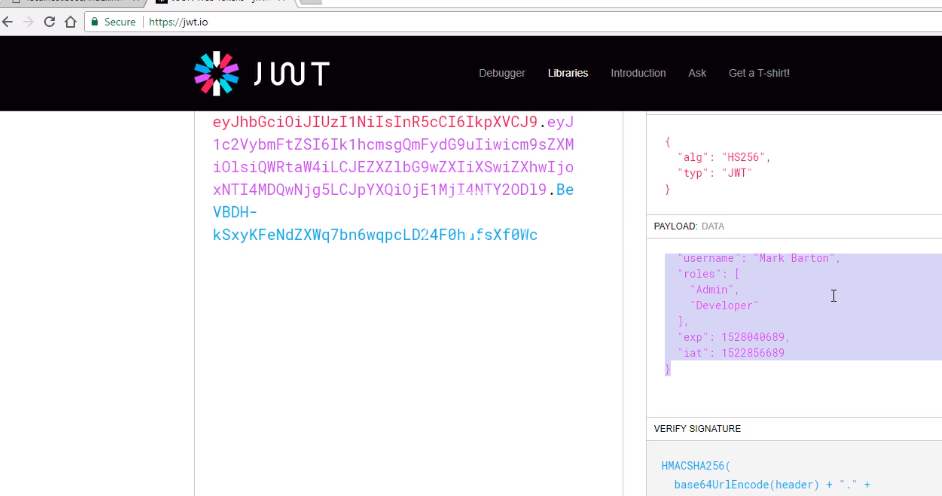

The first thing we're going to do is install a new library in our Node server called `jsonwebtoken`.

```javascript
const jwt = require("jsonwebtoken");
```

We're then going to modify our `/userroles` route. The first thing we're going to do is deconstruct the `roles` and `username` from the `response`.

```javascript
rp(option)
    .then(function(response) {
     ...
      const { username, roles } = response.body.user;
```

Remember, Domino is still doing the security role. Even if the user says they have a certain role, if they don't have access to the data, Domino will still reject it.

For convenience, we're going to set an expiry on the JWT file of seven days.

We'll just have a date, which will be `today`, a expiry date `exp`, and pass it the `today` date, and we're adding seven days.

Our `payload` is going to be an object. The JWT library will use a `sign` method on that object.

The first thing we're going to have is the `username`, the `roles`, the expiry `exp`.

This is a standard for JWT, `exp`, and then we need a secret.

For now, we're going to hard-code a secret in here. We'll use the secret to decode the JWT later on. We'll just use `egghead` for now.

```javascript
const today = new Date();
const exp = new Date(today);
exp.setDate(today.getDate() + 7);
const payload = jwt.sign(
  {
    username,
    roles,
    exp: parseInt(exp.getTime() / 1000, 10)
  },
  "egghead"
);
```

Finally, we're going to send the JWT token back to the client.
```javascript
      return res.send(payload);
```
Let's see what that looks like. Firing up the browser to our local host with the [index](http://localhost:8088/index.html) , with our Node server running. 

The first thing I'm going to do is log in so that we refresh our local token. After we successfully logged in, we have the `DomAuthSessId` stored in our local storage.

Now if I call `getUserRoles()`, what should happen is if I look in the console, we actually get back a nice long string. 

If I look at the network tab, this should probably be easy to see. Our response is a Base64-encoded string.




JWT tokens are not protecting any sort of privacy. You shouldn't put anything secret in here, because if I go to another website [here](jwt.io), which is called jwt.io, if I scroll up, and if I paste my token in, you can see on this side that actually, it's decrypted my JWT token.



There is my `username`, and my `roles`. 

Just be aware, do not store anything secret in your JWT token. 

The important thing is if I try and manipulate this Base64 string in the client and send it back, my Node server will reject the token, and therefore not respect the roles that I'm trying to say I have.
