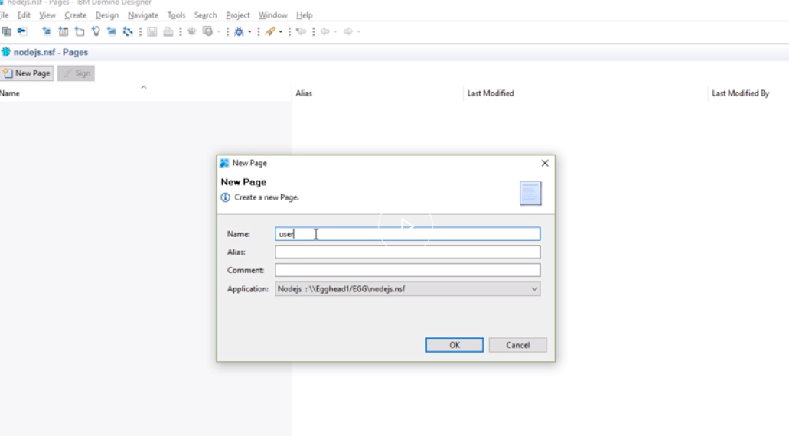
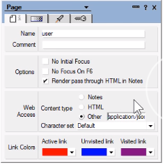
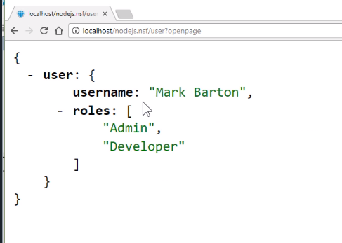
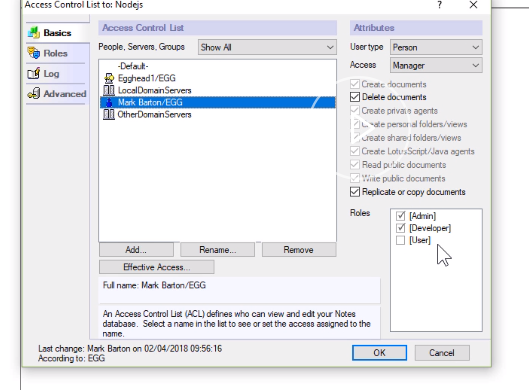

To get more user information from Domino, including what roles the user has, I find the easiest way is to create a simple page. 

I'm using a page because unlike a form no new fields required. 

We're going to call the page `user`. I'm storing this page inside my demo database.



The first thing we want to do is change the MIME type for the page so that it returns JSON data. 



Then, we're going to use simple computed values. 

We'll start with a `user` object. 

```javascript
{"user":{
"username": "<Computed Value>",
"roles": [<Computed Value>]
}}
```

This object will have two properties. It'll have the `username`, and for this computed value, we'll use a simple `@UserName`, and we'll wrap it with a `@name` so we get the common name.

```javascript
@Name([cn];@UserName)
```
Then, our second property will be `roles`. This could be a multivalue, so it's going to potentially be an array. 

We want to remove the square brackets [] and the $$WebClient that Domino will automatically send. 

We'll start with a temporary variable. We'll add a `@trim` and a `@replacesubstring`.

We're going to work on `@userroles`. 

We'll remove one `[`, the other `]` and `$$WebClient`, and we're going to replace those with `""`. 

If we don't have any roles, then we want to return a blank value, else we want to `@implode` them and wrap them in string quotes.

We'll escape that and we will use a comma as a string delimiter, because that's what the JavaScript array delimiter is. 

```javascript
x:=@Trim(
@ReplaceSubstring(@UserRoles;"[":"]":"$$WebClient";"":"":"")
);
@If(x="";"";@Implode("\""+x+"\"";","))
```

We will now test that in the browser. 

I've opened my database and opened my user page in the browser. First one I get is the standard Domino login, because it's a secure database.

I sign in. 

I then get back the JSON data that we've defined using the computed values. 



My test user actually has those roles. They're listed here in the ACL. Let's go forward and use those within our application.

