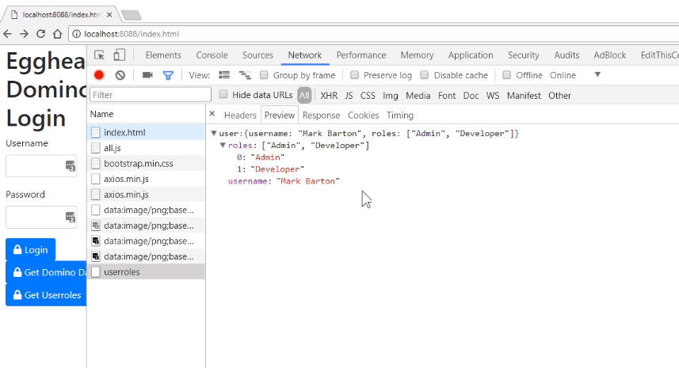

To make use of the user roles we've got from Domino, we're going to go into our node application, our `server.js`.

We're going to create a new route, and we're going to get hold of those roles.

For now, for testing purposes, we'll have a direct route to load up the roles.

```javascript
app.get("/userroles", function(req, res, next) {});
```

Similar to previously, the first thing we need to do is get hold of the `nodedomauthsessid` that we've set in our header.

If we don't have one, we're going to bail because our application needs this authentication header.

```javascript
app.get("/userroles", function(req, res, next) {
  const { nodedomauthsessid } = req.headers;
  if (!nodedomauthsessid) {
    return res.status(401).send(`No NodeDomAuthSessId header`);
  }
```

Next we'll set up the `option` that we are going to pass to our `request-promise`.

```javascript
const option = {
  uri: "http://Egghead1/nodejs.nsf/user?openpage",
  resolveWithFullResponse: true,
  headers: {
    Cookie: `DomAuthSessId=${nodedomauthsessid}`
  }
};
```

We also need to make sure that the request promise library actually returns JSON data.

We do that by setting `json: true` in the `option`.

```javascript
 const option = {
  ...
    json: true
  };
```

Our request promise will be called passing the `option`, and then we'll handle the response or any errors.

We'll deconstruct the `header` and `body` for the response, look for a `dominoauthenticationfailure`.

```javascript
 rp(option)
    .then(function(response) {
      const { headers, body } = response;
      if ("dominoauthenticationfailure" in headers) {
        // Authentication Failure - lets bat it back
        return res.status(401).send(headers.dominoauthenticationfailure);
      }
```

If we get pass that point, we'll just send back the actual response we get back from Domino, which should be some JSON data.

We actually use the JSON method of express to send back correctly-formatted headers.

```javascript
 rp(option)
    .then(function(response) {
     ...
     return res.json(response.body)
```

If we get an error, we'll handle that, as well.

```javascript
rp(option)
    .then(function(response) { ... })
    .catch(function(err) {
      return res.status(err.response.statusCode).send(err.response.body);
});
```

We're now going to test this route in our client application.

Going back into our index html page, we're going to add a new button.

We'll add it next to the `Get Domino Data` we had previously.

```html
  <button onclick="getUserRoles()" type="button" class="btn btn-primary">
                <i class="fas fa-lock"></i> Get Userroles
  </button>
```

We will create a new function call `getUserRoles()`.

First thing we do is set up an options object to pass to our Ajax call using the Axios library.

```javascript
function getUserRoles() {
        const options = {};
        options.method = 'get';
```

Our URL is going to be our new route, which is `/userroles`.

```javascript
      function getUserRoles() {
            const options = {};
            options.method = 'get';
            options.url = '/userroles';
```

We'll pick up the `NodeDomAuthSessId` that we've set in our local storage after we've logged in. Remember this won't work until you have logged in.

```javascript
   function getUserRoles() {
       ...
        const NodeDomAuthSessId = localStorage.getItem('NodeDomAuthSessId');
```

We'll set up our custom header with a value, and now, we make our call using the Axios library.

```javascript
 function getUserRoles() {
       ...
        if (NodeDomAuthSessId) {
                options.headers = { 'NodeDomAuthSessId': NodeDomAuthSessId }
            }
```

For now, we're just going to log out the result which should be JSON data containing our user roles.

We'll make sure to catch any errors, as well, and we'll also log those to the console.

```javascript
axios
  .request(options)
  .then(function(result) {
      console.log(result);
  })
  .catch(function(err) {
    console.log(err);
  });
```

OK, we'll start our node server up, open the [index](http://localhost:8088/index.html) page and test it.

I fired up my node server, launched my [index](http://localhost:8088/index.html) test page. 

Just to confirm, I still have my `NodeDomAuthSessId` in my local storage. It's still a valid identification. 

If I click the `Get Userroles` button, look at my console, I get back some data.

If I look in the network tab, I can now see that the response coming back is actually JSON data with the roles and my username. We can now use this data in our client application.

