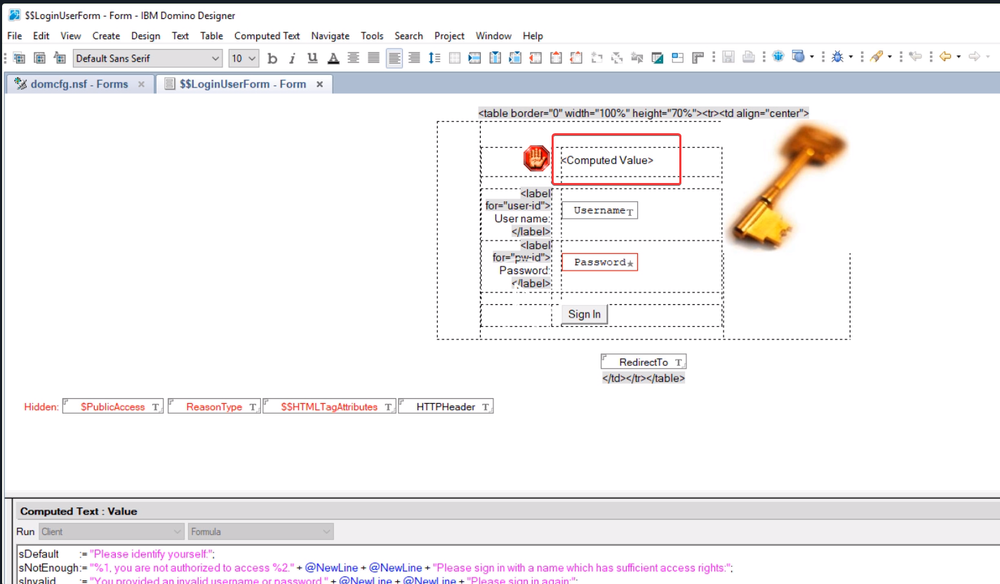
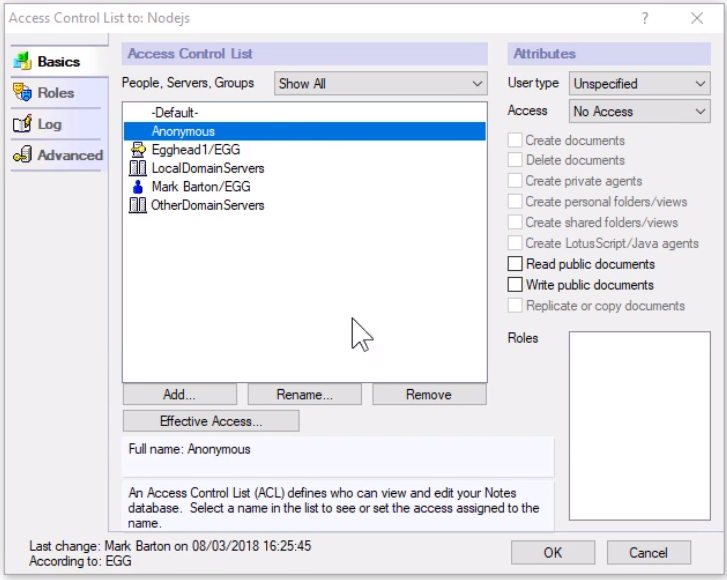
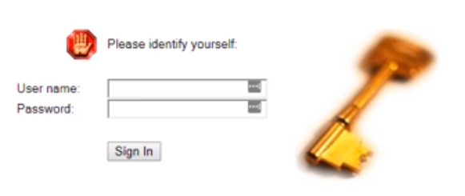
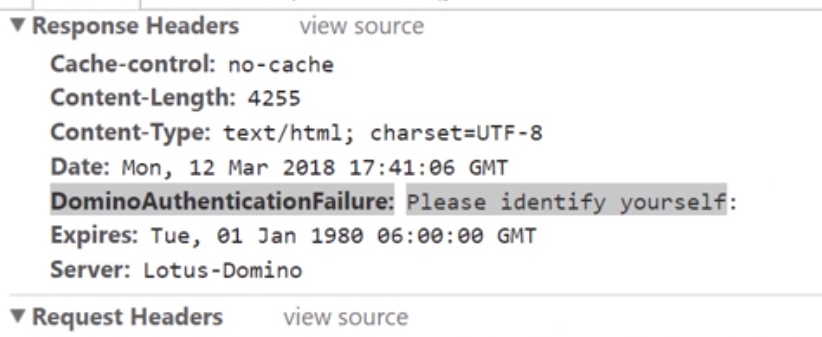
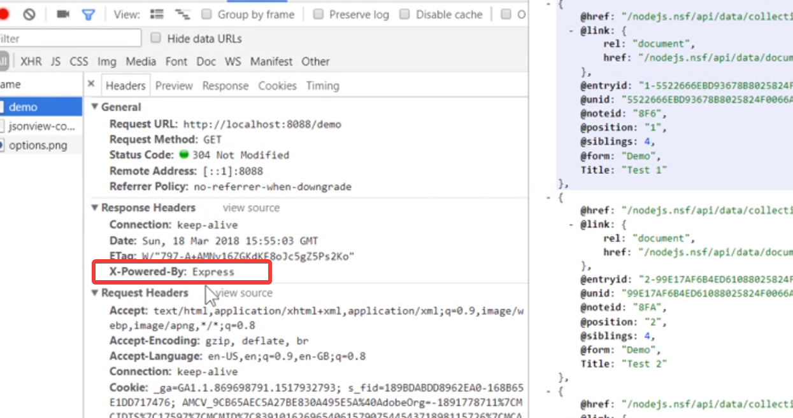
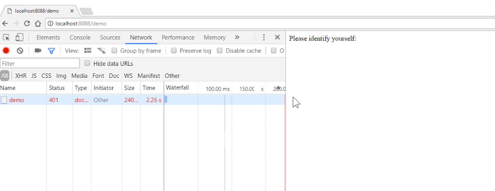
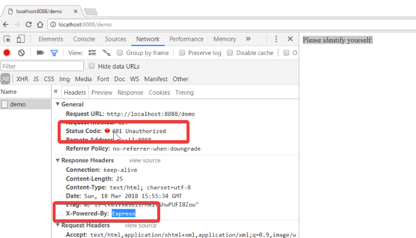

To make it easier for us to see authentication and authorization failures inside Node.js, we're going to add a custom HTTP header to the default login form. Normally, Domino will return a HTTP 200, even though there's an authorization failure. This doesn't really help us in a Node.js application.

If we look inside the standard `$$LoginUserForm`, you can see there's a `<Computed Value>`. This is the standard error message that gets returned to the user when there's an issue. We're going to reuse this code and add a new field to the form.



In this case, we're going to call it `HTTPHeader`. The key thing here is we will add a new line at the bottom, which will set the HTTP header, using the @formula, `@SetHTTPHeader`. @formulas work fine in this instance, so let's use them.

```javascript
@SetHTTPHeader("DominoAuthenticationFailure")
```

I've called my header `DominoAuthenticationFailure`, and I pass it the error message. Let's see how we use that in the Node app.

Here, we have an example notes application. I've set the ACL up with `Anonymous` of `No Access`, and the `-Default-` also of `No Access`.



In theory, if we hit this database in the browser, the standard login form will be presented to us to force a login. If we open our demo database in the browser by calling the `?opendatabase` command
[http://127.0.0.1/nodejs.nsf?opendatabase](http://127.0.0.1/nodejs.nsf?opendatabase), I get the standard login form being presented to me.

If I try that again. You can see, it says, `Please identify yourself` as the error message.



If I look in the network tab, and I look specifically at the `Response Headers` for the original call, you can see there's a new `DominoAuthenticationFailure` response header with the message, `Please identify yourself.`



If I attempt to enter a wrong `User name` and `Password` and hit `Sign In`, then check again the response header, you see I now get, `You provided an invalid username or password` which is the same message displayed on the form. We can use this HTTP header in our Node application.

## Express

We've got our basic [NodeJS](https://egghead.io/courses/for/node) / [Express](https://egghead.io/courses/getting-started-with-express-js) application here.

```javascript
const express = require("express");
const path = require("path");
const pjson = require("./package.json");
const port = ("port", process.env.PORT || 8088);
const app = express();
const rp = require("request-promise");
```

It's using the [Express](https://egghead.io/courses/getting-started-with-express-js) framework, and we are using request-based [promises](https://egghead.io/lessons/javascript-convert-a-callback-to-a-promise). We're not using callbacks in this case.

Our Node application is going to be acting as a proxy, and therefore all our web requests are going to come via the Node application.

Let's make a new demo route to get started. Our first root will be called `/demo`. It's going to be a `get` request.

We will be using the `request-promise` library to go to Domino and get some data. The first thing we're going to do is set up some options for our request object.

Starting with the `uri` to the notes application we're going to call. We're going to be using the Domino data service to get the data.

Remember, this database has restricted access. We should be getting an error when we make a HTTP call to this database.

```javascript
app.get("/demo", function(req, res, next) {
  const options = {
    uri: "http://Egghead1/nodejs.nsf/api/data/collections/name/all"
  };
});
```

We're going to need access to the full response.

We'll set that to `true` here as a property of the object.

```javascript
app.get("/demo", function(req, res, next) {
  const options = {
    uri: "http://Egghead1/nodejs.nsf/api/data/collections/name/all",
    resolveWithFullResponse: true
  };
});
```

Then we'll call the request, passing it the `options`. As it's a promise, we then have to deal with the result. The first thing we're going to do is get the `headers` and the `body` from the `response`.

Now, I'm going to use JavaScript ES6, which is an easy way for [deconstructing](https://egghead.io/lessons/javascript-es6-parameter-object-destructuring-with-required-values) properties from an object. 

We then want to see if we have an error. The way to do that is we're going to check for the Domino authentication failure header, which we have created on our login form.

We're going to look for that in the headers.

```javascript
rp(options).then(function(response) {
  const { headers, body } = response;
  if ("dominoauthenticationfailure" in headers) {
  }
});
```

If we do get a `dominoauthenticationfailure`, we will return an error message back to the browser. We will set the `status` to `401`, which is the standard HTTP authentication failure. We will then return the error message, which has been set in the custom `dominoauthenticationfailure` header.

```javascript
if ("dominoauthenticationfailure" in headers) {
  // Authentication Failure - lets bat it back
  return res.status(401).send(headers.dominoauthenticationfailure);
}
```

Assuming we don't get an authentication failure, we will then just return back the `body` of data which we get from Domino.

```javascript
rp(options).then(function(response) {
  const { headers, body } = response;
  if ("dominoauthenticationfailure" in headers) {
    // Authentication Failure - lets bat it back
    return res.status(401).send(headers.dominoauthenticationfailure);
  }
  return res.send(response.body);
});
```

Finally, we also need to catch any errors. We will just return those back with the status code of the error we've got from Domino. That could be a 404, for instance.

```javascript
rp(options).then(function(response) {
  ...
}).catch(function(err){
    return res.status(err.response.statusCode).send(err.response.body);
})
```

Let's fire up the application and test it. To test our Node application, the first thing we're going to do is initially allow `Anonymous` access to my database. I just want to make sure we can get data going through to the Node application.

I'm then going to go to the Node application and start it up by entering `node server`. 

It will start on port `8088`. 

Now, if I go to the browser and hit our demo URL [http://localhost:8088/demo](http://localhost:8088/demo), we should get some data. 

We get some data back from Domino. Just to make sure, we look at the HTTP headers. 

Yes, we are getting this via the Express server, not via Domino. 



Next, we'll put the security back on, go back to our browser, hit the URL again.

This time, we get a `401`, with the error message coming from Domino of, `Please identify yourself.`



Looking on the network tab, and we can see, it's come from Express, but it's actually 401 Unauthorized, which has come back from Domino.

