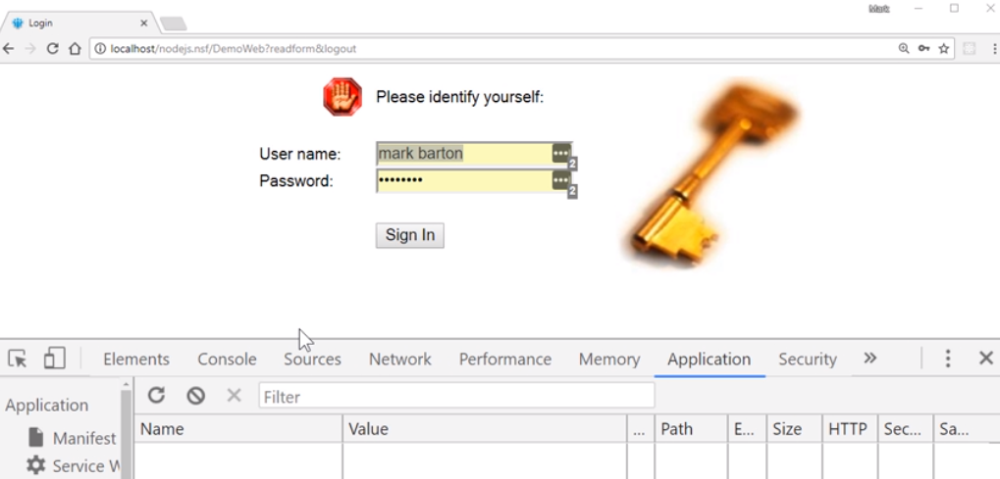
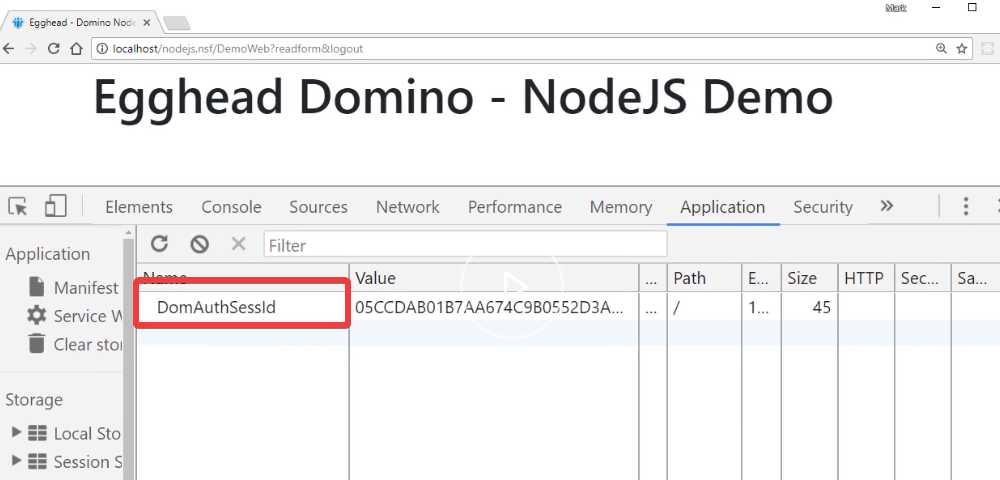
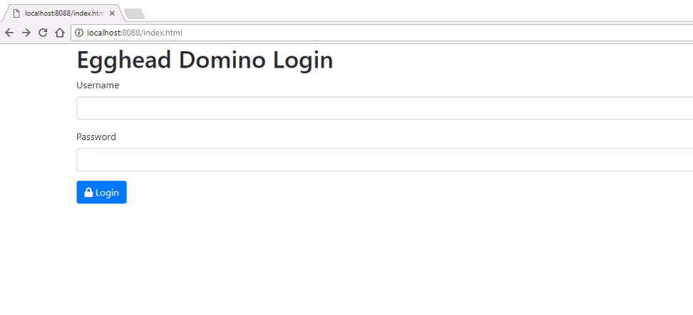
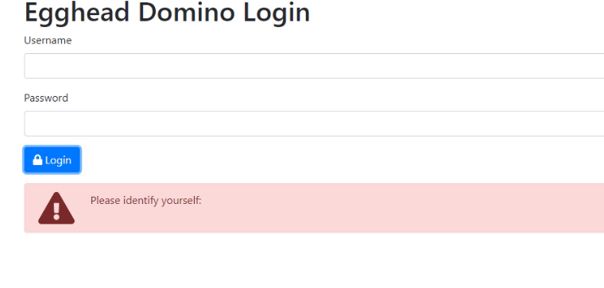
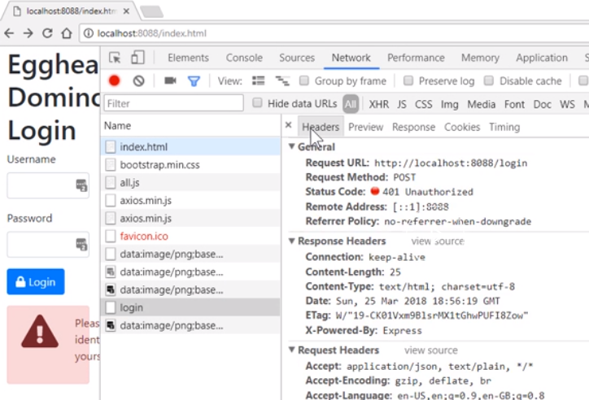
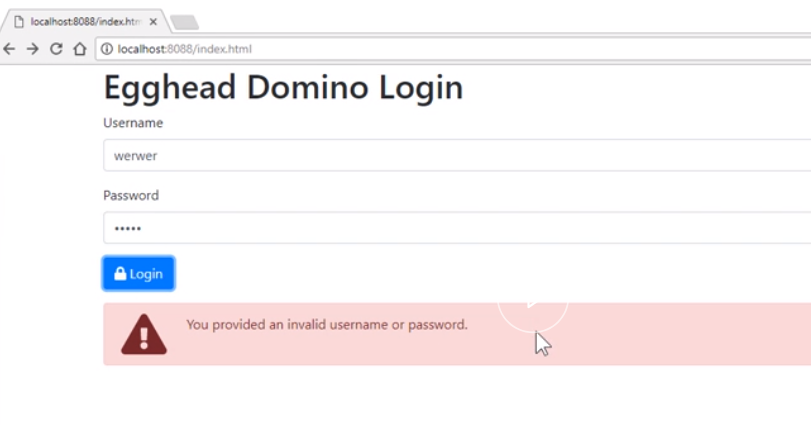
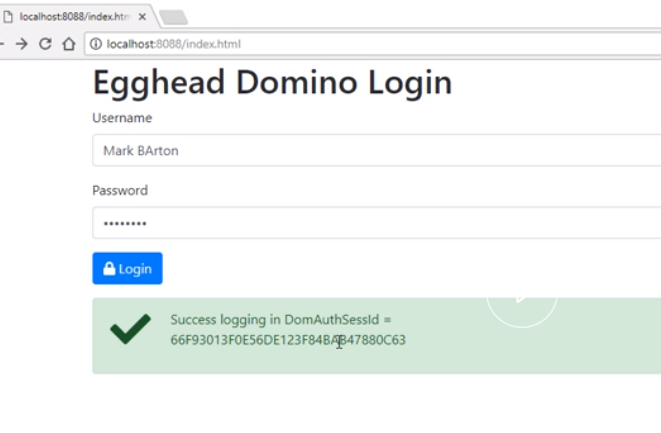

To access Domino Data as an authenticated user via the node application, we need to first understand how Domino records the fact that the user is authenticated. If I attempt to log in to my Domino database, I get the standard login form.



Now, if I look in my cookies, which you can see in Chrome under the Application tab, you can see there's a `DomAuthSessID` cookie being set. It's this value that we need to pass to node which in turn can be passed to Domino.



To get the Domino cookie, we're going to log in via the node server which is acting as a proxy and then intercept it.

To do this, the first thing I've done is install a couple of extra packages. One is `body-parser` so we can easily get our form data from our login form. The other one is a `cookie-parser`. That's to decode Domino cookie which is sent back via the Domino code.

```javascript
const bodyParser = require("body-parser");
const setCookie = require("set-cookie-parser");

app.use(bodyParser.json());
```

We're going to create a new route in our node server which we can then post our credentials to, to attempt to log in to Domino server.

This route will be a `post`. We're going to call it `/login`.

The first thing we're going to do is deconstruct the `Username` and `Password` from the `body` of the request.

```javascript
app.post("/login", function(req, res, next) {
  const { Username, Password } = req.body;
});
```

We're then going to create an `options` object which will be the settings we need for our request to the Domino server.

We're going to do a `post` to the name's and address book (names.nsf).

We want the full response including the status code. The only values we need to post are the `Username` and `Password`.

Importantly, for this library, you need to say simple is false. That's because it considers any status code which isn't in `200` range as an error.

Unfortunately, Domino will return a `302`, which is a redirect on a successful login. Therefore, it will automatically go to error handler. We don't want that, which is why we need to say simple is false.

```javascript
app.post("/login", function(req, res, next) {
  const { Username, Password } = req.body;
  const options = {
    uri: "http://Egghead1/names.nsf?login",
    resolveWithFullResponse: true,
    form: { Username, Password },
    simple: false
  };
});
```

Now, we've got our `options` object. Let's make our call to Domino.

We'll use the `request-promise` package.

We will do a HTTP `post`, pass the `options` object, and then we will deal with the result.

Also, we'll put error-handling just in case.

```javascript
rp.post(options)
  .then(function(response) {})
  .catch(function(err) {});
```

Within our response handler, first thing we're going to do is grab the `headers` and `body`. We'll deconstruct those. Very handy, this ES6 deconstruction.

We're also going to get and check to see if we've got a `dominoauthenticationfailure`.

Remember, we said this is a custom header, so we can deconstruct it from the headers. If `dominoauthenticationfailure` has a value, that means we've got one from Domino. Therefore, we should just return with a `401`.

```javascript
rp.post(options)
  .then(function(response) {
    const { headers, body } = response;
    const dominoauthenticationfailure = headers.dominoauthenticationfailure;

    if (dominoauthenticationfailure) {
      return res.status(401).send(dominoauthenticationfailure);
    }
  })
  .catch(function(err) {});
```

If we get past this point then we're good to go.

The next thing we need to do is we need to get a hold of the Domino authentication cookie which is in the response headers.

We're going to use the `setCookie` parser library to deconstruct the cookies into objects for us. We'll set those to a new value.

```javascript
const cookies = setCookie.parse(response, {
  decodeValues: true
});
```

Now, Domino may return multiple cookies.

We want to make sure we only get the `DomAuthSessId` cookie.

We can do this using a [filter](https://egghead.io/lessons/javascript-refactoring-array-prototype-by-example-filter-some-foreach?pl=javascript-lessons-release-order-e3643aa5) method on an array. If the cookie name property is equal to `DomAuthSessID`, then we know this is the cookie we want.

```javascript
const domino_auth_cookie = cookies.filter(function(cookie) {
  return cookie.name === "DomAuthSessId";
});
```

We're going to check to see if we've got the Domino authentication cookie by looking at the length of the filtered array.

For now, in this test route, we're going to just send back the value of the cookie.

```javascript
if (domino_auth_cookie.length > 0) {
  return res.send(domino_auth_cookie[0].value);
}
```

If we did not get a Domino authentication cookie, then we will just send back, for now, a blank object.

```javascript
return res.send({});
```

Finally, in the error handling, we will trap any errors and send those back to the browser as well.

```javascript
.catch(function(err){
    return res.send(err)
});
```

## Demo HTML Page

We're starting with a basic HTML page.

I'm using [Bootstrap](https://getbootstrap.com/) along with [font awesome](https://fontawesome.com/).

I'm also using the [Axios](https://github.com/axios/axios) library to do Ajax calls.

We're diving straight in.

I assume you've already got your own index login page set up.

I've got some `username` and `password` input fields and a `Login` button.

I also have a `login_success` container and an `login_error` container as well.

If I come down to my `login` function, what I'm going to do is use the Axios library to do a post to my node server.

```javascript
function login() {
  const login_success_container = document.getElementById("login_success");
  login_success_container.classList.replace("d-block", "d-none");

  const login_error_container = document.getElementById("login_error");
  login_error_container.classList.replace("d-block", "d-none");
}
```

I'm going to send through the contents of my form, which is my `username` and `password`.

We do a post to the `/login` route that we have just created in the nodejs application.

```javascript
 axios.post('/login', {
                Username: document.getElementById('username').value,
                Password: document.getElementById('password').value
            }).then(
                function (result) {
                ).catch(function (err) {
            })
```

The Axios library returns a promise.

If we successfully authenticate with Domino, we will get back a 200.

In this case, we'll get back the `DomAuthSessId`.

We will then display that in our success message box.

In this instance, we're going to use ES6 templating language so that we can place the result directly inside our string. To display the success container, we need to change the Bootstrap class `d-none` to `d-block`.

```javascript
axios
  .post("/login", {
    Username: document.getElementById("username").value,
    Password: document.getElementById("password").value
  })
  .then(function(result) {
    const login_success_message = document.getElementById(
      "login_success_message"
    );
    login_success_message.innerText = `Success logging in DomAuthSessId = 
             ${result.data}`;
    login_success_container.classList.replace("d-none", "d-block");
  });
```

If you have an authentication failure from Domino, our node server is going to return either a `401` or `403`.

That will be caught as an error in the Axios's library.

We look for a status code of `401` or `403` to make sure that this is not a general error that we're picking up.

We display whatever's been sent back by Domino inside the error message display. Finally, we display it by changing the Bootstrap class.

```javascript
 axios.post('/login', {
                Username: document.getElementById('username').value,
                Password: document.getElementById('password').value
            }).then(
                function (result) {
                }).catch(function (err) {
                if (err.response) {
                    if (err.response.status === 401 || err.response.status === 403) {
                        const login_error_message = document.getElementById('login_error_message');
                        login_error_message.innerText = err.response.data;
                        login_error_container.classList.replace('d-none', 'd-block');
                    }
                }
            })
```

OK, that's our index page done. 

Let's fire up the node server and test it. 

Open the browser and browse to [http://localhost:8088/index.html](http://localhost:8088/index.html), and we should get our standard Bootstrap login form.



Remember, we're authenticating to the Domino notes names & address book (names.nsf) via our node server. 

If I click `Log In` with empty `username` and `password` fields then Domino come back with a, `Please identify yourself.` 



If we look at the network traffic, we can see that our node server has sent back a 401 unauthorised. It's given a response of, `Please identify yourself`, which is the error message.



Now, let's try entering an invalid `username` and an invalid `password`. Try again. This time, we got another message back from Domino, `You provided an invalid username or password.` 



Finally, let's try it with a valid user. This time, we should be authenticated. We should get back a `DomAuthSessionID`, and we have.



Now, we have this value. We can go forward and store this value inside our client application and make sure it's used every time we want to get Domino Data via the NodeJS application.
