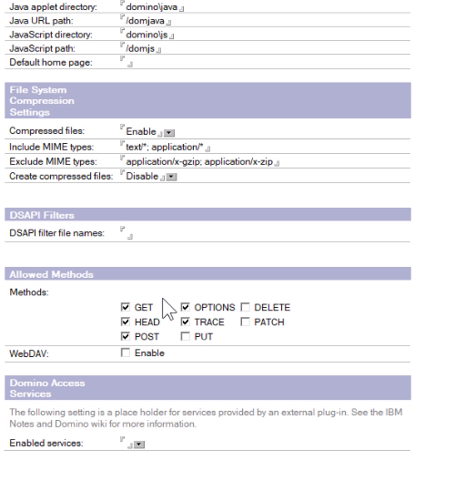
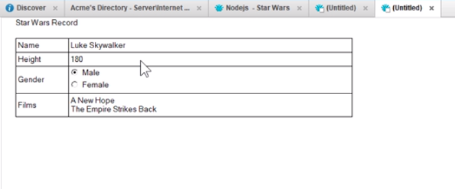
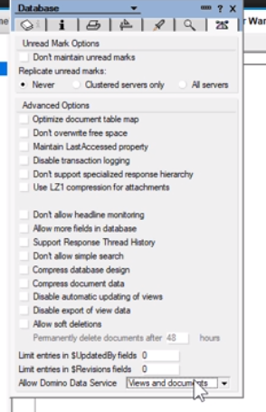
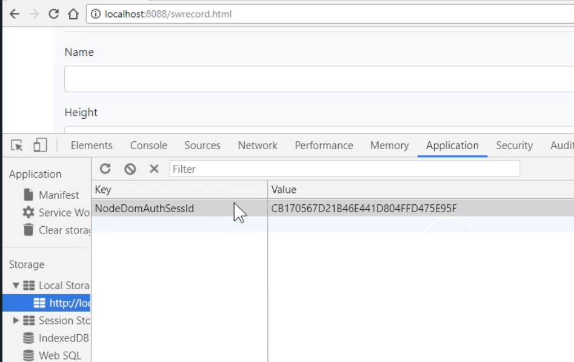
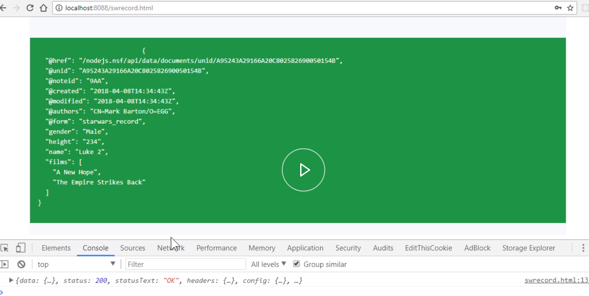
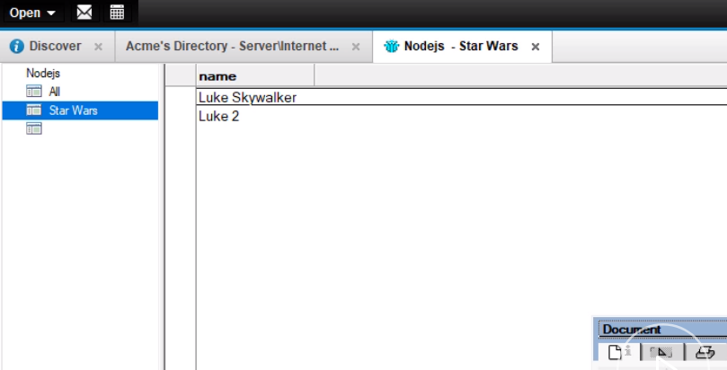
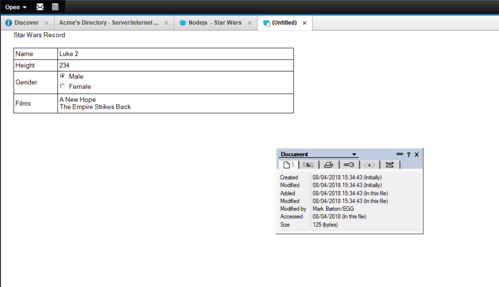

To update data in Domino from Node.js, I recommend you modify your Internet site document and make sure all the available HTTP methods are set.

At the least make sure `PUT`, `DELETE`, and `PATCH` are selected within the `Allowed Methods`



We're going to show you how to use the Node server and the Domino REST API to create some documents. Remember, we're still going to be using proper Domino security.

I've created a very basic form called `Star Wars` Record. We're going to capture `Name`, `Height`, `Gender` which is a radio button, and a multi-value `Films`. I have a record ready for Luke.



The other thing you need to make sure is the database has the correct setting for dealing with the REST API. At the bottom of the database properties, you've got to allow Domino Data
Service for `views and documents`.



The first thing we're going to do is modify our `server.js` file inside our Node application. We need to add a route which we're going to `POST` to from our client application which in turn will then post through to Domino. We're going to call this route `/swrecord` for Star Wars Record.

```javascript
app.post("/swrecord", function(req, res, next) {});
```

Because we're using Domino security, we do need our `nodedomauthsessid` to be sent to us. We'll deconstruct that from the request `header`. If we don't have it, then we're going to bounce it straight back to the client with a 401 status.

```javascript
const { nodedomauthsessid } = req.headers;
if (!nodedomauthsessid) {
  return res.status(401).send(`No NodeDomAuthSessId header`);
}
```

Next, we start sorting out our `options` we're going to use on our request to Domino. Let's start with the `url`. We're using the Domino REST API. It uses the document's collection as part of the API to do a post to.

You also have to associate the post with a form. In our case, it's going to be the `Star Wars_Record` form.

```javascript
const options = {
  uri: "http://Egghead1/nodejs.nsf/api/data/documents?form=starwars_record"
};
```

We need to pass our Domino security cookie and the `body` contents will be the same as our `request body`. We will just pass that directly through.

```javascript
const options = {
  uri: "http://Egghead1/nodejs.nsf/api/data/documents?form=starwars_record",
  headers: {
    cookie: `DomAuthSessId=${nodedomauthsessid}`
  },
  body: req.body
};
```

It's a JSON request, so that's going to be true and we going to resolve with full a response again so we can see the full headers.

```javascript
const options = {
  uri: "http://Egghead1/nodejs.nsf/api/data/documents?form=starwars_record",
  headers: {
    cookie: `DomAuthSessId=${nodedomauthsessid}`
  },
  body: req.body,
  json: true,
  resolveWithFullResponse: true
};
```

Next, we'll make our request to Domino.

It's going to be a `post`.

We're going to pass it the options, then we're going to handle hopefully a successful result, if not it will either be an authentication failure or some error.

If it is a success it actually returns a `location` HTTP header. The `body` of the `response` actually contains no data at all.

```javascript
rp.post(options)
  .then(function(response) {})
  .catch(function(err) {
    return res.status(err.statusCode).send(err.error.message);
  });
```

What we're going to do is deconstruct either the `dominoauthenticationfailure` or the `location` header if everything's gone correctly from our `response.headers`. If we've got a `dominoauthenticationfailure`, we're going to bat that straight back to the client with a status of `401`.

```javascript
rp.post(options)
  .then(function(response) {
    const { dominoauthenticationfailure, location } = response.headers;
    if (dominoauthenticationfailure) {
      return res.status(401).send(dominoauthenticationfailure);
    }
  })
  .catch(function(err) {
    console.log(err);
    return res.status(err.statusCode).send(err.error.message);
  });
```

Then the next thing I want to do is, I don't want to return just a `location` of the saved document. I want to return the actual data that Domino has saved. Therefore, I'm going to do a second request now to Domino, a `get` `request`, to actually get the data.

We're going to set a new `options` object up for the new request. The `uri` in this instance is the `location` header. We still need to take into account the security so we need to pass that as well.

We'll set `json: true` and again, we'll `resolveWithFullResponse: true`.

```javascript
rp.post(options)
  .then(function(response) {
    const { dominoauthenticationfailure, location } = response.headers;
    if (dominoauthenticationfailure) {
      return res.status(401).send(dominoauthenticationfailure);
    }
    const redirect_option = {
      uri: location,
      headers: {
        cookie: `DomAuthSessId=${nodedomauthsessid}`
      },
      json: true,
      resolveWithFullResponse: true
    };
  })
  .catch(function(err) {
    console.log(err);
    return res.status(err.statusCode).send(err.error.message);
  });
```

We're going to make this second request to Domino. It's a `get`. Hopefully we'll get a successful response.

This time the `response` we will be sent straight back to the browser.

What actually we want is the `response.body`.

```javascript
rp.post(options)
  .then(function(response) {
    const { dominoauthenticationfailure, location } = response.headers;
    if (dominoauthenticationfailure) {
      return res.status(401).send(dominoauthenticationfailure);
    }
    const redirect_option = {
      uri: location,
      headers: {
        cookie: `DomAuthSessId=${nodedomauthsessid}`
      },
      json: true,
      resolveWithFullResponse: true
    };
    rp.get(redirect_option)
      .then(function(response) {
        return res.send(response.body);
      })
  })
  .catch(function(err) {
    return res.status(err.statusCode).send(err.error.message);
  });
```

Now we've got to deal with any errors. The Domino REST API returns a JSON object with description of the error messages. We'll now catch those and send them back to the browser at the same time we can set our status code based on the status codes returned from the Domino REST API error.

Then we can send the actual `error.message` itself which is a property of the `err` object. For the inner request for the `get`.

```javascript
     rp.get(redirect_option)
      .then(function(response) {
        return res.send(response.body);
      })
      .catch(function(err) {
        return res.status(err.statusCode).send(err.error.message);
      });
```

Now we're going to do the outer request. But it's going to be exactly the same. 

That's the `server.js` file done. Now we can go ahead and test it. 

Our web page is a standard bootstrap page with a container. We've got a login form first which we use to log into Domino via the Node server. We need that to get our `nodedomauthsessid`.

Then we have another form which we use to collect the data for our Star Wars Record which includes `name`, `height`, radio buttons for the various `gender`, and then the `films` themselves which are checkboxes. 

Then we have a save button. Within our save function, we have a post to our `/swrecord` route.
We retrive the `nodedomauthsessid` from the local storage. 

```javascript
const options = {};
            options.method = 'post';
            options.url = '/swrecord';
            const NodeDomAuthSessId = localStorage.getItem('NodeDomAuthSessId');
            if (NodeDomAuthSessId) {
                options.headers = { 'NodeDomAuthSessId': NodeDomAuthSessId }
            }
```

We then get hold of the `form` data. If you look at the film's one specifically, it has specific syntax to deal with multi values.

```javascript
 options.data = {
              ...
                films: Array.from(document.querySelectorAll('input[name=films]:checked'))
                .map((checkbox) => checkbox.value)
            }
```

Then we use the `axios` library to do a `post` to our Node server, passing the information. Then the `result` is outputted using a `JSON.stringify` to a `result` div, so we can see the `data` coming back from Domino. If it's an error, we catch it and show it in the `error_message`.

```javascript
       axios.request(options).then(
                function (result) {
                    console.log(result);
                    document.getElementById('result').innerHTML =
                        `<pre class="text-white">
                            ${JSON.stringify(result.data, undefined, 2)}</pre>`;
                    success_container.classList.replace('d-none', 'd-block');
                }
            ).catch(function (err) {
                if (err.response) {
                    const error_message = document.getElementById('error_message');
                    error_message.innerText = err.response.data;
                    error_container.classList.replace('d-none', 'd-block');
                }
            })
```
Let's see what they look like in the browser. I've started my server and refreshed my browser.

The first thing I'm going to be presented with is my Domino login form. I enter my `username` and then my `password`. 

The response comes back from the Node server. We can see that in our network tab. 
We'll just bring that up. We can see the response comes back with a `NodeDomAuthSessId`. We store that in local storage.



The result of that is the my Star Wars Record input form is displayed. 

If I give it a `Name`, some `Height` information, I'm going to make this one male. I'm going to have two films selected. I hit `Save`. 

Remember this has gone off to the Node server to Domino, done the post, created the document, and then used the location to get the Domino data itself.

Here is response back from Domino. As we can see, we've got a `@unid` and `@noteid` and the fields I sent through including `films`, which was a multi-value field.



Lets look at that in the notes database.

Opening my demo notes database, I see there is a new document, `Luke 2` which I've just created. 



I open the document up. I have `Luke 2`, `height = 234`, `male`, and two values in the `films`. 

That's worked successfully.

