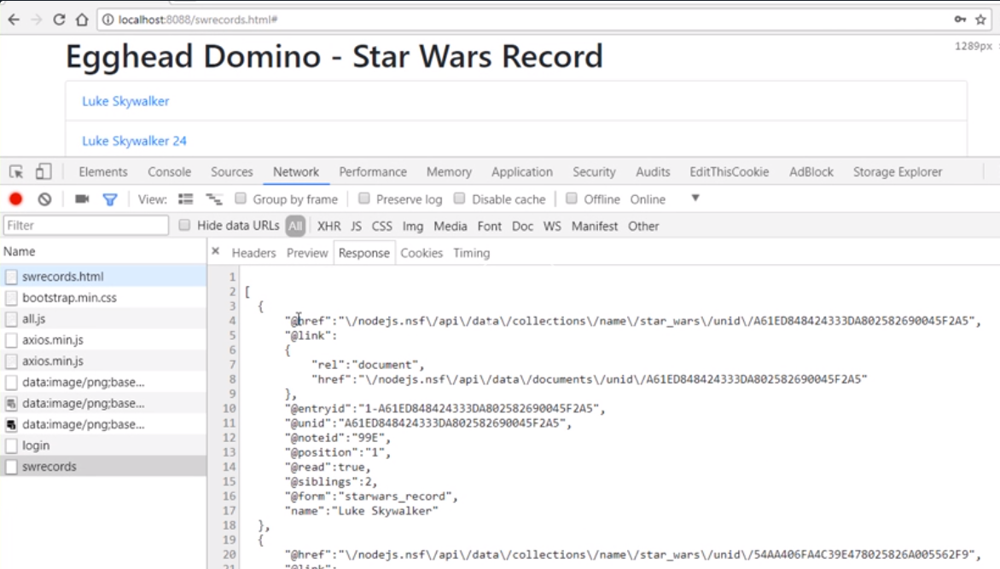
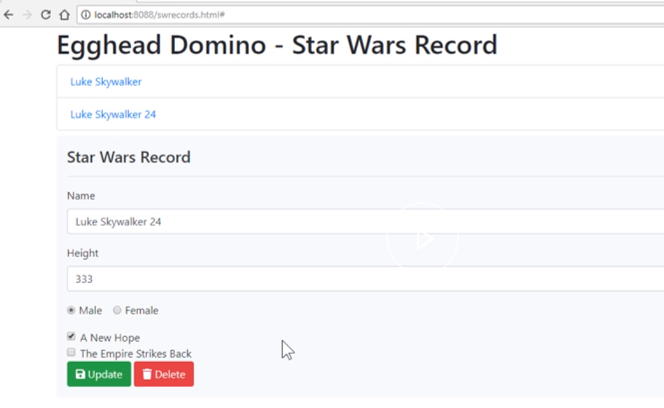
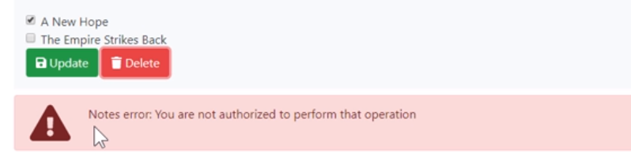
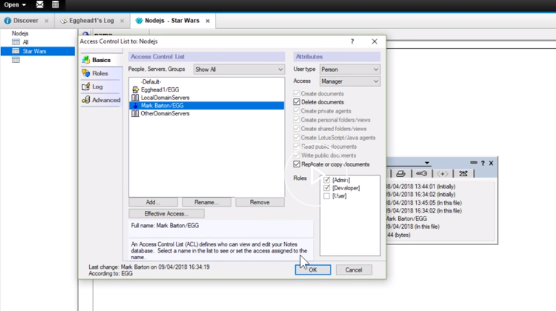

We're now going to demonstrate updating and deleting Domino data via the NodeJS server. To do that for our demonstration, we're going to need to add several routes. They're all fairly similar, so what I'll do is just highlight the differences.

The first that we're going to need to do is get hold of a list of records. We're going to use this list in our demo just to be able to select a document, which will then display the data. It will then allow you to update it or delete it.

```javascript
app.get('/swrecords', function(req, res, next){
 
})
```

Common to all these routes will be the need to have the Domino security token passed. 

```javascript
const {nodedomauthsessid} = req.headers;
 if(!nodedomauthsessid){
  return res.status(401).send(`No NodeDomAuthSessId header`);
 }
```

The `options` we need for the request to Domino are going to be, again, fairly similar across all our routes.

In the case of a view of all records, the last argument in our API call is the view name.

```javascript
const options = {
   uri: "http://Egghead1/nodejs.nsf/api/data/collections/name/star_wars",
   resolveWithFullResponse: true,
   headers:{
     Cookie: `DomAuthSessId=${nodedomauthsessid}`
   }
 };
```

Then we'll use our standard method for dealing with the response back from Domino, which will be to check for any security issues. I'll send through the data and I'll also handle any errors.

```javascript
 rp(options)
 .then(function(response){
  const { headers, body } = response;
  const dominoauthenticationfailure = headers.dominoauthenticationfailure;
  if (dominoauthenticationfailure) {
    return res.status(401).send(dominoauthenticationfailure);
  }
  return res.send(response.body);
 })
 .catch(function(err){
  return res.status(err.response.statusCode).send(err.response.body);
 })
```

That's our first route, which is to get all "Star Wars" records from a note's view. 

We're also going to need the following routes. We're going to need a route to get an individual document.

This one is going to be passed the `unid` of the record. 
```javascript
app.get('/swrecords/:unid', function(req, res, next){
})
```
Similar to previously, we're looking for Domino security and the options are very similar, except the URL is slightly different where we have `documents/unid`. We pass it the `unid`, which has been passed to the express application.

```javascript
const { nodedomauthsessid } = req.headers;
  if (!nodedomauthsessid) {
    return res.status(401).send(`No NodeDomAuthSessId header`);
  }
  const options = {
    uri: `http://Egghead1/nodejs.nsf/api/data/documents/unid/${req.params.unid}`,
    resolveWithFullResponse: true,
    headers: {
      Cookie: `DomAuthSessId=${nodedomauthsessid}`
    }
  };
```

When you have a route that looks like this with a colon `/swrecords/:unid`, that property becomes available to you through the Express framework using this syntax `${req.params.unid}`. The rest of our request to Domino is exactly the same.

```javascript
 rp(options)
    .then(function(response) {
      const { headers, body } = response;
      const dominoauthenticationfailure = headers.dominoauthenticationfailure;
      if (dominoauthenticationfailure) {
        return res.status(401).send(dominoauthenticationfailure);
      }
      return res.send(response.body);
    })
    .catch(function(err) {
      return res.status(err.response.statusCode).send(err.response.body);
    });
```

That's an individual document. 

We now have to deal with the update to an individual document. There are two HTTP methods available to you. There's the `PATCH` and a `PUT`.

Now, according to the Domino REST API, if you use the `PATCH` method, you only need to pass the specific fields you want to update. Whereas the `PUT` method, you need to pass either all your fields, or if you don't, then the ones that you don't pass will be blanked.

Therefore, I see no real value in the `PUT` method. I would stick to `PATCH`. To keep it the same on our Node server, we'll also use the `PATCH` HTTP method. Again, we'll be passed the `unid` of the document we want to update.

```javascript
app.patch('/swrecords/:unid', function(req,res,next){
})
```
Again, we'll be checking for Domino security. 

Now, our `options` for our request to Domino is slightly different. The key thing here is we have to set a special header for Domino called the `X-HTTP-Method-Override`. It needs a `PATCH` as its value.

```javascript
 const options = {
    uri: `http://Egghead1/nodejs.nsf/api/data/documents/unid/${req.params.unid}`,
    headers: {
      cookie: `DomAuthSessId=${nodedomauthsessid}`,
      'X-HTTP-Method-Override':`PATCH`
    },
    body: req.body,
    json: true,
    resolveWithFullResponse: true
  };
```

The actual HTTP request to Domino will be a standard `post`. As part of our `PATCH`, we will be passing the `body` from the `request` and send that straight through to Domino. This can be a subset of fields.

```javascript
 rp.post(options).then(function(response) {
    const { dominoauthenticationfailure, location } = response.headers;
    if (dominoauthenticationfailure) {
      return res.status(401).send(dominoauthenticationfailure);
    }
    res.send(response.body);
  })
  .catch(function(err){
    return res.status(err.statusCode).send(err.error.message);
  });
```

That will then update the Domino document, but it's critical. You must include this value as a HTTP header. The actual request to Domino itself is exactly the same as our other routes.

Next, we'll add the `delete` route. Again, we'll be passed the `unid` of the document we want to delete.

```javascript
app.delete('/swrecords/:unid', function(req, res, next){
})
```

We'll be using Domino security, so we need a token again. Our other `options` for our request to Domino are similar, except the method will be `delete` instead of GET or POST.

```javascript
 const options = {
    uri: `http://Egghead1/nodejs.nsf/api/data/documents/unid/${req.params.unid}`,
    headers: {
      cookie: `DomAuthSessId=${nodedomauthsessid}`
    },
    method:'DELETE',
    resolveWithFullResponse: true,
    json:true
  };
```

We've got all records, get an individual record, update a single record, and delete a record. That's our `server.js` file updated of all the new routes. We'll now look at the our HTML page, which we'll use to show how it all hangs together.

Here, we have our web page, which we're going to use to display our records and edit them and then delete them. Standard bootstrap layout -- we've got a top form, which we'll use to do the login, seen before on this one.

Then we've got a container, which is going to hold a list of our records. Then finally, we have a bottom form, which we'll be using to do the updating of the data. Down the bottom, we have our script functions.

Now, I should point out that this demo is using no libraries, whatsoever. There's no JQuery or no [Angular](https://egghead.io/browse/frameworks/angular), no [React](https://egghead.io/browse/frameworks/react), no [Vue.js](https://egghead.io/browse/frameworks/vue). All this stuff would be much easier using a single-page application.

For now, as a demonstration we can show that we can do it with just vanilia JavaScript. 

We have our `login` function, which is going to be used to get the `username` and `password`. Pass it to our Node server and the response checked.

```javascript
   function login() {

            const error_container = document.getElementById('error_container');
            error_container.classList.replace('d-block', 'd-none');

            axios.post('/login', {
                Username: document.getElementById('username').value,
                Password: document.getElementById('password').value
            }).then(
                function (result) {
                    localStorage.setItem('NodeDomAuthSessId', result.data);
                    // Hide Login Form
                    document.getElementById('login_form').classList.add('d-none');
                    // Display Record Form
                    document.getElementById('sw_records').classList.replace('d-none', 'd-block');
                    load_records();
                }
            ).catch(function (err) {
                if (err.response) {
                    if (err.response.status === 401 || err.response.status === 403) {
                        const error_message = document.getElementById('error_message');
                        error_message.innerText = err.response.data;
                        error_container.classList.replace('d-none', 'd-block');
                    }
                }

            })
        }
```

We have a function to `load_records`. 

This will be calling our `swrecords` route on our Node server. Once we get back the information, we're going to loop over it and update our list element with a list of links.

```javascript
function load_records() {
            const options = {};
            options.method = 'get';
            options.url = '/swrecords';
            const NodeDomAuthSessId = localStorage.getItem('NodeDomAuthSessId');
            if (NodeDomAuthSessId) {
                options.headers = { 'NodeDomAuthSessId': NodeDomAuthSessId }
            }
            axios.request(options).then(
                function (result) {
                    const list = document.getElementById('records');
                    list.innerHTML = ""; //clear down list
                    result.data.forEach(element => {
                        const name = element.name;
                        const unid = element['@unid'];

                        const item = document.createElement('li');
                        item.setAttribute('class', 'list-group-item')
                        const link = document.createElement('a');
                        const link_text = document.createTextNode(name);
                        link.setAttribute('href', `#`);
                        link.setAttribute('onclick', `load_record('${unid}')`);
                        link.appendChild(link_text);
                        item.appendChild(link);
                        list.appendChild(item);

                    });
                }
            )
        }
```

Clicking on a link we'll call the `load_record` function, passing it the `unid` of the selected record. This is passed to our Node server. Using the `swrecord/:unid` route, it will get the data. It will then update the form for it to be editable.

```javascript
function load_record(unid) {
            // display form
            document.getElementById('sw_record').classList.replace('d-none', 'd-block');
            // Hide success block
            document.getElementById('result').classList.replace('d-block', 'd-none');

            const options = {};
            options.method = 'get';
            options.url = `/swrecords/${unid}`;
            const NodeDomAuthSessId = localStorage.getItem('NodeDomAuthSessId');
            if (NodeDomAuthSessId) {
                options.headers = { 'NodeDomAuthSessId': NodeDomAuthSessId }
            }
            axios.request(options).then(
                function (result) {
                    //reset form
                    document.getElementById('sw_record').reset();

                    document.getElementById('name').value = result.data.name;
                    document.getElementById('height').value = result.data.height;
                    if (result.data.gender === 'Male') {
                        document.getElementById('gender_1').checked = true
                    } else {
                        document.getElementById('gender_2').checked = true
                    }
                    if (Array.isArray(result.data.films)) {
                        result.data.films.forEach(function (val) {
                            if (val === 'A New Hope') {
                                document.getElementById('films_1').checked = true
                            }
                            if (val === 'The Empire Strikes Back') {
                                document.getElementById('films_2').checked = true
                            }
                        })
                    } else {
                        if (result.data.films === 'A New Hope') {
                            document.getElementById('films_1').checked = true
                        }
                        if (result.data.films === 'The Empire Strikes Back') {
                            document.getElementById('films_2').checked = true
                        }

                    }
                    document.getElementById('unid').value = result.data['@unid'];
                })
        }
```

We then have our `update` function. This one will do the update by using a `patch` HTTP method when sending to the Node server, passing it the `unid`. 

```javascript
function update() {

            // Hide containers by default
            const success_container = document.getElementById('result');
            success_container.classList.replace('d-block', 'd-none');

            const error_container = document.getElementById('error_container');
            error_container.classList.replace('d-block', 'd-none');

            const options = {};
            options.method = 'patch';
            options.url = `/swrecords/${document.getElementById('unid').value}`;
            const NodeDomAuthSessId = localStorage.getItem('NodeDomAuthSessId');
            if (NodeDomAuthSessId) {
                options.headers = { 'NodeDomAuthSessId': NodeDomAuthSessId }
            }

            options.data = {
                name: document.getElementById('name').value,
                height: document.getElementById('height').value,
                gender: document.querySelector('input[name=gender]:checked').value,
                films: Array.from(document.querySelectorAll('input[name=films]:checked'))
                    .map((checkbox) => checkbox.value)
            }
            axios.request(options).then(
                function (result) {
                    console.log(result);
                    //const success_message = document.getElementById('success_message');
                    document.getElementById('result').innerHTML =
                        `<pre class="text-white">Record Updated</pre>`;
                    success_container.classList.replace('d-none', 'd-block');
                    load_records();
                }
            ).catch(function (err) {
                if (err.response) {
                    const error_message = document.getElementById('error_message');
                    error_message.innerText = err.response.data;
                    error_container.classList.replace('d-none', 'd-block');
                }

            })
        }
```

The last one is a `delete_record` method.

This again is very similar where we're just calling our `swrecords/:unid` and we're passing it a `delete` HTTP method. When a record is selected we hold the `unid` value for the selected record as a hidden input field on the form.
```javascript
function delete_record() {
            // Hide containers by default
            const success_container = document.getElementById('result');
            success_container.classList.replace('d-block', 'd-none');

            const error_container = document.getElementById('error_container');
            error_container.classList.replace('d-block', 'd-none');

            const options = {};
            options.method = 'delete';
            options.url = `/swrecords/${document.getElementById('unid').value}`;
            const NodeDomAuthSessId = localStorage.getItem('NodeDomAuthSessId');
            if (NodeDomAuthSessId) {
                options.headers = { 'NodeDomAuthSessId': NodeDomAuthSessId }
            }
            axios.request(options).then(
                function (result) {
                    document.getElementById('result').innerHTML =
                        `<pre class="text-white">Record Deleted</pre>`;
                    success_container.classList.replace('d-none', 'd-block');
                    load_records();
                    //reset form
                    document.getElementById('sw_record').reset();
                    //hide form
                    document.getElementById('sw_record').classList.replace('d-block', 'd-none');
                }
            ).catch(function (err) {
                if (err.response) {
                    const error_message = document.getElementById('error_message');
                    error_message.innerText = err.response.data;
                    error_container.classList.replace('d-none', 'd-block');
                }

            })

        }
```

Let's have a look and see what it looks like in the browser. I've started my server, refreshed my browser page, loaded up my new HTML page, which is to be [records](http://localhost:8088/swrecords.html). The first thing I'm presented with is the login form.

I'm going to log in to Domino via my Node server, after successfully logging in the next thing that happens is the call to get to the note's view data. 

You'll see here, we're actually getting back a response, which is Domino data which corresponds to this list element up here.



If I click on one of these, I then populate my form. Using the `update()` method here, I can then change a value.



If I click `Update`, it's going to go off and do a `PATCH` request to Domino. The end result is updated automatically, because my view is being refreshed as well.

Finally, just to prove I'm using Domino data, I've turned off the ability to delete from my logged in user. 

If I click `Delete`, I get an error, coming back from Domino saying I'm `not authorized to perform the operation` because in Domino, I'm not authorized to delete documents.



If I enable `Delete documents` in the ACL and then I go back into the browser. 



I try again. The document is then deleted. That's the code working.

To confirm you can click on a document, which loads it up into the form. You can then edit it, update it, and delete it.