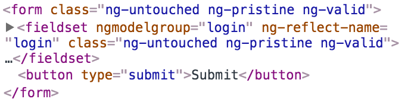
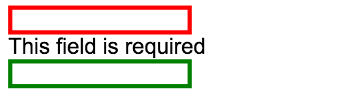

If you use the dev tools to select one of the `<inputs>` inside of your `form`, you'll notice these classes `ng-untouched`, `ng-pristine`, and `ng-valid`. Let's focus on `ng-valid`, because if I change this input to be invalid, this field is required, you'll see that this now has `ng-invalid` instead of `ng-valid`.



What that allows us to do is to style these fields with our own custom styles based on those classes. If I add a style of `ng-invalid` and I say it's a border, it's a `3 px solid red`, and I hit save. You'll see now we're green. If I delete this, this field becomes red.

**app/app.component.ts**
``` javascript
import {Component} from "@angular/core";
@Component({
    selector: 'app',
    styles:[`
.ng-invalid{
    border: 3px solid red;
}
`],
    template: `
<form 
    #formRef="ngForm" 
    (ngSubmit)="onSubmit(formRef.value)"
    >
    <fieldset ngModelGroup="login">
        <input 
            #usernameRef="ngModel"
            name="username"
            [(ngModel)]="username"
            type="text"        
            required
            minlength="3"
        >    
        <div *ngIf="usernameRef.errors?.required">This field is required</div>
        <div *ngIf="usernameRef.errors?.minlength">This field must be longer than {{usernameRef.errors?.minlength.requiredLength}} characters. You only typed {{usernameRef.errors?.minlength.actualLength}}</div>
        
        <input type="password" ngModel name="password">
    </fieldset>
    <button type="submit">Submit</button>
</form> 
{{formRef.value | json}}   
{{formRef.valid | json}}   
   
`
})
```
If I go ahead and duplicate that so we have an `ng-valid` class, we'll say this one is green and I hit save, you'll see it starts as green. 

**app/app.component.ts**
``` javascript
styles:[`
.ng-invalid{
    border: 3px solid red;
}
.ng-valid{
  border: 3px solid green;
}
`]
```
In fact, they're both green. If I delete this, this one turns red and this one's green.



Each input inside of your form is going to provide these convenient validity classes you can use, to simply create your own CSS classes and apply a style based on whether it's valid, or based on whether it's invalid.