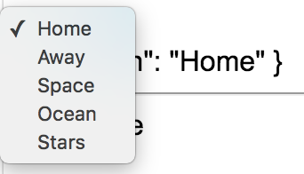

I'm going to reuse these locations and convert the radio buttons or just delete the radio buttons and create a select dropdown.

**app/app.component.ts**
``` javascript
@Component({
  selector: 'app',
  styles:[`
.ng-invalid + label:after{
  content: '<--Pick one!!!'
}
`],
  template: `
<form #formRef="ngForm">
  <select name="" ngModel></select>
</form>
{{formRef.value | json}}
<hr>
Valid: {{formRef.valid | json}}
`
})
export class AppComponent {
  locations = ["Home", "Away", "space", "ocean", "stars"];
}
```
So a select requires a `name`. That'll be the name in our model, and it requires the `ngModel` so that it gets registered to our form, and then the select needs some options.

We'll go ahead and create an option, and we'll loop through these with `*ngFor="let location of locations"`. Each value on this is going to be the current location.

**app/app.component.ts**
``` javascript
<form #formRef="ngForm">
  <select name="" ngModel>
    <option 
        *ngFor="let location of locations"
        [value]="location">
        
        {{location}}

    </option>
  </select>
</form>
```
Remember, if I did this, that would just be the string location, but since you put the square brackets around it, it evaluates whatever location is.

Then inside of the option tag, we'll just do the classic evaluation of location to render that out inside of the option tag. Just to format this a little bit here, so now when I hit save, we'll have a dropdown with `home, away, space, ocean`.

When I select one, you can see that the value changes, and just like before, if I want to change the default, you just say ngModel is locations zero.

**app/app.component.ts**
``` javascript
<form #formRef="ngForm">
  <select name="" [ngModel]="locations[0]">
    <option 
        *ngFor="let location of locations"
        [value]="location">
        
        {{location}}

    </option>
  </select>
</form>
```
 hit save, and now it defaults to home, and I can change that to whatever I want.

 
