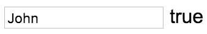
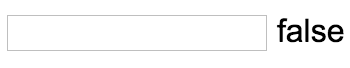

We can make the input required by saying `required`. Then if there's nothing in here, this field will be marked `invalid`. Right now there's no way for us to know in our template whether this is invalid, because this is just **bound to the value** of the input, not the **validity** of the input.

**app/app.component.ts**
``` javascript
import {Component} from "@angular/core";
@Component({
  selector: 'app',
  template: `
  <input  
    type="text"
    [(ngModel)]="username"
    required
  >
  {{username}}
`
})
export class AppComponent {
  username = "John";
}
```
To get the validity we need to access the `ngModel` itself in the template. We can do that by creating a reference to the `ngModel`. That's going to look something like this. I'm going to call this `#usernameRef`, then assign that to the `ngModel` directive.

**app/app.component.ts**
``` javascript
@Component({
  selector: 'app',
  template: `
  <input 
    type="text"
    [(ngModel)]="username"
    #usernameRef="ngModel"
    required 
  >
  {{usernameRef.valid}}
`
})
```
In my binding I can actually access the `usernameRef.valid`. Hit Save, and you'll see that now this is valid because it's required. 



If I could lead everything it's not valid, because this requires something.



If I type this is `true`, delete, it's `false`, because this is a reference to the `ngModel` it knows if this is valid or invalid.