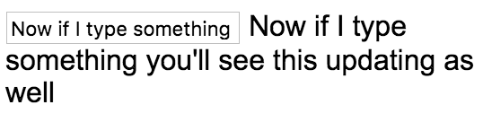

**app/app.component.ts**
``` javascript
import {Component} from "@angular/core";
@Component({
  selector: 'app',
  template: `
    Hello World
`
})
export class AppComponent {}
```
Starting from an Angular 2 "Hello, World," if I create an `input` and then add an `ngModel` attribute to it and assign that to `username`, you'll see that nothing happens other than just an `input` being set up. 

**app/app.component.ts**
``` javascript
import {Component} from "@angular/core";
@Component({
  selector: 'app',
  template: `
    <input type="text" ngModel="username">
`
})
export class AppComponent {}
```
That's because in your modules, where you define your module setup, you need more than just a `BrowserModule`, you also need the `FormsModule`.

**app/app.module.ts**
``` javascript
import {BrowserModule} from "@angular/platform-browser";
import {AppComponent} from "./app.component";
import {NgModule} from "@angular/core";
import {FormsModule} from "@angular/forms";
@NgModule({
  imports: [BrowserModule, FormsModule],
  declarations: [AppComponent],
  bootstrap: [AppComponent]
})
export class AppModule {}
```
I'll go ahead and import that, and include it, and you'll see that `username` is now set to the `ngModel` or the value of the input, but I don't want the string of `username`, I actually want the value of `username`. Go ahead and create a `username`. 

**app/app.component.ts**
``` javascript
export class AppComponent {
  username = "John";
}
```
We'll give this a value of `John`, and we'll see if that changes anything, but unfortunately not, because what it's doing is evaluating this as a string because we told it not to evaluate it. To evaluate this as a property or a field on this class, you have to put a square brackets around it. 

**app/app.component.ts**
``` javascript
import {Component} from "@angular/core";
@Component({
  selector: 'app',
  template: `
    <input type="text" [ngModel]="username">
`
})
export class AppComponent {
  username = "John";
}
```
That way, when you save, it's going to go ahead and look up this `username` and assign it to `ngModel`. Now, you might think you could take that username and place it in some curly braces and that when you start typing -- you see it's John already -- but when I start typing, it doesn't add anything.

**app/app.component.ts**
``` javascript
import {Component} from "@angular/core";
@Component({
  selector: 'app',
  template: `
    <input type="text" [(ngModel)]="username">
    {{username}}
`
})
```
That's because in my `ngModel`, if I want this two-way binding, where right now, it's inputting this and setting this. If I want to get that value out as an event, you also have to add the parens around it, so that every time the `ngModel` or the value of the input changes, it also sends out an event to update this. Now, if I delete and type something, you'll see this updating as well.

