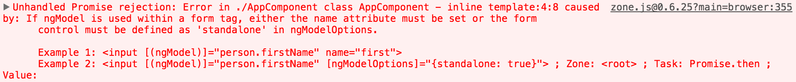

Inputs are almost always wrapped in a `<form>` because you're going to want to submit it and handle that data somehow. Let's go ahead and wrap this input and everything inside of a form.

**app/app.component.ts**
``` javascript
@Component({
  selector: 'app',
  template: `
<form>
  <input
    type="text"
    [(ngModel)]="username"
    #usernameRef="ngModel"
    required
    minlength="3"
  >
  <div *ngIf="usernameRef.errors?.required">This field is required</div>
  <div *ngIf="minLength.errors?.required">This field must be 
  longer than {{minLength.requiredLength}} characters. 
  You only typed {{usernameRef.errors?.minLength.actualLength}}</div>
</form>
`
})
export class AppComponent {
  username= "John";
}
```
After you hit save, you'll notice right away we get an error talking about `ngModel` even though `ngModel` was working before. 



Now it warns us that `ngModel` needs a `name` attribute because once I put a `name` on this...Let's say the `name` of this is `username`. This will help us structure the overall value of the form.

**app/app.component.ts**
``` javascript
template: `
<form>
  <input
    name="username"
    type="text"
    [(ngModel)]="username"
    #usernameRef="ngModel"
    required
    minlength="3"
  >
  <div *ngIf="usernameRef.errors?.required">This field is required</div>
  <div *ngIf="minLength.errors?.required">This field must be 
  longer than {{minLength.requiredLength}} characters. 
  You only typed {{usernameRef.errors?.minLength.actualLength}}</div>
</form>
`
```
If I do a similar reference, I'll say `#formRef` to an `ngForm`, this is basically the same thing as this `usernameRef` to the `ngModel` we did before. I'll put this debugging information down here where I say `formRef.value` and show me the `json` of that. 

**app/app.component.ts**
``` javascript
template: `
<form #formRef="ngForm">
  <input
    name="username"
    type="text"
    [(ngModel)]="username"
    #usernameRef="ngModel"
    required
    minlength="3"
  >
  <div *ngIf="usernameRef.errors?.required">This field is required</div>
  <div *ngIf="minLength.errors?.required">This field must be 
  longer than {{minLength.requiredLength}} characters. 
  You only typed {{usernameRef.errors?.minLength.actualLength}}</div>
</form>
`
```
You'll see that I now have a `"username": John` on there.

As I delete and change values, this object will update. This object is a representation of the `<form>` and all of its inputs where the `<form>` is the root of the object and then everything nested inside of it, like this `name="username"` is represented by that `<input>`. You'll also note that a form has an overall validity.

If I say `.valid`, right now we have this entire object of `username` John and the `form` valid `true`. If I delete everything, `username` blank, valid `false`. It goes ahead and inspects every input in there and determines whether the overall `<form>` itself is valid which you would use to prevent submitting it or letting the user know they need to change something inside the `<form>`.

To submit the form, instead of using a `submit` event which when I click a `submit` button would post and change the URL, we're going to `ngSumbit` event to hijack that process because it's a single page app. I'll say `onSubmit(formRef.value)`, which is just going to be this value down here.

**app/app.component.ts**
``` javascript
template: `
<form #formRef="ngForm" (ngSubmit="onSubmit(formRef.value)">
 
 ...

</form>
{{formRef.value | json}}
{{formRef.valid | json}}
`
```
To submit this, we'll just add a submit button inside the form, a button with a `type="submit"`. We'll just give it a text of `Submit`.

**app/app.component.ts**
``` javascript
template: `
<form #formRef="ngForm" (ngSubmit="onSubmit(formRef.value)">
 
 ...

 <button type="submit">Submit</button>
</form>
{{formRef.value | json}}
{{formRef.valid | json}}
`
```
Then set up our `onSubmit` event handler. It's going to take in the `formValue` and will log out the `formValue`. 

**app/app.component.ts**
``` javascript
export class AppComponent {
  username = "John";

  onSubmit(formValue){
    console.log(formValue)
  }
}
```
You'll see this `formValue` is coming from this `onSubmit(formRef.value)`. When I save and I type my last name and hit enter, it has logged out at the bottom here `Object {username: "John Lindquist"}`.

With this `formRef`, we're able to get any values off of this form and show them inside the template, but we're also able to pass values off of the form and do things like event handlers to pass the value and validity along to anything we want to do programmatically as well.
