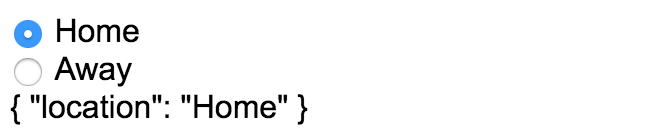
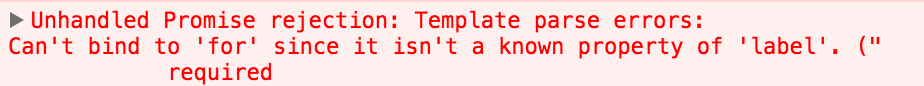
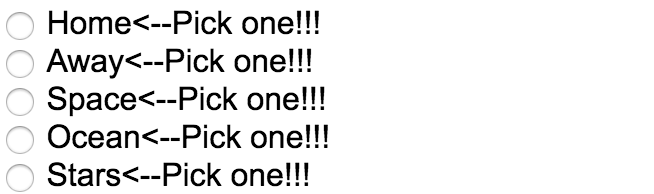

**app/app.component.ts**
``` javascript
import {Component} from "@angular/core";

@Component({
  selector: 'app',
  template: `
<form #formRef="ngForm">

</form>
{{formRef.value | json}}
<hr>
Valid: {{formRef.valid | json}}
`
})
export class AppComponent {
}
```
Starting with an empty form, let's add some radio buttons. Let's first create an array of locations. One will be `Home` and the other will be `Away`. We'll create some radio buttons for this by creating a  `<div>`, `ngFor`ing through our `locations`. I'll say `"let location of locations"`.

**app/app.component.ts**
``` javascript
@Component({
  selector: 'app',
  template: `
<form #formRef="ngForm">
  <div *ngFor="let location of locations">
    {{location}}    // Home Away
  </div>
</form>
{{formRef.value | json}}
<hr>
Valid: {{formRef.valid | json}}
`
})
export class AppComponent {
  locations = ["Home", "Away"];
}
```
Then if I just print out these `locations`, you'll see that I'll get home and away. Let's make this the `<label>` for our input. I'll go ahead and put that on the other side. Now those are just labels. That's just the same but now we need some inputs.

These inputs will be radios. First thing to do is make sure that this `radio` and this `radio` are matched up together in the same group so that I can't click them both. You do that by on the input, because this is creating multiple inputs.

**app/app.component.ts**
``` javascript
<form #formRef="ngForm">
  <div *ngFor="let location of locations">
    <input name="location" type="radio">
    <label for="">{{location}}</label>   
  </div>
</form>
```
I'll say the name of this is going to be location. This word `"location"` has nothing to do with this. It's just the string of `"location"` which is going to add it to our value of the form. Once I do this one now, I click here, here, you see nothing because what we need to do now is add, let's break this across multiple lines, `ngModel`.

**app/app.component.ts**
``` javascript
<form #formRef="ngForm">
  <div *ngFor="let location of locations">
    <input 
      name="location" 
      ngModel
      type="radio"
    >
    <label for="">{{location}}</label>   
  </div>
</form>
```
With any other input, you need a name and an `ngModel`. Now when I click on this, I get nothing. Click on this, I get nothing. That's because now we need a value for this input. The value is going to be this value of `location`. If I leave it like this, this is just the string `"location"`, just like this one. This means it's a string of `"location"`. What I want this to be is an evaluated version of this reference of `location`. 

**app/app.component.ts**
``` javascript
<form #formRef="ngForm">
  <div *ngFor="let location of locations">
    <input 
      name="location" 
      ngModel
      [value]="location"
      type="radio"
    >
    <label for="">{{location}}</label>   
  </div>
</form>
```
This might get confusing sometimes, but just remember if you see the **square brackets, it's evaluating** this. If you don't see the square brackets, it's just reading this in as a string.



Now when we do this, we'll finally be able to click a button and it sets the `{"location": "Home"}`. Click a button, sets the `{"location": "Away"}`. Now let's make it so that the radio is bound to the label because when I click on `Home` nothing happens, when I click on `Away`, nothing happens.

The way we do this is by taking this `for=""` and making sure it matches up with the `id` of our input. We're going to do this in a very similar way we did value, and that's by wrapping this to evaluate the name of the location. What you should try first is wrapping the `for` in the name of the location. That's actually going to throw an error if I bring over the console, an error saying can't bind to `for`. It's not a known property of label. `For` is not a property of label. It's actually an attribute of label.



So if I want to change the for attribute on the label, there's a special syntax called `attr`. Any attributes on any element you can change by evaluating this and assigning it to the attribute of `for`. Now when I save, the errors have gone away. Just show you that real quick. I should be able to click `Home` and click `Away`.

**app/app.component.ts**
``` javascript
<form #formRef="ngForm">
  <div *ngFor="let location of locations">
    <input 
      [id]="location"   // also try: [attr.id]="location"
      name="location" 
      ngModel
      [value]="location"
      type="radio"
    >
    <label [attr.for]="">{{location}}</label>   
  </div>
</form>
```
Now you're probably wondering why does this one need to be attribute and this one doesn't need to be. That's because `id` is actually a property of the input on the DOM whereas `for` is only an attribute of the label. The odd thing to remember is that `id` is actually an attribute as well. It's a property or an attribute so either of these will work.

This is not an Angular 2 quirk. It's actually just an HTML quirk where this is both an attribute and a property. Both of these will work. I can click on `Home` and click on `Away` or click on the buttons. They're bound together.

You'll just have to remember sometimes these are attributes. Sometimes they're properties. If you ever get that error in the console that says it's not a known property, make sure and try the attribute syntax like this.

If you look at what it's doing, let's go ahead and inspect this here, you can see inside of my input that it has evaluated for to be bound to away, not just a string of location. It's actually evaluating this from the array of locations.

Now with our radios we can go ahead and add more of them. You can say `"space", "ocean", "stars"`, or wherever you might go. Now all of our radios are working together because they share the same `name` of location.

**app/app.component.ts**
``` javascript
export class AppComponent {
  locations = ["Home", "Away", "space", "ocean", "stars"];
}
```
That's what the `ngModel` is working with so that the value in our form which is being printed out here through this `formRef.value` and then evaluated as JSON, each of these is working just fine. The last thing to point out is if this is required radio buttons are pretty hard to style.

What you often end up doing is styling the label next to it. If I were to create a `styles` and create an `ng-invalid` which we've covered, this would not this label. It's only going to cover this input because when you go ahead and inspect the elements -- I'll inspect this input here -- you can see the `ng-invalid` is on this input, but it's not on the label.

If you want to style the `label`, just make sure to use a sibling selector, so `+ label`, and let's make this `ng-invalid`, not just valid. We'll say after we just want the content to be pick one.

**app/app.component.ts**
``` javascript
@Component({
  selector: 'app',
  styles:[`
.ng-invalid + label:after{
  content: '<--Pick one!!!'
}
`],
  template: `
<form #formRef="ngForm">
  <div *ngFor="let location of locations">
    <input 
      [id]="location"  
      name="location" 
      ngModel
      [value]="location"
      type="radio"
    >
    <label [attr.for]="">{{location}}</label>   
  </div>
</form>
{{formRef.value | json}}
<hr>
Valid: {{formRef.valid | json}}
`
})
export class AppComponent {
  locations = ["Home", "Away", "space", "ocean", "stars"];
}
```
Now, because you haven't selected one already, you can see that this is invalid. It's finding this label appending the content of pick one to those. As soon as I pick one, that will go away.

