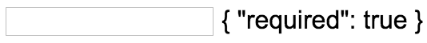
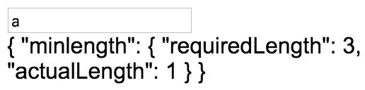
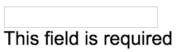
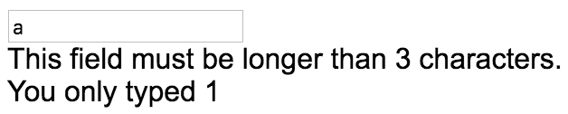
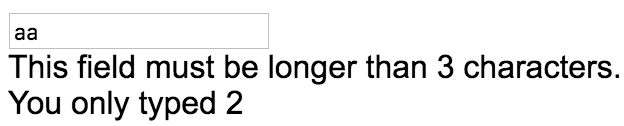

To check on specific errors from our `ngModel`, let's go ahead and check `errors` instead of just validity. Right now we have no errors. When I delete everything because it's required, it'll give me an object.

**app/app.component.ts**
``` javascript
import {Component} from "@angular/core";
@Component({
  selector: 'app',
  template: `
  <input 
    type="text"
    [(ngModel)]="username"
    #usernameRef="ngModel"
    required
  >
  <div>{{usernameRef.errors | json}}</div
`
})
export class AppComponent {
  username = "John";
}
```
To just debug this, we can throw in a `| json`. Now instead of just that object, it'll give us the actual object. 

**app/app.component.ts**
``` javascript
@Component({
  selector: 'app',
  template: `
  <input 
    type="text"
    [(ngModel)]="username"
    #usernameRef="ngModel"
    required 
  >
  <div>{{usernameRef.errors | json}}</div
`
})
```
Right now it's `null` because there are no errors.

When I delete this, you'll see that it has `"required": true` on there. 



If I do something like add `minlength` of three and hit save, it's `null` because there's no errors.

**app/app.component.ts**
``` javascript
@Component({
  selector: 'app',
  template: `
  <input 
    type="text"
    [(ngModel)]="username"
    #usernameRef="ngModel"
    required
    minlength="3" 
  >
  <div>{{usernameRef.errors | json}}</div>
`
})
```
I delete everything, `required` is `true`. When I add one character, you'll see that `minlength` actually gives you back an entire object with the data `requiredLength` of three, `actualLength` of one. You could write an error message based on that.



To show these off, let's do a `<div>` saying `This field is required`. We'll put an `*ngIf` on this which will only show up if `usernameRef.errors.required`. What you're going to see is this will show up. This field is required.

**app/app.component.ts**
``` javascript
@Component({
  selector: 'app',
  template: `
  <input 
    type="text"
    [(ngModel)]="username"
    #usernameRef="ngModel"
    required
    minlength="3" 
  >
  <div *ngIf="usernameRef.errors.required">This field is required</div>
  <div>{{usernameRef.errors | json}}</div>
`
})
```
That's because we're actually getting an error here in the console. To explain what it's saying, `property required of null`, that means that this object `errors` is `null`. When it tries to access `required`, it simply can't do that because `errors` itself is `null`.

What you can do in this situation is just put a `?` here to mark that this is possibly null so don't try and evaluate this if `errors` is `null`. That way when we save, you'll see we get the `null` message from this `<div>` which is our debugging.

**app/app.component.ts**
``` javascript
template: `
  <input 
    type="text"
    [(ngModel)]="username"
    #usernameRef="ngModel"
    required
    minlength="3" 
  >
  <div *ngIf="usernameRef.errors?.required">This field is required</div>
  <div>{{usernameRef.errors | json}}</div>
`
```
When I delete this, my this field is required shows up and my debugging says `"required": true`. This is only going to show this if that `required` is there and `errors` exist.

We could do a similar thing with `minLength`. `MinLength`, I'll say this field must be longer than three characters. I'll hit save. You'll see our debugging says `null`. 

**app/app.component.ts**
``` javascript
template: `
  <input 
    type="text"
    [(ngModel)]="username"
    #usernameRef="ngModel"
    required
    minlength="3" 
  >
  <div *ngIf="usernameRef.errors?.required">This field is required</div>
  <div *ngIf="minLength.errors?.required">This field must be longer than 3 characters</div>
  <div>{{usernameRef.errors | json}}</div>
`
```
I'll delete everything. This field is `required`. I'll put in one character. It'll say `This field must be longer than 3 characters` because this object evaluates to true.

I can actually use these two properties, `requiredLength` and `actualLength`, in my message which I'll do my copying this whole thing here. I'll say `This field must be longer than`, and I'll put the curly braces in. I'll paste `{{minLength.requiredLength}}`, and then `you only typed {{usernameRef.errors?.minLength.actualLength}}` . I'm going to get rid of the debugging because that'll get pretty busy with that on the screen. I'll hit save.

**app/app.component.ts**
``` javascript
template: `
  <input 
    type="text"
    [(ngModel)]="username"
    #usernameRef="ngModel"
    required
    minlength="3" 
  >
  <div *ngIf="usernameRef.errors?.required">This field is required</div>
  <div *ngIf="minLength.errors?.required">This field must be longer than {{minLength.requiredLength}} characters. You only typed {{usernameRef.errors?.minLength.actualLength}}</div>
`
```
You'll see if I delete everything, it'll say `This field is required`. 



If I type `a`, `This field must be longer than three characters`. 



`You only typed one`. `You only typed two`. 



Error message gone.