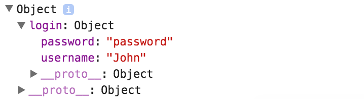

To add a password to our form, we must add another `<input>`. We'll say the `type="password"` and then the minimal required is saying this is an `ngModel`, you don't even have to assign it to anything. You do have to give it a name, though. We'll say the `name="password"`.

**app/app.component.ts**
``` javascript
@Component({
  selector: 'app',
  template: `
  <form 
    #formRef="ngForm" 
    (ngSubmit)="onSubmit(formRef.value)"
    >
    <input 
      #usernameRef="ngModel"
      name="username"
      [(ngModel)]="username"
      type="text"        
      required
      minlength="3"
    >    
    <div *ngIf="usernameRef.errors?.required">This field is required</div>
    <div *ngIf="usernameRef.errors?.minlength">This field must be longer than 
    {{usernameRef.errors?.minlength.requiredLength}} characters. 
    You only typed {{usernameRef.errors?.minlength.actualLength}}</div>

    <input type="password" ngModel name="password">

    <button type="submit">Submit</button>
  </form> 
{{formRef.value | json}}   
{{formRef.valid | json}}   
   
`
})
export class AppComponent {
    username = "John";

    onSubmit(formValue){
        console.log(formValue);
    }
}
```
With that information in there, now you'll see when I update the password, it's updating it in the `form` object, because this `form` is finding this `input` with a name of `password` and saying that password is the value of this here, which is just characters I typed in.

**Browser Output**
``` javascript
{"username": "John",
"password": "arstarst"} true
```
If I type in password, you'll see that `password` shows up here. When I submit as well, you'll see that the object is `John`, with a `"password": "password"`. We can group inputs together inside the form. We'll use a `<fieldset>` and wrap out inputs inside of the `<fieldset>`.

**app/app.component.ts**
``` javascript
<form 
  #formRef="ngForm" 
  (ngSubmit)="onSubmit(formRef.value)"
  >
  <fieldset ngModelGroup="login">

    ...

  </fieldset>
  <button type="submit">Submit</button>
</form>
```
Tab these in a bit and if we save this as an `ngModelGroup="login"`, and hit save, we'll now see our object is the root object with a property of `login`, which has an object of `username` and `password`. 

**Browser Output**
``` javascript
{"login":{"username": "John",
"password": "password"}} true
```
If I type password again and hit submit, you'll see that `submit` object has an `Object` for `login` and that `login` is an object with a `username` and `password`.



As you structure out your data and structure out your form, you can use `ngModel` groups with a property name to help structure out `login` and `password`. Then the names of the inputs are going to be the names of the properties inside of that model group.

**app/app.component.ts**
``` javascript
<form 
  #formRef="ngForm" 
  (ngSubmit)="onSubmit(formRef.value)"
  >
  <fieldset ngModelGroup="login">

    ...

  </fieldset>
  <button type="submit">Submit</button>
</form>
```
To contrast an input, this is the bare minimum you need, where you need `ngModel`, the directive on there with a name or pretty much the maximum is an input with a ref to the ngModel, it's own validation, validation rules as well as some default settings for assigning properties into that ngModel.

As you build out your forms, you start with the absolute simplest, and then slowly start adding rules, and validators and other visuals to help guide the user.