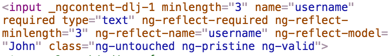
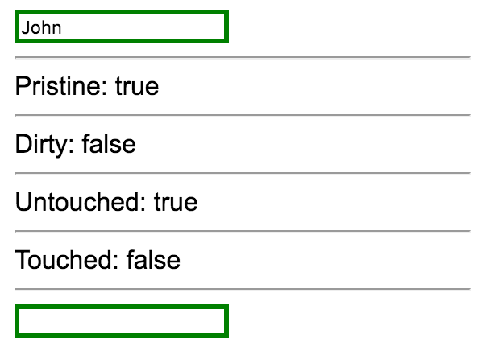

You probably noticed when we inspected this input that there are also classes of `ng-untouched` and `ng-pristine`. While those are classes you could create styles for, they're also properties on the `ngModel` as well.



If I were to check on the `usernameRef.untouched`, and just to visually call this out, we'll put some horizontal rules around it, you'll see that we now have `true`, that this is `untouched`.

**app/app.component.ts**
``` javascript
@Component({
    selector: 'app',
    styles:[`
.ng-invalid{
    border: 3px solid red;
}
.ng-valid{
    border: 3px solid green;
}
`],
    template: `
<form 
    #formRef="ngForm" 
    (ngSubmit)="onSubmit(formRef.value)"
    >
    <fieldset ngModelGroup="login">
        <input 
          #usernameRef="ngModel"
          name="username"
          [(ngModel)]="username"
          type="text"        
          required
          minlength="3"
        >    
        <div *ngIf="usernameRef.errors?.required">This field is required</div>
        <div *ngIf="usernameRef.errors?.minlength">This field must be longer than {{usernameRef.errors?.minlength.requiredLength}} characters. You only typed {{usernameRef.errors?.minlength.actualLength}}</div>

        <hr>
        Untouched: {{usernameRef.untouched}}
        <hr>
     
        <input type="password" ngModel name="password">
    </fieldset>
    <button type="submit">Submit</button>
</form> 
{{formRef.value | json}}   
{{formRef.valid | json}}   
   
`
})
```
If I click inside of there, and then it loses focus, this has now become `touched`, meaning that you've touched it and gone out of it. If I refresh, that doesn't mean that I've changed something, so it's still `true`. It means that you've touched it and it's lost focus, so now it's `false`.

The other one was `ng-pristine`, so this was the one where if you changed something, that means that the field has changed to something else.

**app/app.component.ts**
``` javascript
<hr>
{{usernameRef.pristine}}
<hr>
```
This is no longer the same value it was when it started, or even if I try and change it back to the original value, it's not going to go back to `true`. `Pristine` means it's changed, or something has changed in there, `touched` as you've gone in there and lost focus.

You have the opposite of each of these as well, so `pristine` and `dirty`. Then there's username `touched` and `untouched`. Let's move `untouched` on top, since that's the nothing has happened one, to match `pristine`, meaning nothing has happened.

**app/app.component.ts**
``` javascript
<hr>
{{usernameRef.pristine}}
{{usernameRef.dirty}}

{{usernameRef.untouched}}
{{usernameRef.touched}}
<hr>
```
We'll hit save. You'll see `true false true false`, and if I change something, `false true true false`, because we changed something, so it's `dirty`. So it changed from `dirty`, and once I lose focus, this is now `true`.

You can go ahead and use each of these values for very complex scenarios, depending on what your form needs.

