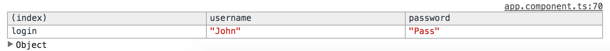

For many form, there are two streams available. To access the form, we need to use `@ViewChild`, look up that `formRef` through that reference, and then we'll just assign that to form. This is looking up this guy and bringing it down so we can control it programmatically.

**app/app.component.ts**
``` javascript
@Component({
    selector: 'app',
    styles:[`
.ng-invalid{
    border: 3px solid red;
}
.ng-valid{
    border: 3px solid green;
}
`],
    template: `
<form 
    #formRef="ngForm"
    (ngSubmit)="onSubmit(formRef.value)"
    >
    ...

</form>
{{formRef.value | json}}
{{formRef.valid | json}}
`
})
export class AppComponent {
  @ViewChild('formRef') form;

  username = "John";

  onSubmit(formValue) {
    console.log(formValue);
  }
}
```
We can access that in `ngAfterViewInit()` because at this point in this lifestyle hook, the view is ready to go. We can say `this.form`, and then the form has a stream called `valueChanges`. We can `.subscribe()` to that and just log out or we'll table out just to give it nicely formatted the results.

**app/app.component.ts**
``` javascript
export class AppComponent {
  @ViewChild('formRef') form;

  username = "John";

  onSubmit(formValue) {
    console.log(formValue);
  }

  ngAfterViewInit(){
    this.form.valueChanges
        .subscribe(v => console.table(v));
  }
}
```
I'll bring up the Chrome dev tools. You can see that it's logging out as I change these. I'll type `password`. You can see we have our object with a log in of `username: John` and `password: pass` right now. Every time this form changes, it's going to pass these value changes along.



There's also a stream called `statusChanges`. I'll just log this one out. 

**app/app.component.ts**
``` javascript
ngAfterViewInit(){
    this.form.statusChanges
        .subscribe(v => console.log(v)); // VALID | INVALID
  }
```
This will actually log out every time the status of my form changes. Now it's invalid. It's back to `valid, invalid, valid`. You can check against these `valid` and `invalid` values.

With a decent understanding of RxJS, you can build out some pretty complex streams. We'll just do a simple example where I say `import rxjs/add/observable`, and I'll need `/combineLatest`. I'm going to need `Observable` itself, so I'll say `{Observable} from rxjs/Observable`. I'm also going to want `filter`, so I'll grab the `/operator/filter`.

**app/app.component.ts**
``` javascript
import {Observable} from "rxjs/Observable";
import "rxjs/add/observable/combineLatest";
import "rxjs/add/operator/filter";
```
With these two operators and observable, I can build up something like we'll say `Observable.combineLatest`, and we'll want to combine `this.form.statusChanges` and `this.form.valueChanges`. We'll combine these, so I'll have a `status` and a `value` and combine these into an object of `status` and `value`. On this I can `.filter`. This will pass that object of `status` and `value`. But I'm only going to want the `status` on there. If `status` is `VALID`, then I want to print out the `value` of that object. I'll `console.table(value)`.

**app/app.component.ts**
``` javascript
ngAfterViewInit(){
  Observable.combineLatest(
    this.form.statusChanges,
    this.form.valueChanges,
    (status, value)=> ({status, value})
  )
    .filter(({status})=> status === 'VALID')
    .subscribe(({value})=> console.table(value))
  }
```
If I save and bring up the dev tools, I'll clear this out, you can see I'll only get changes when I'm making changes and the field is still valid.

I got JO but once I went less than JO, you'll see I'm making changes in the field that's `invalid` but I'm not getting them because I'll only get changes pushed through when the field is `value`. For this example, you could add this to local storage every time someone put in a valid change to the form and save it and ignore any changes to the form that were `invalid`.

They could always revert back to a `valid` state of the form.