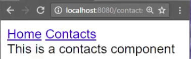

To create some navigation, I am going into my `app.component.ts`, where the `router-outlet` is in my template. I'll just say `nav`. I'll create a tag, and instead of `href`, I am going to use a **directive** called `routerlink`. This `routerlink` is going to be empty because that one's going to point to "Home", when I click on this.

**app/app.component.ts**
```javascript
import {Component} from "@angular/core";
@Component({
  selector:"app",
  template: '
<nav>
<a routerlink="">Home</a>
</nav>
<router-outlet></router-outlet>
'
})
export class AppComponent{}
```

The second one, not `href` but `RouterLink`, is going to point to "contacts", so this one will load contacts. Just format this a little bit and hit save.

**app/app.component.ts**
```javascript
@Component({
  selector:"app",
  template: '
<nav>
<a routerlink="">Home</a>
<a routerlink="contacts">Contacts</a>
</nav>
<router-outlet></router-outlet>
'
})
```

You'll see how the navigation of home, contacts, home, contacts change in the URL, and load in those individual modules.

