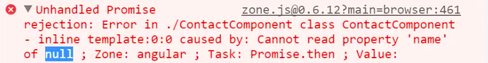

Now it's boring just to see "contact 4" in there. Contact four is Darth Vader, and we ought to see Darth Vader. Let's hop over to our contact.component for the individual contact. Instead of just `id` here, we can actually say contact, and make this contact. We'll make this contact.

**contacts/contact.component.ts**
```javascript
@Component({
  template:'
contact {{contact$ | async}}
'
})
export class ContactsComponent{
  contact$;

  constructor(private route:ActivatedRoute){
    this.contact$ = route.params
      .map((p:any) => p.id);
  }
}
```

This isn't just going to be `route.params.map`. We're going to map to the `id`. Then we're going to do what's called a `.switchMap`, where we take that `id` and we pass that along to the `http.get`. In the constructor I'll need to inject the HTTP service.

**contacts/contact.component.ts**
```javascript
constructor(private route:ActivatedRoute, private http:Http){
  this.contact$ = route.params
    .map((p:any) => p.id)
    .switchMap(id => http.get)
}
```

I'll need to make sure and import this switch map method. Just duplicate that, and this one's switch map.

**contacts/contact.component.ts**
```javascript
import "rxjs/add/operator/switchMap";
```

Then we can `http.get`. I'll grab the URL from contacts.component, this whole thing here, back to my contact.component, and the string of this plus the `id`. That's coming from here.

**contacts/contact.component.ts**
```javascript
constructor(private route:ActivatedRoute, private http:Http){
  this.contact$ = route.params
    .map((p:any) => p.id)
    .switchMap(id => http.get('https://starwars-json-server-ewtdxbyfdz.now.sh/people' + id))
}
```

We're getting the `id` from the route and then passing it along to the next operator in the chain and taking that `id` and switching over to a different stream. This stream is the `http.get`. Now, as always, we do need to map the response and parse the JSON on it, but after that we're done and we have the entire contact object.

**contacts/contact.component.ts**
```javascript
constructor(private route:ActivatedRoute, private http:Http){
  this.contact$ = route.params
    .map((p:any) => p.id)
    .switchMap(id => http.get('https://starwars-json-server-ewtdxbyfdz.now.sh/people' + id)
      .map(res => res.json())
    )
}
```

I'm going to wrap this `contact$ | async` in some parens. I'm going to do this syntax, where I do this `?.name`.

**contacts/contact.component.ts**
```javascript
@Component({
  template:'
contact {{(contact$ | async?.name)}}
'
})
```

I'll show it working first and explain it. I'll click on Darth. It looks like this failed because of a missing /. This needs to be `/id` here.

**contacts/contact.component.ts**
```javascript
.switchMap(id => http.get('https://starwars-json-server-ewtdxbyfdz.now.sh/people/' + id)
```

I'll hit save and try it one more time.    
Now it will say "contact Darth Vader". You might have noticed how this loaded just a little bit after the page loaded. What's going on here, and what this syntax is doing, if I delete this question mark, and you look at what happens in the console, it says that name is null.



That's because we're trying to access this before my HTTP has loaded. One solution is a null guard where you put the question mark in there and say, "Hey, don't load this if this is null." Another one is, that I prefer, there's an operator called `startWith`.

I can actually start with an object that has the name of, we'll just say loading, just to show this happening.

**contacts/contact.component.ts**
```javascript
constructor(private route:ActivatedRoute, private http:Http){
  this.contact$ = route.params
    .map((p:any) => p.id)
    .switchMap(id => http.get('https://starwars-json-server-ewtdxbyfdz.now.sh/people' + id)
      .map(res => res.json())
    )
    .startWith({name: 'Loading...'})
}
```

I'll hit save. Once I click on contacts, and then Darth Vader, there's a brief loading before it turned into Darth Vader.

This is never null, it's actually starting with an object with a name of "Loading...", so you don't have to guard against it being null. Even if you just make this blank, it will start with a blank name, and you'll avoid that null check. As soon as this loads, the Darth Vader name will appear.

Let's finish this off by wrapping this in an `<h2>` to make it nice and big, and then loading the image of Darth Vader beneath it. The image is also on this contact object, so if I grab this and paste it here, and say dot image, let's also do a `startWith({name: '', image: ''}).

**contacts/contact.component.ts**
```javascript
@Component({
    template:`
<h2>{{(contact$ | async).name}}</h2>
{{(contact$ | async).image}}

`
})
```

You'll see that the image is "darth_vader.jpg", but we need this to link to our API here /darth_vader.jpg. Let's pull this out and bring this up here. Say it's an API. This can be API plus people/ plus ID. After this line, when we have our object back, I want to map again where I have my contact.

**contacts/contact.component.ts**
```javascript
constructor(private route:ActivatedRoute, private http:Http){
  const api = 'https://starwars-json-server-ewtdxbyfdz.now.sh/people';

  this.contact$ = route.params
    .map((p:any) => p.id)
    .switchMap(id => http.get(api + 'people/' + id)
      .map(res => res.json())
      .map(contact => )
    )
    .startWith({name: 'Loading...'})
}
```

I'm going to `Object.assign`. This is where I can create a new object, pass in my contact, and then override what the image is. I'm going to say the image is `api + contact.image`. This way our contact has now become this new object.

**contacts/contact.component.ts**
```javascript
  this.contact$ = route.params
    .map((p:any) => p.id)
    .switchMap(id => http.get(api + 'people/' + id)
      .map(res => res.json())
      .map(contact => Object.assign({}, contact, {image: api + contact.image}))
    )
    .startWith({name: 'Loading...'})
}
```

`Object.assign` takes everything from contact and assigns it to this empty object. Finally we get the `contact.image`, which by default was just contact image, or the `darth_vader.jpg`. Now we're making it so it's the entire API /darth_vader.jpg.

Now when I hit save, you'll see that here is the entire URL to that image. We can now take this entire URL to the image. I'll cut it out of here. I'll evaluate the right side of this, using these square brackets. I'll paste this in. It looks like I didn't copy a paren.

**contacts/contact.component.ts**
```javascript
@Component({
    template:`
<h2>{{(contact$ | async).name}}</h2>

`
})
```

Now when I hit save, we'll have Darth Vader and the image underneath it, and I can navigate back and forth between my contacts, Han Solo, Yoda, and I'll get their name and the image from this API.