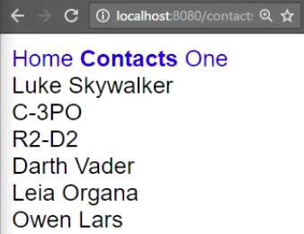

I have some "Star Wars" data at this URL. It's just an array of all the people in Star Wars. If you want to set this up yourself to follow along, just go [here](https://github.com/johnlindquist/swapi-json-server), `$ npm install` and `$ npm start`, and you'll have your own local copy running.

In my contacts.component, I want to load in this data. I'll say `constructor`, and I need to inject the http service. To be able to use this, I'm going to have to add the http module to my contacts.module.

**contacts/contacts.module.ts**
```javascript
@NgModule({
  imports:[CommonModule, contactsRoutes, HttpModule],
  declarations: [ContactsComponent, ContactComponent]
})
```

We'll import the `HttpModule`. Then, back in the component, I can load all the people by http.get, and paste in that string from my API.

**contacts/contacts.component.ts**
```javscript
export class ContactsComponent{
  constructor(private http:Htpp){
    http.get('https://starwars-json-server-ewtdxbyfdz.now.sh/people')
  }
}
```

I need to map the response and parse it as JSON. Always remember, **if you use a RxJS operator, you need to import it**, `rxjs/add/operator/map`. Then I'm going to assign this to `contacts`, and since this will be an observable, I'm going to add a $ to the end. It's a naming convention for that. I'll say `contacts$` is all of this stuff.

**contacts/contacts.component.ts**
```javscript
import "rxjs/add/operator/map";
@Component({
  template:'
This is a contacts component
'
})
export class ContactsComponent{
  contacts$;

  constructor(private http:Htpp){
    this.contacts$ = http.get('https://starwars-json-server-ewtdxbyfdz.now.sh/people')
      .map(res => res.json);
  }
}
```

That's going to be an array of people, which I can then display in this `template`. I'll say 
`<div *ngFor="let contact of contacts$ | async">`. Render out the `contact.name`. Just made a typo. I forgot to invoke JSON. JSON's a method to take the response, get the body, and return the JSON object off of that.

**contacts/contacts.component.ts**
```javscript
@Component({
  template:'
<div *ngFor="let contact of contacts$ | async">

{{contact.name}}

</div>
'
})
export class ContactsComponent{
  contacts$;

  constructor(private http:Htpp){
    this.contacts$ = http.get('https://starwars-json-server-ewtdxbyfdz.now.sh/people')
      .map(res => res.json());
  }
}
```

I'll hit save, and now we should see, in the Contacts, an array of divs, or the divs that are parsed out and loaded, a collection of divs that each have the contacts that we loaded in and displaying the contact.name.



Let's take these divs and nest an `a` tag inside of it. We can set up, just like we've done before, these links to click on, and set up the router link. The `[routerLink]` here is just going to be the `contact.id`. This is going to be relative to the current URL, so we're in Contacts, and this will just append the ID to it.

**contacts/contacts.component.ts**
```javscript
@Component({
  template:'
<div *ngFor="let contact of contacts$ | async">

<a [routerLink]="contact.id">
  {{contact.name}}
</a>
</div>
'
})
```

When I click on Luke, it's going to append 1 onto that. When I click on C3PO, it's going to append a 2 onto that. If I wanted to hard code this, it'd look a little bit different. It wouldn't be c`ontact/contact.id`, because that wouldn't evaluate anything. It's like contacts divided by contact.id.

What you do is you make an array, and then you use strings for the parts that you know what the strings and names are, and then comma-separate the values you want to evaluate.

**contacts/contacts.component.ts**
```javscript
<a [routerLink]="['contacts', contact.id]">
  {{contact.name}}
</a>
```

This would evaluate to `contacts/contact.id`, but because we're inside of the `/contacts` path already, this would actually try and take us to contacts/contacts, and then contact.id.

We could solve that, if you need to work with absolute URLs, just by putting "/" in the front. This will work the same and behave as you'd expect. I'll go to Contacts, click on Darth. It will take us to Contact 4, go back to Contacts.

**contacts/contacts.component.ts**
```javscript
<a [routerLink]="['/contacts', contact.id]">
  {{contact.name}}
</a>
```

What makes sense most of the time is keep track of where you are inside your app. We are currently inside of the contacts.module, which is mapped to that `/contacts` path, so a `contact.id` is all we need to make sure to go to the proper /id.

**contacts/contacts.component.ts**
```javscript
<a [routerLink]="contact.id">
  {{contact.name}}
</a>
```