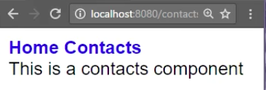
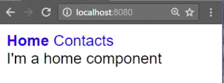

To add a bit of styling to our navigation, we'll add some `styles` and these are just arrays of strings. We'll say we'll take this `a` tag and we'll get rid of the `text-decoration`. So we don't see those underlines anymore on the navigation.

**app/app.component.ts**
```javascript
import {Component} from "@angular/core";
@Component({
  selector:'app',
  styles:['
a{
  text-decoration:none;
}
'],

  template '...'
})
```

We have "home" and "contacts" with no underlines and then let's say if the current route is `active`, then we want the font weight to be bold. This won't change anything because we're not using this active class.

**app/app.component.ts**
```javascript
import {Component} from "@angular/core";
@Component({
  selector:'app',
  styles:['
a{
  text-decoration:none;
}

a.active{
  font-weight: bold;
}
'],

  template '...'
})
```

To use this `active` class, we need to say that the `routerLinkActive`, meaning that when this is active, then use the `active` class. You're mapping this to this up here, so you can name that anything you want.

**app/app.component.ts**
```javascript
@Component({
  selector:'app',
  styles:['...'],
  template '
<nav>
<a routerlink="" routerLinkActive="active">Home</a>
<a routerlink="contacts" routerLinkActive="active">Contacts</a>
</nav>
<router-outlet></router-outlet>
'
})
```

I'll come over here and do the same thing, set to `active`, let's save. You see the behavior right now is home, home is active and bold.

Then I'll click on contacts. Contacts is active and bold, but home is still bold.



The reason is that this path/contacts also matches the path, so if you look in app routes, also matches this path of nothing. There's the path of nothing plus contacts, so both of these paths match.

**app/app.routes.ts**
```javascript
const routes = [
 {path : '', loadChildren: 'app/home/home.module'},
 {path: 'contacts', loadChildren: 'app/contacts/contacts.module'}
];

To get rid of that, what I'm going to do is format this a little bit. We're going to grab the `RouterLinkActiveOptions`, very long directive name, and set this to `{exact:true}`. Because this is an object, not a string, we do need to evaluate it, so put the brackets around there.

**app/app.component.ts**
```javascript
@Component({
  selector:'app',
  styles:['...'],

  template '
<nav>
  <a 
    routerlink=""
    routerLinkActive="active"
    [routerLinkActiveOptions]="{exact:true}"
    >Home</a>
  <a
    routerlink="contacts" routerLinkActive="active">Contacts</a>
</nav>
<router-outlet></router-outlet>
'
})
```

I'll hit save and these will read in these options, meaning that this path has to match exactly for this to be bold and this to be active. Now I want to click on it. Home is bold and I want to click on contacts, contacts is bold. Our navigation is styled and working as we expect it to.

