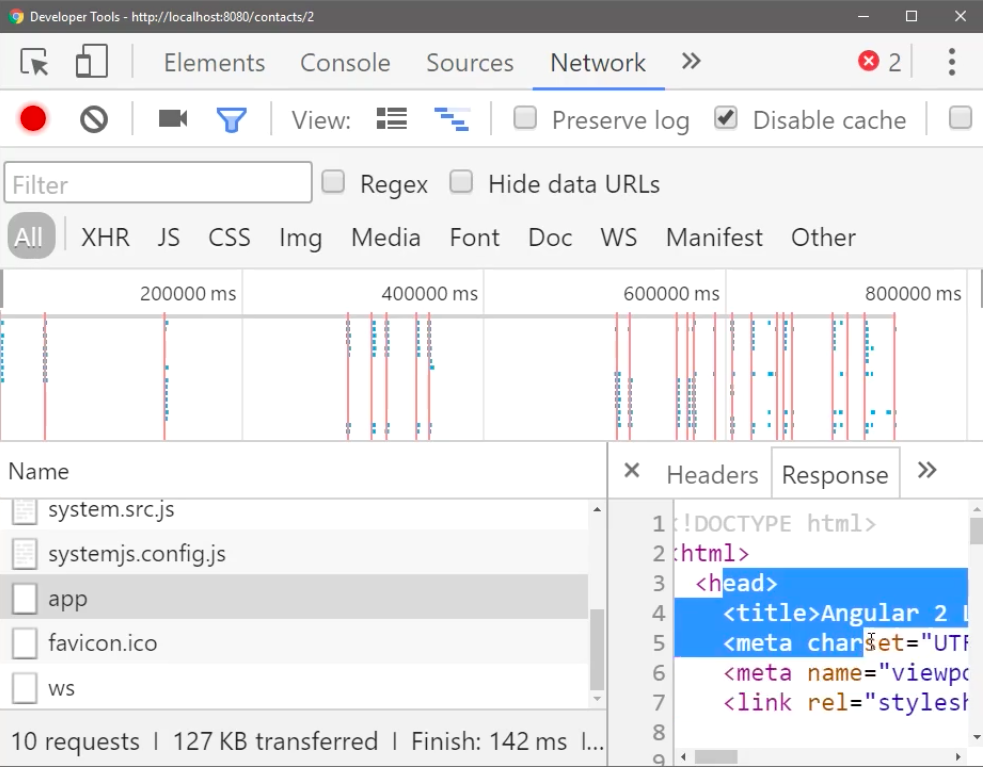
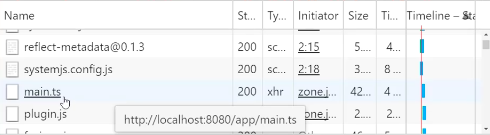

So far our navigation has worked just fine with home, contacts, and contact one, but as soon as I try and navigate to contact two, you'll see this just hangs because it can't load our app.


What's happening with this? If you see an error like this, and I'm using **systemjs** to load this, it means it tried to load in my app using systemjs but what got returned was an HTML file. That's because just like any other single-page application, this is always returning an index HTML.

What's happening here is it's trying to load from this URL, from /2. It's trying to load my app from contacts/app, which you'll see in here is contacts/app return the index.html, which is definitely not what we want.



The reason that happened is because our base href is set to ./

**index.html** 
```html
<base href="./">
```

I'm doing this because I'm sharing these examples on **Plunker** so you guys can play with them embedded. What happens if I delete this? I'll hit save. I'll try and navigate back to the root again.


Now, I'll get a huge explosion of errors in the console saying that a base ref is not set -- no base href found. I either need to define this in my index.html or configure it with a token. The solution that's going to work for us is just in my HTML if I create this base and I assign it to /. That just means use the root of my server to load any of these things.

**index.html** 
```html
<base href="/">
```

If I go to contacts, contact one and now contact two, and I hit enter, it's going to be just fine because now when it hits contacts two and it tries to load this app file, you'll see it loads this system.js config.

It knows that app file is really main.ts and it confined that /app/main.ts doesn't get lost in the weeds of /contact anymore because it knows to look back up to the / right after the root of the server, which is 8080.



You'll also notice right now that the styling is gone. That's because your href needs to be set or this base href needs to be set before anything else that uses the URLs. That includes any sort of style sheets.

**index.html**
```html
head>
    <title>Angular 2 Lessons</title>
    <meta charset="UTF-8">
    <meta name="viewport" content="width=device-width, initial-scale=1">

    <base href="/">

    <link rel="stylesheet" href="styles.css">
```


If I paste this here and hit save, now you'll see that this will load with a proper styling with my Arial font set because it could find the style sheet. Otherwise, it would have tried to load that style sheet from /contacts instead of just /.

This covers the 99 percent scenario, just the / saying the root of the server is where I want to host everything from. I'd like to explain this scenario where I'm hosting this locally for recording but I'm also hosting it on Plunker so you can play with it embedded.

That's actually going to require me to write some logic in here. I'm going to say my path will check the `document.location.href`. If the href includes Plunker anywhere in the URL, then we want the path to be relative, so `./` otherwise we want the path to be just absolute to the root of the server.

**index.html**
```html
head>
    <title>Angular 2 Lessons</title>
    <meta charset="UTF-8">
    <meta name="viewport" content="width=device-width, initial-scale=1">

    <script>
      var path = document.location.href.includes('plnkr')
              ? './'
              : '/';

    </script>

    <link rel="stylesheet" href="styles.css">
```


That's just because Plunker hosts from a current directory, not from the root of Plunker while we're hosting from the root. From here, I can just say `document.write` so drop the base href tag in here. This is just a string. I'm going to concatenate that path in there, `path` plus that, end of the string.

**index.html**
```html
<script>
  var path = document.location.href.includes('plnkr')
          ? './'
          : '/';
  document.write('<base href="' + path + '"/>');
</script>
```

When I hit save, you'll see everything goes back to working just fine. I get my style sheets. I'm now able to go to `/2`. This will load up just fine, the contacts two, contacts, home. It loads the styles fine and everything. This will also account for the case that I want to host this demo on Plunker.