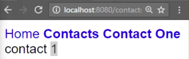

We'll add another `a` tag this time, that links to 'contacts/1', and we'll just call this "Contact One". To navigate to 'contacts/1' as a route param,

**app/app.component.ts**
```javascript
@Component({
  selector:'app',
  styles:['...'],

  template '
<nav>
  <a 
    routerlink=""
    routerLinkActive="active"
    [routerLinkActiveOptions]="{exact:true}"
    >Home</a>
  <a
    routerlink="contacts" 
    routerLinkActive="active">
    Contacts
  </a>
  <a
    routerLink="contacts/1"
    routerLinkActive="active">
    Contact One
  </a>
</nav>
<router-outlet></router-outlet>
'
})
```

let's hop into our contacts.routes, and we'll make another path. This one is going to be `:id`, so this ID is going to represent that 1 or that route param.

**contacts/contacts.routes.ts**
```javascript
const routes = [
  {path: '', component: ContactsComponent}
  {path: ':id', component: ContactComponent}
];
```

Then we'll make another component, this time called just `ContactComponent`, singular. Let's go over and make that component here. We'll call it `contact.component.ts`, open that up, create My Component, a template of "I'm the first contact"

**contacts/contact.component.ts**
```javascript
import {Component} from "@angular/core";
@Component({
  template:'
I'm the first contact
'
})
export class ContactComponent{}
```

Export the class, `ContactComponent`, and make sure to register it with our contact.module -- so add our `ContactComponent`.

**contacts/contacts.module.ts**
```javascript
import {ContactComponent} from "./contact.component";
@NgModule({
  imports:[CommonModule, contactsRoutes],
  declarations: [ContactsComponent, ContactComponent]
})
```

Then we'll just hop back into our routes, make sure we import the `ContactComponent`. From here, we should be able to see home, contact, and contact one.

**contacts/contacts.routes.ts**
```javascript
import {ContactComponent} from "./contact.component";
const routes = [
  {path: '', component: ContactsComponent}
  {path: ':id', component: ContactComponent}
];
```

This one is loading in, "I'm the first contact," which is in our contact.component. To get that one off of the URL -- because you'll see that it is up here in the URL, so /1 -- we'll go into the `ContactComponent`. In the `constructor`, you can inject something called the `ActivatedRoute`.

**contacts/contact.component.ts**
```javascript
export class ContactComponent{
  constructor(private route:ActivatedRoute){}
}
```

The `route` has `params` on it, and this `params` is **an observable**. What we can do to display an observable inside of our template is first we'll delete everything in there and just say `contact` and the double curlies, and set up an `id` and say, "Hey, this is async," meaning this is an observable, and it should be treated as such, so subscribe to it in the template.

**contacts/contact.component.ts**
```javascript
import {Component} from "@angular/core";
@Component({
  template:'
contact {{id | async}}
'
})
export class ContactComponent{
  constructor(private route:ActivatedRoute){
    route.params
  }
}
```

This `id` needs to be exposed on our class, and then we can assign the `id` to `route.params.map`, and then we just map the params to a params.id. This will just grab the ID off of that. We're going to cast this to `any`, just to make that red error go away because Typescript didn't recognize that.

**contacts/contact.component.ts**
```javascript
import {Component} from "@angular/core";
@Component({
  template:'
contact {{id | async}}
'
})
export class ContactComponent{
  id;

  constructor(private route:ActivatedRoute){
    this.id = route.params.map((p:any) => p.id);
  }
}
```

Also, anytime you use an operator in RxJS, like `map`, you need to import "rxjs/add/operator/map." I'll hit save, and now you should be able to see home, contacts, and contact one. We have contact one, and 1 is this ID, which we're grabbing off the route params and mapping this.



There could be many other `params`, but we're just grabbing the `id` off of the `params`. Lastly, just as before, you'll see contact one and contacts are both highlighted in the styling, so let's go back into our app.component and grab that `routerLinkActiveOptions`, drop that on contacts, because this contacts route is matching this /contact/1.

**app/app.component.ts**
```javascript
@Component({
  selector:'app',
  styles:['...'],

  template '
<nav>
  <a 
    routerlink=""
    routerLinkActive="active"
    [routerLinkActiveOptions]="{exact:true}">
    Home
  </a>
  <a
    routerlink="contacts" 
    routerLinkActive="active">
    [routerLinkActiveOptions]="{exact:true}"
    Contacts
  </a>
  <a
    routerLink="contacts/1"
    routerLinkActive="active">
    Contact One
  </a>
</nav>
<router-outlet></router-outlet>
'
})
```

This way, with `[routerLinkActiveOptions]="{exact:true}"`, when we navigate to contacts, and then contact one, now this will no longer highlight, because it's not an exact match anymore.