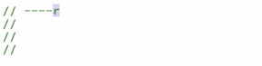
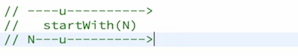
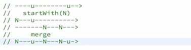

In our user interface over here our `refreshButton` actually has a small bug, which might annoy some users. When we click refresh, the current list should be immediately cleared away. While it's loading, it should stay empty until new data arrives.

Actually what happens is that as soon as we click refresh like this it doesn't get cleared immediately, but it stays as the old data until the new data arrives. This also happened when we loaded the page initially.

Before the first response arrived, there was actually a flash of undesired content, which was this placeholder in each of these suggested users. What we need to do instead is first clear the element on startup to not have any text. Second, we need to clear the element again whenever we press the `refreshButton`.

I just changed here the `renderSuggestion` function such that you can give a `null` as the suggested user data. If it's `null`, then it will simply hide the element over here. 

```javascript
function renderSuggestion(suggestedUser, selector) {
	var suggestionEl = document.querySelector(selector);
	if (suggestedUser === null) {
		suggestedEl.style.visibility = 'hidden';
	} else {
		suggestionEl.style.visibility = 'hidden';
		var usernameEl = suggestionEl.querySelector('.username');
		usernameEl.href = suggestedUser.html_url;
		usernameEl.textContent = suggestedUser.login;
		var imageEl = suggestionEl.querySelector('img');
		imgEl.src = "";
		imgEl.src = suggestedUser.avater_url;
	}
}
```

What you're probably thinking right now is that we just need to call `renderSuggestion` `null` and `'.suggestion1'` It will clear the first suggested user's element here on startup.

```javascript
renderSuggestion(null, '.suggestion1');
```

Then we just need to do this again for the second and the third, and then there we have it. On startup, all of these elements will be cleared.

```javascript
renderSuggestion(null, '.suggestion1');

renderSuggestion(null, '.suggestion2');

renderSuggestion(null, '.suggestion3');
```

There will be no flash of placeholders, but not so fast. I know this would actually solve the problem, but let's reflect for a moment. Why is this a bad idea?

The element over here is a dynamic value changing over time. In lesson number three we learned that in reactive programming we should specify the dynamic behavior of this value completely at the time of declaration.

Where was this declared? Well, if you think of the data that is behind this thing, this was declared here in `suggestion1Stream`. Where was it actually defined? Was inside this `createSuggestionStream`, if you look at this, you cannot see that at startup it is empty.

```javascript
function createSuggestionStream(responseStream) {
  return responseStream.map(listUser =>
    listUser[Math.floor(Math.random()*listUser.length)]
  );
}

var suggestion1Stream = createSuggestionStream(responseStream);
```

You simply don't see that here because that is not specified here at the time of declaration. We need to somehow move this behavior of change. This is somehow specifying a change. 

```javascript
renderSuggestion(null, '.suggestion1');

renderSuggestion(null, '.suggestion2');

renderSuggestion(null, '.suggestion3');
```

We need to move this change into the declaration of `suggestion1Stream`, all right?

I'm going to do that with a nice operator called `.startWith` You're probably thinking, *Okay... So what does that do?* It is a pretty simple operator. It does the following. Given a stream of some sort, and let's say that this `responseStream` happens some time later in time. It happens not immediately, but it happens after a while.

	

This is mapped to a suggested user as we saw here in maps for a random user. This part near here is this stream that we previously had. 

```javascript
responseStream.map(listUser =>
    listUser[Math.floor(Math.random()*listUser.length)]
```

What `.startWith` does is basically it just prepends that stream with a value that you specify. It prepends it at the beginning here with a `null` and then later we have a user.



That's what `.startWith` does. That's how we can clear the element at startup because this `N` is the first initial moment, and that's also our startup moment. That's what `.startWith(null)` does. What about the other feature? On refresh, we should clear the element.

```javascript
function createSuggestionStream(responseStream) {
  return responseStream.map(listUser =>
    listUser[Math.floor(Math.random()*listUser.length)]
  ).startWith(null);
}
```

Well, same story. The dynamic behavior of this element should be completely specified at the time of the declaration. What is the time of declaration again? It's over here. Again, we're not trying to change this when refresh happens.


One naïve approach would be to take this `refreshClickStream`, subscribe to it, and then we simply go and call `renderSuggestion` with `null` for each of those suggestions. Again, this would be something else changing that element, and the dynamic behavior of this element would not be defined here at the time of declaration.

```javascript
refreshClickStream.subscribe(ev => {
	//renderSuggestion(null, '.suggestion1');
})
```

How can we include this behavior here into the time of declaration of the suggestion stream? We can do something like this. We can `.merge` with the `refreshClickStream`, and we're going to `.map` each of these `refreshClickStream` to `null` values. Even though there's a refresh event there we're just going to `.map` that to `null`.

```javascript
function createSuggestionStream(responseStream) {
  return responseStream.map(listUser =>
    listUser[Math.floor(Math.random()*listUser.length)]
  )
  .startWith(null)
  .merge(refreshClickEvent.map(ev => null));
}
```

Now we have the `.startWith` there, and we're going to `.merge` that with, let's say, over here refresh happens. That refresh will be mapped to a `null`. It will look like this. Let's say that this was, also refresh. We're going to `.map` that to a `null`.

Then when we `.merge` these two folks, we will see something that looks like this. It starts with a `null`. Then it gets an actual user data. When you refresh, it got a `null` again. Now let's say you clicked refresh again, and some time later that data from the response will come here. Let's actually write it like this. We're going to have our user there.



Now when we click refresh it will immediately clear this list. Then after the loading passes, it will show us new users like that.