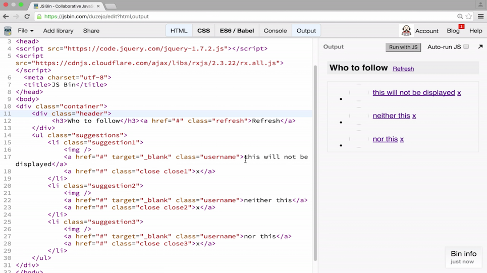

Logging the response to the console like this is not enough. We also need to render that data on the DOM. Here, we can see our desired output. This was created simply with HTML. Here, we have our `"header"` with who to follow. On the right, we have the refresh button. We also have a list with the three suggestions.



Here, we have some placeholder data like this will not be displayed and either this. The first link is a link to the `"username"`. We'll take to the GitHub users profile page. We're supposed to fill this `href` with that link. We're supposed to fill the text content of this link with the user's login name. Also, there's an `` element here where we will put the avatar for that user.

```html
<li class="suggestion1">
    
    <a href="#" target="_blank" class="username">this will not be displayed</a>
    <a href="#" class="close close1">x</a>
</li>
```

How do we do that in Rx with observables? We have this `responseStream` that emits actually an array of users. It has an array containing probably some hundreds of users. We need only three of those. We need to represent somehow the first user, the second user, and the third user. We can do that by creating one stream of events for each of these users.

For instance, we can create a stream for the suggestion of the first user to follow. We do that by getting the `responseStream` which emits arrays. We're going to get those lists of users.

```javascript
var suggestion1Stream = responseStream.map(listUser => ...)
```

We're going to `.map` that to one of those entries. We do that by doing `Math.floor`, then `Math.random` multiplied by the amount of items in that array. This will give us one random user in that array of users. 

```javascript
var suggestion1Stream = responseStream.map(listUser => 
	listUser[Math.floor(Math.random()*listUser.length)]
);
```

Then we need to do the same thing for the second user like this.

```javascript
var suggestion2Stream = responseStream.map(listUser => 
	listUser[Math.floor(Math.random()*listUser.length)]
);
```

As you can see, this is very repetitive code. We could actually put this in a function so we can reuse it. Let's call that function `createSuggestionStream`. Given the `responseStream`, it will `.map` that `responseStream` to one random user. There we can call that function by just doing `createSuggestionStream` and giving it the `responseStream`. This will return us an event stream that has one random user. We just do the same for the second user and for the third user.

```javascript
function createSuggestionStream(responseStream) {
	return responseStream.map(listUser => 
		listUser[Math.floor(Math.random()*listUser.length)]
	);
} 

var suggestion1Stream = createSuggestionStream(responseStream);
var suggestion2Stream = createSuggestionStream(responseStream);
var suggestion3Stream = createSuggestionStream(responseStream);
```	

Now that we have the streams, they don't do anything by themselves. That's the idea of event streams. You need to always add an event listener or `subscribe` to them and then you have your `user`. Inside here, we finally have one single `user`, not an array. We need to render that to the DOM here.

```javascript
suggestion1Stream.subsribe(user => {
	
});
```

I'm going to call `renderSuggestion` with a `user` and a selector which is `'.suggestion1'`. Of course, this `renderSuggestion` function doesn't exist yet. I need to create that.

So let's go ahead and create that. `renderSuggestion`, it takes some piece of `userData` and a `selector`. What I want this to do is get that data, get the element behind that `selector`, and put the data in that element. Let's go again and get our `element` behind that `selector`. Let's get the `"username"` link in that `element` which is `".username"` class. We can do something with this `element`.

We can get the `href` and put `userData.html_url` if I remember correctly. We can do `usernameEl` and we can set the `textContent` to be `userData.login` if I remember correctly again.

```javascript
function renderSuggestion(userData, selector) {
	var element = document.querySelector(selector);
	var usernameEl  = element.querySelector('.username');
	usernameEl.href = userData.html_url;
	usernameEl.textContent = userData.login;
}
```

`imgEl`, now we need to get that particular `imgEl` which is inside that list item. We set the `src` for this to be `userData.avatar_url`. This `userData` is an object returned by GitHub's API. If you want to see how the whole structure of this object is, the JSON, you can check the GitHub's specifications.

```javascript
function renderSuggestion(userData, selector) {
	var element = document.querySelector(selector);
	var usernameEl  = element.querySelector('.username');
	usernameEl.href = userData.html_url;
	usernameEl.textContent = userData.login;
	var imgEl = element.querySelector('img');
	imgEl.src = userData.avatar_url;
}
```

So we run this. `suggestion1Stream` got its data from the `responseStream`. We just `subscribe` to that `suggestion1Stream` and we render this to the DOM. We do that with the other users like this, basically copy pasting and changing the selectors and the stream names two and three. We run again. We're going to see the users rendered to the DOM.

```javascript
suggestion1Stream.subscribe(user => {
	renderSuggestion(user, '.suggestion1');
});

suggestion2Stream.subscribe(user => {
	renderSuggestion(user, '.suggestion2');
});

suggestion3Stream.subscribe(user => {
	renderSuggestion(user, '.suggestion3');
});
```