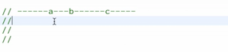
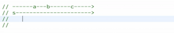
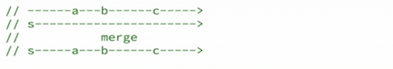
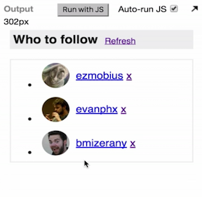

So now, let's try to implement that feature, which is when we `'click'` the `refreshButton`, we should get even more users being displayed here. How do we do that?

First of all, we know that when `'click'`s happen on this `refreshButton`, those should be represented as an event stream, just like everything else is. We can use `fromEvent` -- we have seen this before -- from this element, the `refreshButton` and from the type `'click'`.

```javascript
var refreshButton = document.querySelector('.refresh');

var refreshClickStream = Rx.Observable.fromEvent(refreshButton, 'click');
```

Now we have the `refreshClickStream`, but the `'click'` events don't carry themselves an API URL. That's what we need in order to do the network request.

We need to `.map` each of these `'click'`s to an actual URL. We need to change the `requestStream` to be the `refreshClickStream` to `.map` to something. So we're going to `.map` each of these events to something.

```javascript
var requestStream = refreshClickStream
	.map(ev => {
		return ''
	})
```

Here, we want to return a URL, for instance, of the `https://api.github.com/users`. We should give also a `randomOffset` here, because we want to get different users. So we make a `randomOffset`. There's a number between 0 and 500, and we put that here. OK.

```javascript
var requestStream = refreshClickStream
	.map(ev => {
		var randomOffset = Math.floor(Math.random()*500); 
		return 'https://api.github.com/users?since=' + randomOffset;
	});
```

Now, `requestStream` works in a different way. Whenever refresh happens, it will `.map` to a URL. Then the response will pick that up by `.map` the request to something, and it should work.

But now, if you're clever you notice that this doesn't actually do any request in the beginning, because since we `.map` `'click'`s to URLs, if I don't ever `'click'` that, then I will never get a URL in the `requestStream`.

This data being displayed here is coming from the HTML. We're not really getting any data at all from the back end here, because I simply haven't `'click'`ed here yet. I actually broke the feature that we had before.

Why is this happening? Well, we need to have an initial request. We need to have the start up request, and sort of I broke that, so we need to put that back somehow. Let's make a stream that has only that start up request. Just basically what we had there before, but just with a different variable name.

```javascript
var startupRequestStream = Rx.Observable.just('https://api.github.com/users');
```

Now, this is a lonely `requestStream`. It's not being used by the `responseStream`. The `responseStream` here only uses `requestStream`. It's not using `startupRequestStream`. So `requestStream` is actually `requestOnRefreshStream`.

```javascript
var requestOnRefreshStream = refreshClickStream
	.map(ev => {
		var randomOffset = Math.floor(Math.random()*500); 
		return 'https://api.github.com/users?since=' + randomOffset;
	});

var responseStream = requestOnRefreshStream
	.flatMap(requestUrl =>
		Rx.Observable.fromPromise(jQuery.getJSON(requestUrl))
	)
```

How can we get that one to be used also for the response? Well, we can do something here called `.merge` `startupRequestStream`. When we do this, as you can see, we already got data here. This came from the `startupRequestStream`. Then if I `'click'` refresh, we will get even more users.

```javascript
var responseStream = requestOnRefreshStream.merge(startupRequestStream)
	.flatMap(requestUrl =>
		Rx.Observable.fromPromise(jQuery.getJSON(requestUrl))
	)
```

So, what did I just do here with `.merge`? `.merge` is this kind of operation that gives you back an observable with events from either this or that. If we draw a marble diagram for that, it looks somehow like this. So let's say we have `a`, `b`, and `c`. Let's actually suppose that these are events from the `requestOnRefresh`.



Then we have events from `startupRequestStream`. It looks like this, because there's only one event, and it happens in the beginning.



Then when we `.merge`, it will simply make an output observable that has events from both of those. It means that it has this `s` event, it also has `a`, and it also has `b`, and it also has `c`. This is what we get as this operation`requestOnRefreshStream.merge(startupRequestStream)`.



It has events from `startupRequest`, and it also has events from `requestOnRefresh`. That's how we got this output that we see here.

